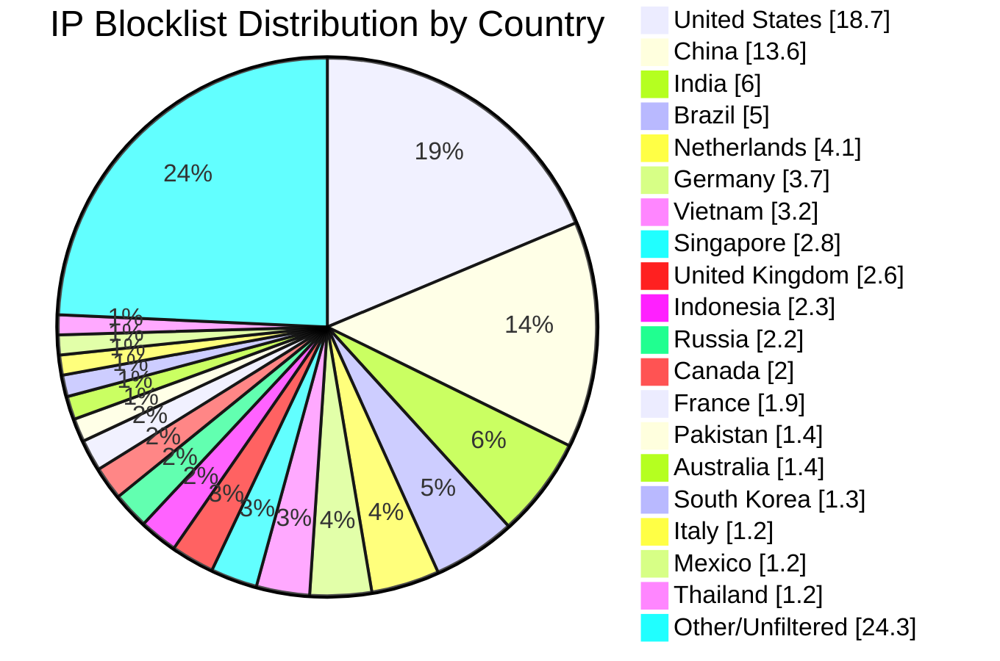

# Multi-Country IP Address Internet Blocklist Aggregator


          


* * *

Automated IP blocklist aggregation with multi-country geographical filtering

* * *

## 🚀 Features

- **Multi-Country Support**: Filter IPs from multiple countries - aggregate or individual lists
- **Automated Aggregation**: Combines multiple IP blocklists into a single deduplicated list
- **Geographical Filtering**: Filters IPs by country with support for multiple countries
- **Individual & Combined Files**: Generates both per-country files and combined multi-country files
- **Docker Support**: Runs in containerized environment for consistency
- **GitHub Actions**: Automated daily updates with manual trigger support
- **Multi-source**: Supports multiple URL sources via environment configuration
- **Enhanced Statistics**: Comprehensive reporting with per-country breakdowns

## 📊 Latest Statistics

**Last Updated:** 2026-07-19 08:42:06 UTC

## 📈 Country Distribution



## Overall Summary

- **Total Input IPs:** 1,248,278
- **Countries Processed:** 50
- **Combined Unique IPs:** 1,097,983
- **Combined Output File:** `aggregated-multi-50countries-combined.txt`
- **Overall Filter Rate:** 87.96%

## Per-Country Results

| Country | Code | Networks Found | Networks Optimized | IPs Matched | Filter Rate | Output File |
|---------|------|----------------|--------------------|-----------|-----------|-----------|
| United States | US | 137,787 | 135,973 | 233,265 | 18.69% | `aggregated-us-only.txt` |
| China | CN | 7,716 | 7,715 | 169,295 | 13.56% | `aggregated-cn-only.txt` |
| India | IN | 13,160 | 13,130 | 75,278 | 6.03% | `aggregated-in-only.txt` |
| Germany | DE | 29,153 | 29,083 | 46,276 | 3.71% | `aggregated-de-only.txt` |
| Russia | RU | 13,272 | 13,034 | 27,181 | 2.18% | `aggregated-ru-only.txt` |
| United Kingdom | GB | 35,446 | 35,279 | 32,509 | 2.60% | `aggregated-gb-only.txt` |
| Thailand | TH | 1,979 | 1,979 | 14,722 | 1.18% | `aggregated-th-only.txt` |
| Vietnam | VN | 2,188 | 2,188 | 39,764 | 3.19% | `aggregated-vn-only.txt` |
| South Korea | KR | 3,909 | 3,899 | 15,851 | 1.27% | `aggregated-kr-only.txt` |
| Brazil | BR | 12,907 | 12,848 | 62,637 | 5.02% | `aggregated-br-only.txt` |
| Taiwan | TW | 2,387 | 2,387 | 13,879 | 1.11% | `aggregated-tw-only.txt` |
| Canada | CA | 16,857 | 16,741 | 25,535 | 2.05% | `aggregated-ca-only.txt` |
| Singapore | SG | 9,463 | 9,453 | 34,885 | 2.79% | `aggregated-sg-only.txt` |
| Italy | IT | 9,737 | 9,694 | 15,290 | 1.22% | `aggregated-it-only.txt` |
| Netherlands | NL | 18,776 | 18,667 | 51,390 | 4.12% | `aggregated-nl-only.txt` |
| Indonesia | ID | 6,499 | 6,473 | 28,213 | 2.26% | `aggregated-id-only.txt` |
| France | FR | 33,011 | 32,984 | 23,198 | 1.86% | `aggregated-fr-only.txt` |
| Venezuela | VE | 956 | 956 | 7,716 | 0.62% | `aggregated-ve-only.txt` |
| Australia | AU | 12,109 | 12,038 | 17,104 | 1.37% | `aggregated-au-only.txt` |
| Turkey | TR | 3,444 | 3,421 | 13,692 | 1.10% | `aggregated-tr-only.txt` |
| Ukraine | UA | 5,541 | 5,485 | 9,105 | 0.73% | `aggregated-ua-only.txt` |
| Iran | IR | 2,057 | 2,056 | 5,181 | 0.42% | `aggregated-ir-only.txt` |
| Poland | PL | 8,180 | 8,150 | 8,287 | 0.66% | `aggregated-pl-only.txt` |
| Mexico | MX | 4,452 | 4,448 | 15,085 | 1.21% | `aggregated-mx-only.txt` |
| Spain | ES | 11,055 | 11,035 | 9,146 | 0.73% | `aggregated-es-only.txt` |
| Argentina | AR | 3,452 | 3,450 | 11,773 | 0.94% | `aggregated-ar-only.txt` |
| Egypt | EG | 728 | 728 | 3,596 | 0.29% | `aggregated-eg-only.txt` |
| Pakistan | PK | 1,351 | 1,349 | 17,138 | 1.37% | `aggregated-pk-only.txt` |
| Malaysia | MY | 2,550 | 2,550 | 5,781 | 0.46% | `aggregated-my-only.txt` |
| Bulgaria | BG | 2,378 | 2,367 | 3,041 | 0.24% | `aggregated-bg-only.txt` |
| Czechia | CZ | 3,623 | 3,622 | 1,937 | 0.16% | `aggregated-cz-only.txt` |
| Colombia | CO | 2,217 | 2,217 | 6,489 | 0.52% | `aggregated-co-only.txt` |
| United Arab Emirates | AE | 3,826 | 3,826 | 4,292 | 0.34% | `aggregated-ae-only.txt` |
| Romania | RO | 3,987 | 3,979 | 2,514 | 0.20% | `aggregated-ro-only.txt` |
| Kazakhstan | KZ | 1,309 | 1,308 | 2,664 | 0.21% | `aggregated-kz-only.txt` |
| Morocco | MA | 493 | 493 | 4,169 | 0.33% | `aggregated-ma-only.txt` |
| Saudi Arabia | SA | 1,675 | 1,675 | 4,278 | 0.34% | `aggregated-sa-only.txt` |
| South Africa | ZA | 3,992 | 3,978 | 8,447 | 0.68% | `aggregated-za-only.txt` |
| Bangladesh | BD | 2,628 | 2,626 | 7,319 | 0.59% | `aggregated-bd-only.txt` |
| Chile | CL | 1,931 | 1,929 | 3,586 | 0.29% | `aggregated-cl-only.txt` |
| Nigeria | NG | 1,080 | 1,080 | 1,663 | 0.13% | `aggregated-ng-only.txt` |
| Kenya | KE | 873 | 873 | 3,078 | 0.25% | `aggregated-ke-only.txt` |
| Algeria | DZ | 219 | 219 | 2,107 | 0.17% | `aggregated-dz-only.txt` |
| Serbia | RS | 994 | 992 | 1,278 | 0.10% | `aggregated-rs-only.txt` |
| Peru | PE | 1,180 | 1,179 | 2,053 | 0.16% | `aggregated-pe-only.txt` |
| Sri Lanka | LK | 248 | 248 | 920 | 0.07% | `aggregated-lk-only.txt` |
| Iraq | IQ | 684 | 684 | 2,890 | 0.23% | `aggregated-iq-only.txt` |
| Ethiopia | ET | 97 | 97 | 1,179 | 0.09% | `aggregated-et-only.txt` |
| Ghana | GH | 343 | 343 | 571 | 0.05% | `aggregated-gh-only.txt` |
| Belarus | BY | 418 | 418 | 736 | 0.06% | `aggregated-by-only.txt` |

## IP Sources

- **Source 1:** https://raw.githubusercontent.com/borestad/firehol-mirror/refs/heads/main/firehol_level1.netset
- **Source 2:** https://raw.githubusercontent.com/borestad/firehol-mirror/refs/heads/main/firehol_level2.netset
- **Source 3:** https://rules.emergingthreats.net/fwrules/emerging-Block-IPs.txt
- **Source 4:** https://feodotracker.abuse.ch/downloads/ipblocklist_recommended.txt
- **Source 5:** https://raw.githubusercontent.com/stamparm/ipsum/master/levels/2.txt
- **Source 6:** https://raw.githubusercontent.com/borestad/iplists/refs/heads/main/spamhaus/spamhaus-drop.ipv4
- **Source 7:** https://raw.githubusercontent.com/borestad/iplists/refs/heads/main/spamhaus/spamhaus-asndrop.ipv4
- **Source 8:** https://raw.githubusercontent.com/romainmarcoux/malicious-ip/refs/heads/main/full-300k-aa.txt
- **Source 9:** https://raw.githubusercontent.com/romainmarcoux/malicious-ip/refs/heads/main/full-300k-ab.txt
- **Source 10:** https://raw.githubusercontent.com/romainmarcoux/malicious-ip/refs/heads/main/full-300k-ac.txt
- **Source 11:** https://raw.githubusercontent.com/romainmarcoux/malicious-ip/refs/heads/main/full-300k-ad.txt
- **Source 12:** http://cinsscore.com/list/ci-badguys.txt
- **Source 13:** https://cdn.jsdelivr.net/gh/LittleJake/ip-blacklist/all_blacklist.txt
- **Source 14:** https://raw.githubusercontent.com/MagicTeaMC/bad-ips/refs/heads/main/bad-ips.txt
- **Source 15:** https://raw.githubusercontent.com/MagicTeaMC/MCSTORM-IP/main/mcstorm-ip.txt
- **Source 16:** https://opendbl.net/lists/blocklistde-all.list
- **Source 17:** https://raw.githubusercontent.com/bitwire-it/ipblocklist/refs/heads/main/ip-list.txt
- **Source 18:** https://raw.githubusercontent.com/sefinek/Malicious-IP-Addresses/refs/heads/main/lists/main.txt
- **Source 19:** https://raw.githubusercontent.com/borestad/firehol-mirror/refs/heads/main/firehol_level3.netset
- **Source 20:** https://raw.githubusercontent.com/borestad/firehol-mirror/refs/heads/main/firehol_level4.netset
- **Source 21:** https://raw.githubusercontent.com/borestad/firehol-mirror/refs/heads/main/firehol_webserver.netset

## Configuration Details


### 📁 Generated Files

- **`aggregated.txt`** - 1,248,278 total aggregated IPs from all sources
- **`aggregated-ae-only.txt`** - 4,292 IPs from AE
- **`aggregated-ar-only.txt`** - 11,773 IPs from AR
- **`aggregated-au-only.txt`** - 17,104 IPs from AU
- **`aggregated-bd-only.txt`** - 7,319 IPs from BD
- **`aggregated-bg-only.txt`** - 3,041 IPs from BG
- **`aggregated-br-only.txt`** - 62,637 IPs from BR
- **`aggregated-by-only.txt`** - 736 IPs from BY
- **`aggregated-ca-only.txt`** - 25,535 IPs from CA
- **`aggregated-cl-only.txt`** - 3,586 IPs from CL
- **`aggregated-cn-only.txt`** - 169,295 IPs from CN
- **`aggregated-co-only.txt`** - 6,489 IPs from CO
- **`aggregated-cz-only.txt`** - 1,937 IPs from CZ
- **`aggregated-de-only.txt`** - 46,276 IPs from DE
- **`aggregated-dz-only.txt`** - 2,107 IPs from DZ
- **`aggregated-eg-only.txt`** - 3,596 IPs from EG
- **`aggregated-es-only.txt`** - 9,146 IPs from ES
- **`aggregated-et-only.txt`** - 1,179 IPs from ET
- **`aggregated-fr-only.txt`** - 23,198 IPs from FR
- **`aggregated-gb-only.txt`** - 32,509 IPs from GB
- **`aggregated-gh-only.txt`** - 571 IPs from GH
- **`aggregated-id-only.txt`** - 28,213 IPs from ID
- **`aggregated-in-only.txt`** - 75,278 IPs from IN
- **`aggregated-iq-only.txt`** - 2,890 IPs from IQ
- **`aggregated-ir-only.txt`** - 5,181 IPs from IR
- **`aggregated-it-only.txt`** - 15,290 IPs from IT
- **`aggregated-ke-only.txt`** - 3,078 IPs from KE
- **`aggregated-kr-only.txt`** - 15,851 IPs from KR
- **`aggregated-kz-only.txt`** - 2,664 IPs from KZ
- **`aggregated-lk-only.txt`** - 920 IPs from LK
- **`aggregated-ma-only.txt`** - 4,169 IPs from MA
- **`aggregated-mx-only.txt`** - 15,085 IPs from MX
- **`aggregated-my-only.txt`** - 5,781 IPs from MY
- **`aggregated-ng-only.txt`** - 1,663 IPs from NG
- **`aggregated-nl-only.txt`** - 51,390 IPs from NL
- **`aggregated-pe-only.txt`** - 2,053 IPs from PE
- **`aggregated-pk-only.txt`** - 17,138 IPs from PK
- **`aggregated-pl-only.txt`** - 8,287 IPs from PL
- **`aggregated-ro-only.txt`** - 2,514 IPs from RO
- **`aggregated-rs-only.txt`** - 1,278 IPs from RS
- **`aggregated-ru-only.txt`** - 27,181 IPs from RU
- **`aggregated-sa-only.txt`** - 4,278 IPs from SA
- **`aggregated-sg-only.txt`** - 34,885 IPs from SG
- **`aggregated-th-only.txt`** - 14,722 IPs from TH
- **`aggregated-tr-only.txt`** - 13,692 IPs from TR
- **`aggregated-tw-only.txt`** - 13,879 IPs from TW
- **`aggregated-ua-only.txt`** - 9,105 IPs from UA
- **`aggregated-us-only.txt`** - 233,265 IPs from US
- **`aggregated-ve-only.txt`** - 7,716 IPs from VE
- **`aggregated-vn-only.txt`** - 39,764 IPs from VN
- **`aggregated-za-only.txt`** - 8,447 IPs from ZA
- **`aggregated-multi-50countries-combined.txt`** - 1,097,983 unique IPs (deduplicated across all countries)

---

## 🛴 Install

Set up your own copy of this repository to aggregate and filter your IP blocklists for multiple countries.

* * *

### 👆 Click the green "Use this template" button in the upper right corner

         
1. **Sign in** to GitHub and navigate to [this repository](https://github.com/dewdmadbro/ip-blocklist-dewd).
2. Click the **"Use this template"** button (in the upper right corner).
3. Select **Create a new repository**. Enter a name (e.g., `my-eu-badip-blocklist`), and confirm.
4. Your new repository is now independent — it will not share commit history with the original.
5. You can immediately begin editing or configuring it for your own multi-country IP aggregation project.

> The **"Use this template"** button on GitHub allows you to quickly create a new, independent repository pre-populated with the project's files and structure. Your new repository won't inherit commit history from the template. This is perfect for your personal blocklist repo.

*Usage is below for steps on running this repository with Github Actions in your new IP aggregation project.*


## 🛠 Usage

### GitHub Actions (Recommended)

#### First Step - Enable Write Permissions

1. **Enable Actions**: Go to Settings > Actions > General > Workflow permissions
2. **Set Permissions**: Select "Read and write permissions", click "Save".


#### Second Step - Configure The Repo

3. **Configure Environment**: Edit `.env` file with your desired sources and countries
4. **Your Favorite Blocklists**: Load as many blocklists as you like, just make sure the line starts with `LIST1_`, `LIST2_`, `LIST3_`, etc.
5. **Multiple Countries**: Countries can be modified the same way, `COUNTRY_ISO_CODE_1`, `COUNTRY_NAME_1`, `COUNTRY_ISO_CODE_2`, `COUNTRY_NAME_2`, etc.
6. **Find Country Codes**: You can find your country codes in the [geoip2-ipv4 spreadsheet](https://datahub.io/core/geoip2-ipv4)
7. **Automatic Runs**: The workflow runs twice daily. At both **02:17 AM/PM UTC** or it will run anytime if you [modified the cron file](https://github.com/dewdmadbro/ip-blocklist-dewd/edit/main/.github/workflows/ip-aggregation.yml)


#### Third Step - Running This Action

8. **Run This Now**: You can run this Github Action by using the "Action" tab up top
9. **Generate Multi-Country Blocklists**: Under "All workflows" you can find this action
10. **Run workflow**: On this page, off to the right is a button with a dropdown to "Run workflow"
11. **Off to the races**: Each run will consume some of your free monthly Github Actions 2000 min (33.3 hours)

> Please adjust cron, it is how often your aggregator runs in [.github/workflows/ip-aggregation.yml](https://github.com/dewdmadbro/ip-blocklist-dewd/edit/main/.github/workflows/ip-aggregation.yml), also modify your blacklists and countries in the [.env](https://github.com/dewdmadbro/ip-blocklist-dewd/edit/main/.env) file.

## ⚙ Configuration

### 🌍 Multi-Country Setup

The `.env` file supports multiple countries:

```bash
# European Union Example
COUNTRY_ISO_CODE_1=DE
COUNTRY_NAME_1=Germany

COUNTRY_ISO_CODE_2=FR
COUNTRY_NAME_2=France

COUNTRY_ISO_CODE_3=NL
COUNTRY_NAME_3=Netherlands

COUNTRY_ISO_CODE_4=IT
COUNTRY_NAME_4=Italy

COUNTRY_ISO_CODE_5=ES
COUNTRY_NAME_5=Spain
```

This will generate:
- `aggregated-de-only.txt` (Germany IPs)
- `aggregated-fr-only.txt` (France IPs) 
- `aggregated-nl-only.txt` (Netherlands IPs)
- `aggregated-it-only.txt` (Italy IPs)
- `aggregated-es-only.txt` (Spain IPs)
- `aggregated-multi-5countries-combined.txt` (All countries combined, deduplicated)

### Sample .env file

```bash
# Add your IP list sources
LIST_1=https://example.com/blocklist1.txt
LIST_2=https://example.com/blocklist2.txt

# Set multiple countries (NEW FEATURE!)
COUNTRY_ISO_CODE_1=DE
COUNTRY_NAME_1=Germany

COUNTRY_ISO_CODE_2=FR  
COUNTRY_NAME_2=France

# Configure paths (usually don't need to change)
GEOIP_CSV_PATH=/data/geoip/geoip2-ipv4.csv
ALL_IPS_FROM_LISTS=/data/output/aggregated.txt
```

## 🏠 Local Deployment (Alternative)

If you'd rather download this repo and run this project offline, the instructions are below:

### 1. Clone the repository

The first step is to download the files from the internet, and get them locally on your machine.

```bash
git clone https://github.com/dewdmadbro/ip-blocklist-dewd.git
```

### 2. Configure your sources and countries in .env

The next step is to configure the project to your liking. Edit your `.env` file. You can enter as many IP based block lists as you need and configure multiple countries.

```bash
nano .env
```

### 3. Run with Docker Compose

You can now run the project and see what happens.

```bash
docker compose up --build
```

### 4. Check results

Let's see what happened!

```bash
ls -la data/output/
```

## 📁 Output Files

### Per-Country Files
- `data/output/aggregated-{country-code}-only.txt` - Country-specific IPs (e.g., `aggregated-de-only.txt` for Germany)

### Combined Multi-Country Files  
- `data/output/aggregated-multi-{number-of-countries-total}countries-combined.txt` - Combined IPs from all countries (deduplicated)
- Example: `aggregated-multi-3countries-combined.txt` for Germany + France + Netherlands

### Core Files
- `data/output/aggregated.txt` - All deduplicated IPs from all sources (before country filtering)
- `data/output/stats.md` - Comprehensive processing statistics with per-country breakdowns

## 🔄 Workflow Triggers

The GitHub Action runs automatically when:

- **Daily Schedule**: Every day, twice. Once at at 02:17 AM UTC and then again at 02:17 PM UTC
- **File Changes**: When `.env`, `Dockerfile`, or key scripts are modified
- **Manual Trigger**: Via GitHub Actions interface


## 🧹 Starting With Clean Output

If you're going to customize the list: 

- You should remove the [./data/output](https://github.com/dewdmadbro/ip-blocklist-dewd/edit/main/data/output) folder, as it will only contain data pertinent to the last run.

- Always remove the [./data/output](https://github.com/dewdmadbro/ip-blocklist-dewd/edit/main/data/output) folder when you customize the countries. 

> This will ensure you dont include older, unused countries in your new aggreagtion lists.


## ⚡ Performance

- **Multi-Country Processing**: Parallel processing of multiple countries
- **Processing Speed**: ~10,000 IPs per second for filtering per country
- **Parallel Processing**: Multi-core optimization for large datasets  
- **Memory Efficient**: Streaming processing for large files
- **Optimized Lookup**: Integer-based IP range matching with SubnetTree
- **Network Optimization**: Automatic collapsing of overlapping CIDR blocks

## 🌼 Features and Optimizations

- **🌍 Multi-country IP blocklist aggregation** for comprehensive regional security  
- **📊 Per-country statistical analysis** with detailed filtering metrics
- **🔄 Automated multi-country updates** via GitHub Actions
- **🚀 Parallel country processing** for improved performance
- **📁 Individual and combined output files** for flexible deployment
- **🛡️ Regional threat mitigation** with configurable multi-country rules
- **💾 Memory-efficient processing** even with multiple large country datasets
- **🔗 Network optimization** with automatic CIDR block collapsing

## 👍 Acknowledgements

This project would not have been possible without the amazing work of the following other projects:

* * *

### 🎩 Datopian

Thank you to [Datopian](https://github.com/datasets/geoip2-ipv4) for maintaining the [GeoIP2 IPv4 dataset](https://datahub.io/core/geoip2-ipv4). This dataset provides otherwise impossible information for IP geolocation, allowing this project to filter IPs based on multiple countries simultaneously.

- [GeoIP2 IPv4 Dataset](https://datahub.io/core/geoip2-ipv4) by Datopian is essential for filtering and identifying IP addresses across various countries, enabling the dynamic multi-country functionality of this project.


* * *

### 🦘 Andrew Twin

Special thanks to [Andrew Twin](https://github.com/andrewtwin) for creating and sharing the [IP Aggregator](https://github.com/andrewtwin/ip-aggregator) project. Andrew's work on efficiently aggregating IP blocklists was a fundamental inspiration and foundation for this enhanced multi-country version.

- The [IP Aggregator](https://github.com/andrewtwin/ip-aggregator) allows easy downloading, parsing, and filtering of multiple IP blocklists, which this project leverages and extends for multi-country IP management tasks.


* * *

### 📗 Blocklist maintainers

I would like to additionally acknowledge the maintainers and contributors of various [IP blocklists](https://github.com/topics/ip-blocklist) and [IP blacklists](https://github.com/topics/ip-blacklist). Thank you for maintaining up-to-date, community-driven threat intelligence that forms the foundation of generating these multi-country filtered files. While the specific lists in this repo may vary, the collective dedication to improving online security and privacy of all contributors is deeply appreciated.


* * *

