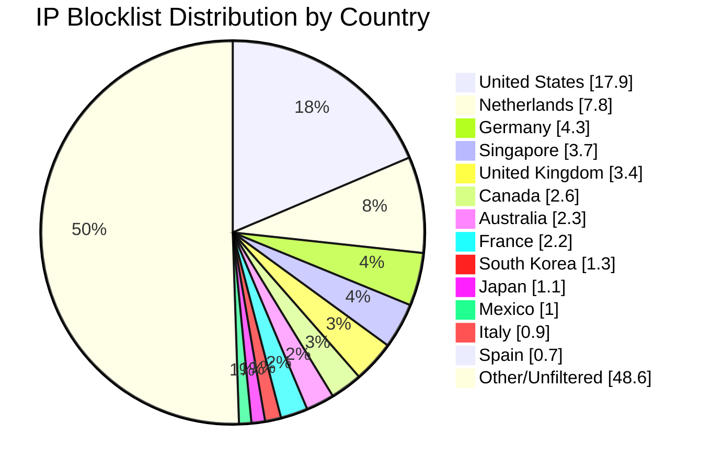

# Multi-Country IP Aggregation Statistics

**Last Updated:** 2026-05-03 04:58:19 UTC

## 📈 Country Distribution

## Overall Summary

- **Total Input IPs:** 504,707
- **Countries Processed:** 14
- **Combined Unique IPs:** 248,268
- **Combined Output File:** `aggregated-multi-14countries-combined.txt`
- **Overall Filter Rate:** 49.19%

## Per-Country Results

| Country | Code | Networks Found | Networks Optimized | IPs Matched | Filter Rate | Output File |
|---------|------|----------------|--------------------|-----------|-----------|-----------|
| France | FR | 32,393 | 32,367 | 11,256 | 2.23% | `aggregated-fr-only.txt` |
| Netherlands | NL | 18,273 | 18,151 | 39,203 | 7.77% | `aggregated-nl-only.txt` |
| Italy | IT | 9,580 | 9,556 | 4,659 | 0.92% | `aggregated-it-only.txt` |
| Spain | ES | 11,140 | 11,107 | 3,563 | 0.71% | `aggregated-es-only.txt` |
| Mexico | MX | 4,307 | 4,303 | 4,890 | 0.97% | `aggregated-mx-only.txt` |
| Japan | JP | 12,061 | 12,055 | 5,693 | 1.13% | `aggregated-jp-only.txt` |
| Australia | AU | 11,396 | 11,317 | 11,358 | 2.25% | `aggregated-au-only.txt` |
| Singapore | SG | 9,268 | 9,258 | 18,632 | 3.69% | `aggregated-sg-only.txt` |
| United States | US | 169,198 | 167,680 | 90,203 | 17.87% | `aggregated-us-only.txt` |
| Canada | CA | 16,890 | 16,768 | 13,046 | 2.58% | `aggregated-ca-only.txt` |
| United Kingdom | GB | 33,411 | 33,252 | 17,244 | 3.42% | `aggregated-gb-only.txt` |
| Australia | AU | 11,396 | 11,317 | 11,358 | 2.25% | `aggregated-au-only.txt` |
| Germany | DE | 28,972 | 28,867 | 21,811 | 4.32% | `aggregated-de-only.txt` |
| South Korea | KR | 4,006 | 3,996 | 6,710 | 1.33% | `aggregated-kr-only.txt` |

## IP Sources

- **Source 1:** https://raw.githubusercontent.com/borestad/firehol-mirror/refs/heads/main/firehol_level1.netset
- **Source 2:** https://raw.githubusercontent.com/borestad/firehol-mirror/refs/heads/main/firehol_level2.netset
- **Source 3:** https://rules.emergingthreats.net/fwrules/emerging-Block-IPs.txt
- **Source 4:** https://feodotracker.abuse.ch/downloads/ipblocklist_recommended.txt
- **Source 5:** https://raw.githubusercontent.com/stamparm/ipsum/master/levels/2.txt
- **Source 6:** https://raw.githubusercontent.com/borestad/iplists/refs/heads/main/spamhaus/spamhaus-drop.ipv4
- **Source 7:** https://raw.githubusercontent.com/borestad/iplists/refs/heads/main/spamhaus/spamhaus-asndrop.ipv4
- **Source 8:** https://raw.githubusercontent.com/romainmarcoux/malicious-ip/refs/heads/main/full-300k-aa.txt
- **Source 9:** https://raw.githubusercontent.com/romainmarcoux/malicious-ip/refs/heads/main/full-300k-ab.txt
- **Source 10:** https://raw.githubusercontent.com/romainmarcoux/malicious-ip/refs/heads/main/full-300k-ac.txt
- **Source 11:** https://raw.githubusercontent.com/romainmarcoux/malicious-ip/refs/heads/main/full-300k-ad.txt
- **Source 12:** http://cinsscore.com/list/ci-badguys.txt
- **Source 13:** https://raw.githubusercontent.com/borestad/firehol-mirror/refs/heads/main/firehol_level3.netset
- **Source 14:** https://raw.githubusercontent.com/borestad/firehol-mirror/refs/heads/main/ciarmy.ipset
- **Source 15:** https://raw.githubusercontent.com/borestad/firehol-mirror/refs/heads/main/firehol_level4.netset

## Configuration Details

