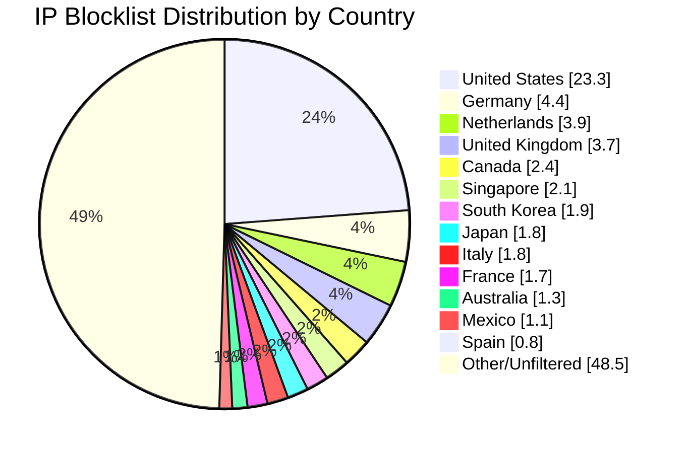

# Multi-Country IP Aggregation Statistics

**Last Updated:** 2026-05-03 04:20:28 UTC

## 📈 Country Distribution

## Overall Summary

- **Total Input IPs:** 939,361
- **Countries Processed:** 14
- **Combined Unique IPs:** 471,326
- **Combined Output File:** `aggregated-multi-14countries-combined.txt`
- **Overall Filter Rate:** 50.18%

## Per-Country Results

| Country | Code | Networks Found | Networks Optimized | IPs Matched | Filter Rate | Output File |
|---------|------|----------------|--------------------|-----------|-----------|-----------|
| France | FR | 32,393 | 32,367 | 16,060 | 1.71% | `aggregated-fr-only.txt` |
| Netherlands | NL | 18,273 | 18,151 | 36,638 | 3.90% | `aggregated-nl-only.txt` |
| Italy | IT | 9,580 | 9,556 | 16,927 | 1.80% | `aggregated-it-only.txt` |
| Spain | ES | 11,140 | 11,107 | 7,054 | 0.75% | `aggregated-es-only.txt` |
| Mexico | MX | 4,307 | 4,303 | 10,290 | 1.10% | `aggregated-mx-only.txt` |
| Japan | JP | 12,061 | 12,055 | 17,226 | 1.83% | `aggregated-jp-only.txt` |
| Australia | AU | 11,396 | 11,317 | 12,566 | 1.34% | `aggregated-au-only.txt` |
| Singapore | SG | 9,268 | 9,258 | 19,549 | 2.08% | `aggregated-sg-only.txt` |
| United States | US | 169,198 | 167,680 | 219,138 | 23.33% | `aggregated-us-only.txt` |
| Canada | CA | 16,890 | 16,768 | 22,520 | 2.40% | `aggregated-ca-only.txt` |
| United Kingdom | GB | 33,411 | 33,252 | 34,400 | 3.66% | `aggregated-gb-only.txt` |
| Australia | AU | 11,396 | 11,317 | 12,566 | 1.34% | `aggregated-au-only.txt` |
| Germany | DE | 28,972 | 28,867 | 40,936 | 4.36% | `aggregated-de-only.txt` |
| South Korea | KR | 4,006 | 3,996 | 18,022 | 1.92% | `aggregated-kr-only.txt` |

## IP Sources

- **Source 1:** https://raw.githubusercontent.com/borestad/firehol-mirror/refs/heads/main/firehol_level1.netset
- **Source 2:** https://raw.githubusercontent.com/borestad/firehol-mirror/refs/heads/main/firehol_level2.netset
- **Source 3:** https://rules.emergingthreats.net/fwrules/emerging-Block-IPs.txt
- **Source 4:** https://raw.githubusercontent.com/borestad/blocklist-abuseipdb/main/abuseipdb-s100-30d.ipv4
- **Source 5:** https://feodotracker.abuse.ch/downloads/ipblocklist_recommended.txt
- **Source 6:** https://raw.githubusercontent.com/stamparm/ipsum/master/levels/2.txt
- **Source 7:** https://raw.githubusercontent.com/borestad/iplists/refs/heads/main/spamhaus/spamhaus-drop.ipv4
- **Source 8:** https://raw.githubusercontent.com/borestad/iplists/refs/heads/main/spamhaus/spamhaus-asndrop.ipv4
- **Source 9:** https://raw.githubusercontent.com/romainmarcoux/malicious-ip/refs/heads/main/full-300k-aa.txt
- **Source 10:** https://raw.githubusercontent.com/romainmarcoux/malicious-ip/refs/heads/main/full-300k-ab.txt
- **Source 11:** https://raw.githubusercontent.com/romainmarcoux/malicious-ip/refs/heads/main/full-300k-ac.txt
- **Source 12:** https://raw.githubusercontent.com/romainmarcoux/malicious-ip/refs/heads/main/full-300k-ad.txt
- **Source 13:** https://opendbl.net/lists/tor-exit.list
- **Source 14:** http://cinsscore.com/list/ci-badguys.txt
- **Source 15:** https://cdn.jsdelivr.net/gh/LittleJake/ip-blacklist/all_blacklist.txt
- **Source 16:** https://raw.githubusercontent.com/MagicTeaMC/bad-ips/refs/heads/main/bad-ips.txt
- **Source 17:** https://raw.githubusercontent.com/MagicTeaMC/MCSTORM-IP/main/mcstorm-ip.txt
- **Source 18:** https://opendbl.net/lists/blocklistde-all.list
- **Source 19:** https://raw.githubusercontent.com/bitwire-it/ipblocklist/refs/heads/main/ip-list.txt
- **Source 20:** https://raw.githubusercontent.com/actuallymentor/bluetack-ip-blacklist-generator/refs/heads/master/blacklist
- **Source 21:** https://raw.githubusercontent.com/pallebone/StrictBlockPAllebone/refs/heads/master/BlockIP.txt
- **Source 22:** https://raw.githubusercontent.com/O-X-L/risk-db-lists/refs/heads/main/ip/top_100000.txt
- **Source 23:** https://raw.githubusercontent.com/borestad/firehol-mirror/refs/heads/main/firehol_level3.netset
- **Source 24:** https://raw.githubusercontent.com/borestad/firehol-mirror/refs/heads/main/firehol_abusers_1d.netset
- **Source 25:** https://raw.githubusercontent.com/borestad/firehol-mirror/refs/heads/main/ciarmy.ipset
- **Source 26:** https://raw.githubusercontent.com/borestad/firehol-mirror/refs/heads/main/firehol_level4.netset
- **Source 27:** https://raw.githubusercontent.com/elliotwutingfeng/ThreatFox-IOC-IPs/refs/heads/main/ips.txt
- **Source 28:** https://raw.githubusercontent.com/Naunter/BT_BlockLists/refs/heads/master/list_1.txt 

## Configuration Details

