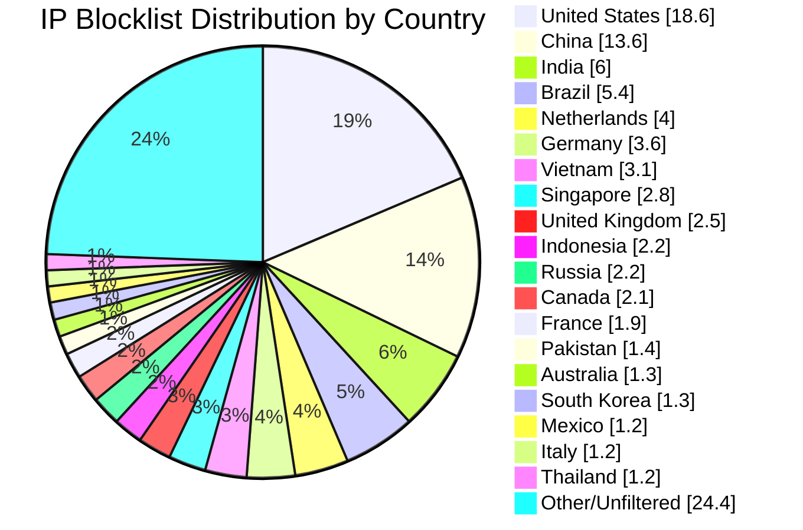

# Multi-Country IP Aggregation Statistics

**Last Updated:** 2026-07-26 14:07:36 UTC

## 📈 Country Distribution

## Overall Summary

- **Total Input IPs:** 1,273,257
- **Countries Processed:** 50
- **Combined Unique IPs:** 1,120,038
- **Combined Output File:** `aggregated-multi-50countries-combined.txt`
- **Overall Filter Rate:** 87.97%

## Per-Country Results

| Country | Code | Networks Found | Networks Optimized | IPs Matched | Filter Rate | Output File |
|---------|------|----------------|--------------------|-----------|-----------|-----------|
| United States | US | 135,484 | 133,670 | 236,297 | 18.56% | `aggregated-us-only.txt` |
| China | CN | 7,801 | 7,800 | 172,747 | 13.57% | `aggregated-cn-only.txt` |
| India | IN | 13,176 | 13,145 | 76,742 | 6.03% | `aggregated-in-only.txt` |
| Germany | DE | 29,225 | 29,158 | 46,415 | 3.65% | `aggregated-de-only.txt` |
| Russia | RU | 13,278 | 13,041 | 27,532 | 2.16% | `aggregated-ru-only.txt` |
| United Kingdom | GB | 35,497 | 35,342 | 32,398 | 2.54% | `aggregated-gb-only.txt` |
| Thailand | TH | 1,984 | 1,984 | 15,370 | 1.21% | `aggregated-th-only.txt` |
| Vietnam | VN | 2,193 | 2,193 | 39,961 | 3.14% | `aggregated-vn-only.txt` |
| South Korea | KR | 3,949 | 3,939 | 15,954 | 1.25% | `aggregated-kr-only.txt` |
| Brazil | BR | 13,023 | 12,978 | 68,264 | 5.36% | `aggregated-br-only.txt` |
| Taiwan | TW | 2,388 | 2,388 | 13,970 | 1.10% | `aggregated-tw-only.txt` |
| Canada | CA | 16,948 | 16,824 | 26,432 | 2.08% | `aggregated-ca-only.txt` |
| Singapore | SG | 9,453 | 9,443 | 35,162 | 2.76% | `aggregated-sg-only.txt` |
| Italy | IT | 9,769 | 9,745 | 15,490 | 1.22% | `aggregated-it-only.txt` |
| Netherlands | NL | 18,880 | 18,759 | 51,391 | 4.04% | `aggregated-nl-only.txt` |
| Indonesia | ID | 6,505 | 6,481 | 28,629 | 2.25% | `aggregated-id-only.txt` |
| France | FR | 33,610 | 33,583 | 23,728 | 1.86% | `aggregated-fr-only.txt` |
| Venezuela | VE | 957 | 957 | 7,786 | 0.61% | `aggregated-ve-only.txt` |
| Australia | AU | 12,139 | 12,065 | 17,002 | 1.34% | `aggregated-au-only.txt` |
| Turkey | TR | 3,450 | 3,428 | 13,774 | 1.08% | `aggregated-tr-only.txt` |
| Ukraine | UA | 5,551 | 5,495 | 10,032 | 0.79% | `aggregated-ua-only.txt` |
| Iran | IR | 2,048 | 2,047 | 5,355 | 0.42% | `aggregated-ir-only.txt` |
| Poland | PL | 8,204 | 8,171 | 8,333 | 0.65% | `aggregated-pl-only.txt` |
| Mexico | MX | 4,471 | 4,467 | 15,774 | 1.24% | `aggregated-mx-only.txt` |
| Spain | ES | 11,172 | 11,153 | 9,418 | 0.74% | `aggregated-es-only.txt` |
| Argentina | AR | 3,474 | 3,472 | 12,007 | 0.94% | `aggregated-ar-only.txt` |
| Egypt | EG | 728 | 728 | 3,684 | 0.29% | `aggregated-eg-only.txt` |
| Pakistan | PK | 1,355 | 1,353 | 17,634 | 1.38% | `aggregated-pk-only.txt` |
| Malaysia | MY | 2,570 | 2,570 | 5,854 | 0.46% | `aggregated-my-only.txt` |
| Bulgaria | BG | 2,376 | 2,365 | 3,068 | 0.24% | `aggregated-bg-only.txt` |
| Czechia | CZ | 3,621 | 3,620 | 1,942 | 0.15% | `aggregated-cz-only.txt` |
| Colombia | CO | 2,215 | 2,215 | 6,722 | 0.53% | `aggregated-co-only.txt` |
| United Arab Emirates | AE | 3,842 | 3,842 | 4,373 | 0.34% | `aggregated-ae-only.txt` |
| Romania | RO | 3,995 | 3,986 | 2,560 | 0.20% | `aggregated-ro-only.txt` |
| Kazakhstan | KZ | 1,312 | 1,311 | 2,700 | 0.21% | `aggregated-kz-only.txt` |
| Morocco | MA | 494 | 494 | 4,219 | 0.33% | `aggregated-ma-only.txt` |
| Saudi Arabia | SA | 1,682 | 1,682 | 4,347 | 0.34% | `aggregated-sa-only.txt` |
| South Africa | ZA | 4,021 | 4,007 | 8,646 | 0.68% | `aggregated-za-only.txt` |
| Bangladesh | BD | 2,627 | 2,625 | 8,001 | 0.63% | `aggregated-bd-only.txt` |
| Chile | CL | 1,975 | 1,973 | 3,693 | 0.29% | `aggregated-cl-only.txt` |
| Nigeria | NG | 1,091 | 1,091 | 1,726 | 0.14% | `aggregated-ng-only.txt` |
| Kenya | KE | 873 | 873 | 2,972 | 0.23% | `aggregated-ke-only.txt` |
| Algeria | DZ | 219 | 219 | 2,186 | 0.17% | `aggregated-dz-only.txt` |
| Serbia | RS | 992 | 990 | 1,303 | 0.10% | `aggregated-rs-only.txt` |
| Peru | PE | 1,120 | 1,119 | 2,082 | 0.16% | `aggregated-pe-only.txt` |
| Sri Lanka | LK | 248 | 248 | 956 | 0.08% | `aggregated-lk-only.txt` |
| Iraq | IQ | 683 | 683 | 2,878 | 0.23% | `aggregated-iq-only.txt` |
| Ethiopia | ET | 97 | 97 | 1,187 | 0.09% | `aggregated-et-only.txt` |
| Ghana | GH | 342 | 342 | 589 | 0.05% | `aggregated-gh-only.txt` |
| Belarus | BY | 417 | 417 | 753 | 0.06% | `aggregated-by-only.txt` |

## IP Sources

- **Source 1:** https://raw.githubusercontent.com/borestad/firehol-mirror/refs/heads/main/firehol_level1.netset
- **Source 2:** https://raw.githubusercontent.com/borestad/firehol-mirror/refs/heads/main/firehol_level2.netset
- **Source 3:** https://rules.emergingthreats.net/fwrules/emerging-Block-IPs.txt
- **Source 4:** https://feodotracker.abuse.ch/downloads/ipblocklist_recommended.txt
- **Source 5:** https://raw.githubusercontent.com/stamparm/ipsum/master/levels/2.txt
- **Source 6:** https://raw.githubusercontent.com/borestad/iplists/refs/heads/main/spamhaus/spamhaus-drop.ipv4
- **Source 7:** https://raw.githubusercontent.com/borestad/iplists/refs/heads/main/spamhaus/spamhaus-asndrop.ipv4
- **Source 8:** https://raw.githubusercontent.com/romainmarcoux/malicious-ip/refs/heads/main/full-300k-aa.txt
- **Source 9:** https://raw.githubusercontent.com/romainmarcoux/malicious-ip/refs/heads/main/full-300k-ab.txt
- **Source 10:** https://raw.githubusercontent.com/romainmarcoux/malicious-ip/refs/heads/main/full-300k-ac.txt
- **Source 11:** https://raw.githubusercontent.com/romainmarcoux/malicious-ip/refs/heads/main/full-300k-ad.txt
- **Source 12:** http://cinsscore.com/list/ci-badguys.txt
- **Source 13:** https://cdn.jsdelivr.net/gh/LittleJake/ip-blacklist/all_blacklist.txt
- **Source 14:** https://raw.githubusercontent.com/MagicTeaMC/bad-ips/refs/heads/main/bad-ips.txt
- **Source 15:** https://raw.githubusercontent.com/MagicTeaMC/MCSTORM-IP/main/mcstorm-ip.txt
- **Source 16:** https://opendbl.net/lists/blocklistde-all.list
- **Source 17:** https://raw.githubusercontent.com/bitwire-it/ipblocklist/refs/heads/main/ip-list.txt
- **Source 18:** https://raw.githubusercontent.com/sefinek/Malicious-IP-Addresses/refs/heads/main/lists/main.txt
- **Source 19:** https://raw.githubusercontent.com/borestad/firehol-mirror/refs/heads/main/firehol_level3.netset
- **Source 20:** https://raw.githubusercontent.com/borestad/firehol-mirror/refs/heads/main/firehol_level4.netset
- **Source 21:** https://raw.githubusercontent.com/borestad/firehol-mirror/refs/heads/main/firehol_webserver.netset

## Configuration Details

