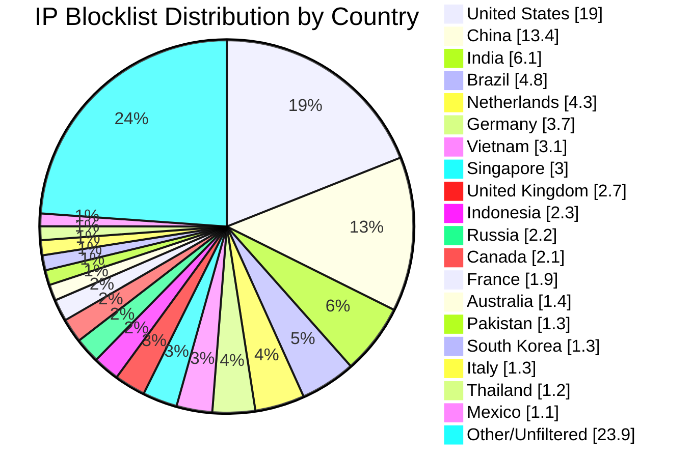

# Multi-Country IP Aggregation Statistics

**Last Updated:** 2026-07-07 10:07:44 UTC

## 📈 Country Distribution

## Overall Summary

- **Total Input IPs:** 1,208,173
- **Countries Processed:** 50
- **Combined Unique IPs:** 1,064,843
- **Combined Output File:** `aggregated-multi-50countries-combined.txt`
- **Overall Filter Rate:** 88.14%

## Per-Country Results

| Country | Code | Networks Found | Networks Optimized | IPs Matched | Filter Rate | Output File |
|---------|------|----------------|--------------------|-----------|-----------|-----------|
| United States | US | 146,470 | 144,657 | 229,670 | 19.01% | `aggregated-us-only.txt` |
| China | CN | 7,922 | 7,919 | 162,337 | 13.44% | `aggregated-cn-only.txt` |
| India | IN | 13,039 | 13,009 | 73,738 | 6.10% | `aggregated-in-only.txt` |
| Germany | DE | 29,016 | 28,930 | 45,236 | 3.74% | `aggregated-de-only.txt` |
| Russia | RU | 13,226 | 12,987 | 26,365 | 2.18% | `aggregated-ru-only.txt` |
| United Kingdom | GB | 35,133 | 34,962 | 32,635 | 2.70% | `aggregated-gb-only.txt` |
| Thailand | TH | 1,967 | 1,967 | 14,163 | 1.17% | `aggregated-th-only.txt` |
| Vietnam | VN | 2,174 | 2,174 | 37,409 | 3.10% | `aggregated-vn-only.txt` |
| South Korea | KR | 3,913 | 3,903 | 15,415 | 1.28% | `aggregated-kr-only.txt` |
| Brazil | BR | 13,073 | 13,013 | 57,803 | 4.78% | `aggregated-br-only.txt` |
| Taiwan | TW | 2,373 | 2,373 | 13,626 | 1.13% | `aggregated-tw-only.txt` |
| Canada | CA | 16,851 | 16,729 | 25,433 | 2.11% | `aggregated-ca-only.txt` |
| Singapore | SG | 9,368 | 9,358 | 36,007 | 2.98% | `aggregated-sg-only.txt` |
| Italy | IT | 9,679 | 9,655 | 15,225 | 1.26% | `aggregated-it-only.txt` |
| Netherlands | NL | 18,798 | 18,684 | 51,509 | 4.26% | `aggregated-nl-only.txt` |
| Indonesia | ID | 6,473 | 6,452 | 27,397 | 2.27% | `aggregated-id-only.txt` |
| France | FR | 32,809 | 32,782 | 22,472 | 1.86% | `aggregated-fr-only.txt` |
| Venezuela | VE | 954 | 954 | 7,339 | 0.61% | `aggregated-ve-only.txt` |
| Australia | AU | 12,084 | 12,012 | 17,263 | 1.43% | `aggregated-au-only.txt` |
| Turkey | TR | 3,428 | 3,408 | 13,358 | 1.11% | `aggregated-tr-only.txt` |
| Ukraine | UA | 5,410 | 5,355 | 8,748 | 0.72% | `aggregated-ua-only.txt` |
| Iran | IR | 2,050 | 2,049 | 4,693 | 0.39% | `aggregated-ir-only.txt` |
| Poland | PL | 8,117 | 8,083 | 8,052 | 0.67% | `aggregated-pl-only.txt` |
| Mexico | MX | 4,334 | 4,330 | 13,817 | 1.14% | `aggregated-mx-only.txt` |
| Spain | ES | 11,350 | 11,330 | 8,947 | 0.74% | `aggregated-es-only.txt` |
| Argentina | AR | 3,487 | 3,485 | 10,685 | 0.88% | `aggregated-ar-only.txt` |
| Egypt | EG | 787 | 787 | 3,260 | 0.27% | `aggregated-eg-only.txt` |
| Pakistan | PK | 1,343 | 1,341 | 15,960 | 1.32% | `aggregated-pk-only.txt` |
| Malaysia | MY | 2,535 | 2,535 | 5,705 | 0.47% | `aggregated-my-only.txt` |
| Bulgaria | BG | 2,358 | 2,347 | 2,969 | 0.25% | `aggregated-bg-only.txt` |
| Czechia | CZ | 3,597 | 3,596 | 1,873 | 0.16% | `aggregated-cz-only.txt` |
| Colombia | CO | 2,199 | 2,198 | 5,830 | 0.48% | `aggregated-co-only.txt` |
| United Arab Emirates | AE | 3,726 | 3,726 | 4,051 | 0.34% | `aggregated-ae-only.txt` |
| Romania | RO | 4,039 | 4,031 | 2,464 | 0.20% | `aggregated-ro-only.txt` |
| Kazakhstan | KZ | 1,296 | 1,295 | 2,530 | 0.21% | `aggregated-kz-only.txt` |
| Morocco | MA | 477 | 477 | 4,041 | 0.33% | `aggregated-ma-only.txt` |
| Saudi Arabia | SA | 1,647 | 1,647 | 4,322 | 0.36% | `aggregated-sa-only.txt` |
| South Africa | ZA | 3,990 | 3,976 | 7,859 | 0.65% | `aggregated-za-only.txt` |
| Bangladesh | BD | 2,621 | 2,618 | 6,534 | 0.54% | `aggregated-bd-only.txt` |
| Chile | CL | 1,911 | 1,909 | 3,197 | 0.26% | `aggregated-cl-only.txt` |
| Nigeria | NG | 1,083 | 1,083 | 1,386 | 0.11% | `aggregated-ng-only.txt` |
| Kenya | KE | 873 | 873 | 2,811 | 0.23% | `aggregated-ke-only.txt` |
| Algeria | DZ | 219 | 219 | 1,936 | 0.16% | `aggregated-dz-only.txt` |
| Serbia | RS | 973 | 971 | 1,224 | 0.10% | `aggregated-rs-only.txt` |
| Peru | PE | 1,105 | 1,104 | 1,858 | 0.15% | `aggregated-pe-only.txt` |
| Sri Lanka | LK | 248 | 248 | 860 | 0.07% | `aggregated-lk-only.txt` |
| Iraq | IQ | 682 | 682 | 2,535 | 0.21% | `aggregated-iq-only.txt` |
| Ethiopia | ET | 97 | 97 | 1,061 | 0.09% | `aggregated-et-only.txt` |
| Ghana | GH | 342 | 342 | 538 | 0.04% | `aggregated-gh-only.txt` |
| Belarus | BY | 418 | 418 | 697 | 0.06% | `aggregated-by-only.txt` |

## IP Sources

- **Source 1:** https://raw.githubusercontent.com/borestad/firehol-mirror/refs/heads/main/firehol_level1.netset
- **Source 2:** https://raw.githubusercontent.com/borestad/firehol-mirror/refs/heads/main/firehol_level2.netset
- **Source 3:** https://rules.emergingthreats.net/fwrules/emerging-Block-IPs.txt
- **Source 4:** https://feodotracker.abuse.ch/downloads/ipblocklist_recommended.txt
- **Source 5:** https://raw.githubusercontent.com/stamparm/ipsum/master/levels/2.txt
- **Source 6:** https://raw.githubusercontent.com/borestad/iplists/refs/heads/main/spamhaus/spamhaus-drop.ipv4
- **Source 7:** https://raw.githubusercontent.com/borestad/iplists/refs/heads/main/spamhaus/spamhaus-asndrop.ipv4
- **Source 8:** https://raw.githubusercontent.com/romainmarcoux/malicious-ip/refs/heads/main/full-300k-aa.txt
- **Source 9:** https://raw.githubusercontent.com/romainmarcoux/malicious-ip/refs/heads/main/full-300k-ab.txt
- **Source 10:** https://raw.githubusercontent.com/romainmarcoux/malicious-ip/refs/heads/main/full-300k-ac.txt
- **Source 11:** https://raw.githubusercontent.com/romainmarcoux/malicious-ip/refs/heads/main/full-300k-ad.txt
- **Source 12:** http://cinsscore.com/list/ci-badguys.txt
- **Source 13:** https://cdn.jsdelivr.net/gh/LittleJake/ip-blacklist/all_blacklist.txt
- **Source 14:** https://raw.githubusercontent.com/MagicTeaMC/bad-ips/refs/heads/main/bad-ips.txt
- **Source 15:** https://raw.githubusercontent.com/MagicTeaMC/MCSTORM-IP/main/mcstorm-ip.txt
- **Source 16:** https://opendbl.net/lists/blocklistde-all.list
- **Source 17:** https://raw.githubusercontent.com/bitwire-it/ipblocklist/refs/heads/main/ip-list.txt
- **Source 18:** https://raw.githubusercontent.com/sefinek/Malicious-IP-Addresses/refs/heads/main/lists/main.txt
- **Source 19:** https://raw.githubusercontent.com/borestad/firehol-mirror/refs/heads/main/firehol_level3.netset
- **Source 20:** https://raw.githubusercontent.com/borestad/firehol-mirror/refs/heads/main/firehol_level4.netset
- **Source 21:** https://raw.githubusercontent.com/borestad/firehol-mirror/refs/heads/main/firehol_webserver.netset

## Configuration Details

