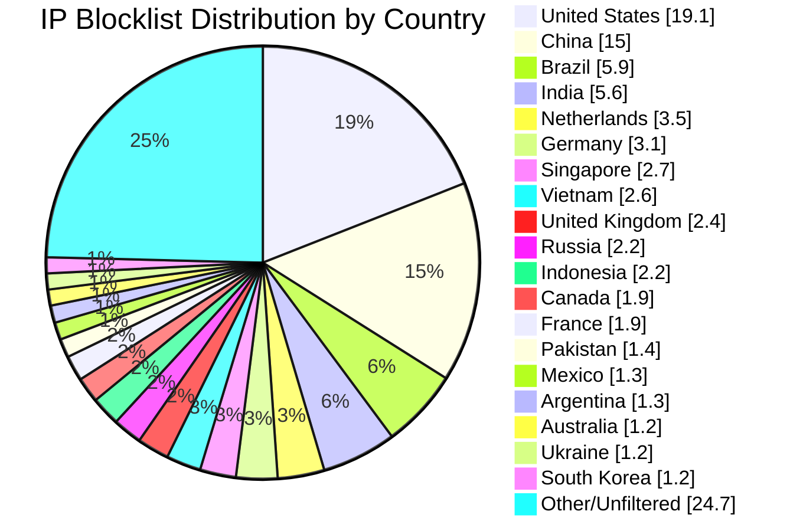

# Multi-Country IP Aggregation Statistics

**Last Updated:** 2026-09-07 12:50:36 UTC

## 📈 Country Distribution

## Overall Summary

- **Total Input IPs:** 1,505,056
- **Countries Processed:** 50
- **Combined Unique IPs:** 1,326,360
- **Combined Output File:** `aggregated-multi-50countries-combined.txt`
- **Overall Filter Rate:** 88.13%

## Per-Country Results

| Country | Code | Networks Found | Networks Optimized | IPs Matched | Filter Rate | Output File |
|---------|------|----------------|--------------------|-----------|-----------|-----------|
| United States | US | 130,282 | 128,440 | 287,276 | 19.09% | `aggregated-us-only.txt` |
| China | CN | 7,830 | 7,829 | 225,040 | 14.95% | `aggregated-cn-only.txt` |
| India | IN | 13,289 | 13,260 | 83,654 | 5.56% | `aggregated-in-only.txt` |
| Germany | DE | 29,980 | 29,865 | 46,295 | 3.08% | `aggregated-de-only.txt` |
| Russia | RU | 13,215 | 12,981 | 32,587 | 2.17% | `aggregated-ru-only.txt` |
| United Kingdom | GB | 35,923 | 35,760 | 35,621 | 2.37% | `aggregated-gb-only.txt` |
| Thailand | TH | 2,062 | 2,062 | 16,159 | 1.07% | `aggregated-th-only.txt` |
| Vietnam | VN | 2,222 | 2,222 | 39,466 | 2.62% | `aggregated-vn-only.txt` |
| South Korea | KR | 3,943 | 3,932 | 17,688 | 1.18% | `aggregated-kr-only.txt` |
| Brazil | BR | 12,586 | 12,544 | 89,313 | 5.93% | `aggregated-br-only.txt` |
| Taiwan | TW | 2,411 | 2,411 | 16,665 | 1.11% | `aggregated-tw-only.txt` |
| Canada | CA | 17,185 | 17,069 | 28,204 | 1.87% | `aggregated-ca-only.txt` |
| Singapore | SG | 9,598 | 9,588 | 40,324 | 2.68% | `aggregated-sg-only.txt` |
| Italy | IT | 9,808 | 9,786 | 17,277 | 1.15% | `aggregated-it-only.txt` |
| Netherlands | NL | 19,163 | 19,049 | 53,037 | 3.52% | `aggregated-nl-only.txt` |
| Indonesia | ID | 6,616 | 6,595 | 32,474 | 2.16% | `aggregated-id-only.txt` |
| France | FR | 33,424 | 33,396 | 27,975 | 1.86% | `aggregated-fr-only.txt` |
| Venezuela | VE | 979 | 979 | 8,278 | 0.55% | `aggregated-ve-only.txt` |
| Australia | AU | 12,309 | 12,242 | 18,163 | 1.21% | `aggregated-au-only.txt` |
| Turkey | TR | 3,540 | 3,520 | 16,540 | 1.10% | `aggregated-tr-only.txt` |
| Ukraine | UA | 5,554 | 5,509 | 17,823 | 1.18% | `aggregated-ua-only.txt` |
| Iran | IR | 2,069 | 2,068 | 5,751 | 0.38% | `aggregated-ir-only.txt` |
| Poland | PL | 8,247 | 8,218 | 8,996 | 0.60% | `aggregated-pl-only.txt` |
| Mexico | MX | 4,317 | 4,313 | 19,093 | 1.27% | `aggregated-mx-only.txt` |
| Spain | ES | 11,404 | 11,370 | 11,964 | 0.79% | `aggregated-es-only.txt` |
| Argentina | AR | 3,498 | 3,496 | 19,073 | 1.27% | `aggregated-ar-only.txt` |
| Egypt | EG | 740 | 740 | 4,089 | 0.27% | `aggregated-eg-only.txt` |
| Pakistan | PK | 1,378 | 1,377 | 20,659 | 1.37% | `aggregated-pk-only.txt` |
| Malaysia | MY | 2,615 | 2,615 | 6,944 | 0.46% | `aggregated-my-only.txt` |
| Bulgaria | BG | 2,365 | 2,351 | 3,385 | 0.22% | `aggregated-bg-only.txt` |
| Czechia | CZ | 3,696 | 3,695 | 2,194 | 0.15% | `aggregated-cz-only.txt` |
| Colombia | CO | 2,250 | 2,250 | 8,197 | 0.54% | `aggregated-co-only.txt` |
| United Arab Emirates | AE | 3,788 | 3,788 | 5,315 | 0.35% | `aggregated-ae-only.txt` |
| Romania | RO | 4,057 | 4,048 | 2,917 | 0.19% | `aggregated-ro-only.txt` |
| Kazakhstan | KZ | 1,288 | 1,287 | 3,189 | 0.21% | `aggregated-kz-only.txt` |
| Morocco | MA | 489 | 489 | 5,376 | 0.36% | `aggregated-ma-only.txt` |
| Saudi Arabia | SA | 1,723 | 1,723 | 5,853 | 0.39% | `aggregated-sa-only.txt` |
| South Africa | ZA | 4,070 | 4,056 | 10,030 | 0.67% | `aggregated-za-only.txt` |
| Bangladesh | BD | 2,713 | 2,711 | 8,860 | 0.59% | `aggregated-bd-only.txt` |
| Chile | CL | 2,001 | 1,999 | 5,683 | 0.38% | `aggregated-cl-only.txt` |
| Nigeria | NG | 1,126 | 1,126 | 1,793 | 0.12% | `aggregated-ng-only.txt` |
| Kenya | KE | 883 | 883 | 3,468 | 0.23% | `aggregated-ke-only.txt` |
| Algeria | DZ | 220 | 220 | 2,424 | 0.16% | `aggregated-dz-only.txt` |
| Serbia | RS | 1,004 | 1,004 | 1,486 | 0.10% | `aggregated-rs-only.txt` |
| Peru | PE | 1,123 | 1,122 | 2,373 | 0.16% | `aggregated-pe-only.txt` |
| Sri Lanka | LK | 252 | 252 | 1,025 | 0.07% | `aggregated-lk-only.txt` |
| Iraq | IQ | 675 | 675 | 3,275 | 0.22% | `aggregated-iq-only.txt` |
| Ethiopia | ET | 100 | 100 | 1,373 | 0.09% | `aggregated-et-only.txt` |
| Ghana | GH | 354 | 354 | 715 | 0.05% | `aggregated-gh-only.txt` |
| Belarus | BY | 424 | 424 | 1,001 | 0.07% | `aggregated-by-only.txt` |

## IP Sources

- **Source 1:** https://raw.githubusercontent.com/borestad/firehol-mirror/refs/heads/main/firehol_level1.netset
- **Source 2:** https://raw.githubusercontent.com/borestad/firehol-mirror/refs/heads/main/firehol_level2.netset
- **Source 3:** https://rules.emergingthreats.net/fwrules/emerging-Block-IPs.txt
- **Source 4:** https://feodotracker.abuse.ch/downloads/ipblocklist_recommended.txt
- **Source 5:** https://raw.githubusercontent.com/stamparm/ipsum/master/levels/2.txt
- **Source 6:** https://raw.githubusercontent.com/borestad/iplists/refs/heads/main/spamhaus/spamhaus-drop.ipv4
- **Source 7:** https://raw.githubusercontent.com/borestad/iplists/refs/heads/main/spamhaus/spamhaus-asndrop.ipv4
- **Source 8:** https://raw.githubusercontent.com/romainmarcoux/malicious-ip/refs/heads/main/full-300k-aa.txt
- **Source 9:** https://raw.githubusercontent.com/romainmarcoux/malicious-ip/refs/heads/main/full-300k-ab.txt
- **Source 10:** https://raw.githubusercontent.com/romainmarcoux/malicious-ip/refs/heads/main/full-300k-ac.txt
- **Source 11:** https://raw.githubusercontent.com/romainmarcoux/malicious-ip/refs/heads/main/full-300k-ad.txt
- **Source 12:** http://cinsscore.com/list/ci-badguys.txt
- **Source 13:** https://cdn.jsdelivr.net/gh/LittleJake/ip-blacklist/all_blacklist.txt
- **Source 14:** https://raw.githubusercontent.com/MagicTeaMC/bad-ips/refs/heads/main/bad-ips.txt
- **Source 15:** https://raw.githubusercontent.com/MagicTeaMC/MCSTORM-IP/main/mcstorm-ip.txt
- **Source 16:** https://opendbl.net/lists/blocklistde-all.list
- **Source 17:** https://raw.githubusercontent.com/bitwire-it/ipblocklist/refs/heads/main/ip-list.txt
- **Source 18:** https://raw.githubusercontent.com/sefinek/Malicious-IP-Addresses/refs/heads/main/lists/main.txt
- **Source 19:** https://raw.githubusercontent.com/borestad/firehol-mirror/refs/heads/main/firehol_level3.netset
- **Source 20:** https://raw.githubusercontent.com/borestad/firehol-mirror/refs/heads/main/firehol_level4.netset
- **Source 21:** https://raw.githubusercontent.com/borestad/firehol-mirror/refs/heads/main/firehol_webserver.netset

## Configuration Details

