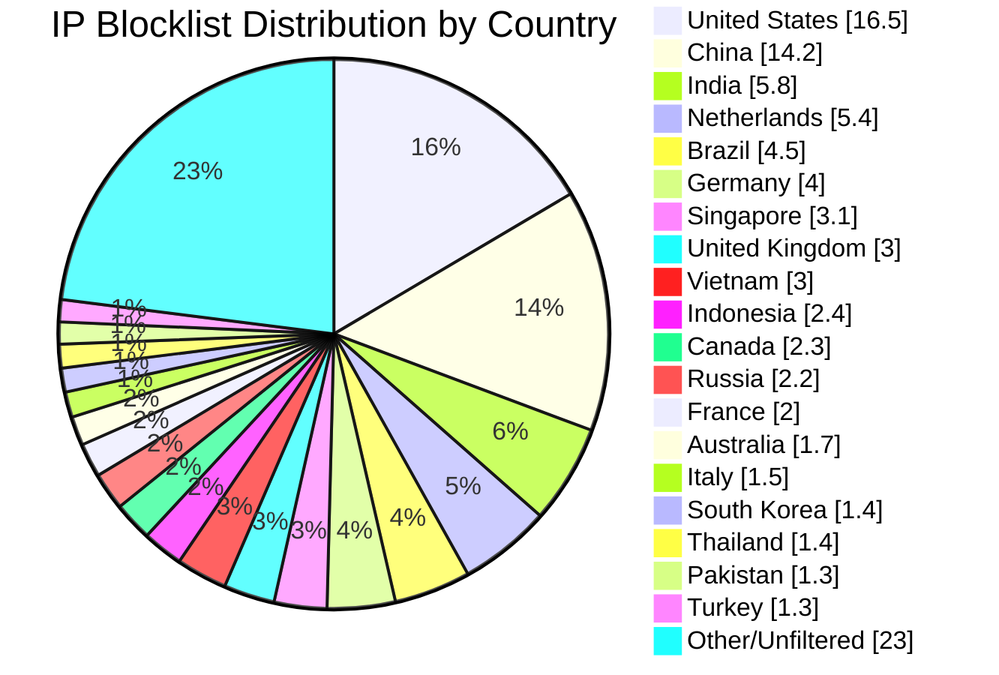

# Multi-Country IP Aggregation Statistics

**Last Updated:** 2026-05-12 02:14:03 UTC

## 📈 Country Distribution

## Overall Summary

- **Total Input IPs:** 895,275
- **Countries Processed:** 50
- **Combined Unique IPs:** 795,278
- **Combined Output File:** `aggregated-multi-50countries-combined.txt`
- **Overall Filter Rate:** 88.83%

## Per-Country Results

| Country | Code | Networks Found | Networks Optimized | IPs Matched | Filter Rate | Output File |
|---------|------|----------------|--------------------|-----------|-----------|-----------|
| United States | US | 167,975 | 166,467 | 147,808 | 16.51% | `aggregated-us-only.txt` |
| China | CN | 7,573 | 7,572 | 127,267 | 14.22% | `aggregated-cn-only.txt` |
| India | IN | 12,849 | 12,821 | 52,031 | 5.81% | `aggregated-in-only.txt` |
| Germany | DE | 28,807 | 28,725 | 35,600 | 3.98% | `aggregated-de-only.txt` |
| Russia | RU | 13,075 | 12,845 | 19,634 | 2.19% | `aggregated-ru-only.txt` |
| United Kingdom | GB | 34,028 | 33,858 | 26,681 | 2.98% | `aggregated-gb-only.txt` |
| Thailand | TH | 1,943 | 1,942 | 12,300 | 1.37% | `aggregated-th-only.txt` |
| Vietnam | VN | 2,134 | 2,134 | 26,496 | 2.96% | `aggregated-vn-only.txt` |
| South Korea | KR | 3,984 | 3,974 | 12,829 | 1.43% | `aggregated-kr-only.txt` |
| Brazil | BR | 12,903 | 12,767 | 40,676 | 4.54% | `aggregated-br-only.txt` |
| Taiwan | TW | 2,418 | 2,418 | 10,996 | 1.23% | `aggregated-tw-only.txt` |
| Canada | CA | 17,039 | 16,905 | 20,331 | 2.27% | `aggregated-ca-only.txt` |
| Singapore | SG | 9,243 | 9,233 | 27,900 | 3.12% | `aggregated-sg-only.txt` |
| Italy | IT | 9,559 | 9,535 | 13,414 | 1.50% | `aggregated-it-only.txt` |
| Netherlands | NL | 18,372 | 18,250 | 48,601 | 5.43% | `aggregated-nl-only.txt` |
| Indonesia | ID | 6,412 | 6,393 | 21,722 | 2.43% | `aggregated-id-only.txt` |
| France | FR | 32,099 | 32,073 | 18,082 | 2.02% | `aggregated-fr-only.txt` |
| Venezuela | VE | 928 | 928 | 3,942 | 0.44% | `aggregated-ve-only.txt` |
| Australia | AU | 12,110 | 12,041 | 15,067 | 1.68% | `aggregated-au-only.txt` |
| Turkey | TR | 3,410 | 3,386 | 11,239 | 1.26% | `aggregated-tr-only.txt` |
| Ukraine | UA | 5,547 | 5,492 | 7,225 | 0.81% | `aggregated-ua-only.txt` |
| Iran | IR | 2,013 | 2,012 | 3,265 | 0.36% | `aggregated-ir-only.txt` |
| Poland | PL | 8,019 | 7,988 | 5,204 | 0.58% | `aggregated-pl-only.txt` |
| Mexico | MX | 4,378 | 4,374 | 9,679 | 1.08% | `aggregated-mx-only.txt` |
| Spain | ES | 10,946 | 10,915 | 6,298 | 0.70% | `aggregated-es-only.txt` |
| Argentina | AR | 3,471 | 3,469 | 8,504 | 0.95% | `aggregated-ar-only.txt` |
| Egypt | EG | 730 | 730 | 2,642 | 0.30% | `aggregated-eg-only.txt` |
| Pakistan | PK | 1,320 | 1,320 | 11,909 | 1.33% | `aggregated-pk-only.txt` |
| Malaysia | MY | 2,480 | 2,480 | 4,821 | 0.54% | `aggregated-my-only.txt` |
| Bulgaria | BG | 2,287 | 2,277 | 2,335 | 0.26% | `aggregated-bg-only.txt` |
| Czechia | CZ | 3,600 | 3,600 | 1,407 | 0.16% | `aggregated-cz-only.txt` |
| Colombia | CO | 2,222 | 2,222 | 4,057 | 0.45% | `aggregated-co-only.txt` |
| United Arab Emirates | AE | 3,232 | 3,232 | 2,614 | 0.29% | `aggregated-ae-only.txt` |
| Romania | RO | 3,917 | 3,908 | 1,620 | 0.18% | `aggregated-ro-only.txt` |
| Kazakhstan | KZ | 1,255 | 1,254 | 1,947 | 0.22% | `aggregated-kz-only.txt` |
| Morocco | MA | 478 | 478 | 3,206 | 0.36% | `aggregated-ma-only.txt` |
| Saudi Arabia | SA | 1,630 | 1,630 | 3,486 | 0.39% | `aggregated-sa-only.txt` |
| South Africa | ZA | 3,962 | 3,949 | 4,912 | 0.55% | `aggregated-za-only.txt` |
| Bangladesh | BD | 2,615 | 2,612 | 4,299 | 0.48% | `aggregated-bd-only.txt` |
| Chile | CL | 1,885 | 1,885 | 2,255 | 0.25% | `aggregated-cl-only.txt` |
| Nigeria | NG | 1,071 | 1,071 | 1,087 | 0.12% | `aggregated-ng-only.txt` |
| Kenya | KE | 853 | 853 | 2,261 | 0.25% | `aggregated-ke-only.txt` |
| Algeria | DZ | 217 | 217 | 1,426 | 0.16% | `aggregated-dz-only.txt` |
| Serbia | RS | 951 | 949 | 906 | 0.10% | `aggregated-rs-only.txt` |
| Peru | PE | 1,103 | 1,102 | 1,286 | 0.14% | `aggregated-pe-only.txt` |
| Sri Lanka | LK | 249 | 249 | 581 | 0.06% | `aggregated-lk-only.txt` |
| Iraq | IQ | 680 | 680 | 1,503 | 0.17% | `aggregated-iq-only.txt` |
| Ethiopia | ET | 98 | 98 | 870 | 0.10% | `aggregated-et-only.txt` |
| Ghana | GH | 342 | 342 | 479 | 0.05% | `aggregated-gh-only.txt` |
| Belarus | BY | 418 | 418 | 578 | 0.06% | `aggregated-by-only.txt` |

## IP Sources

- **Source 1:** https://raw.githubusercontent.com/borestad/firehol-mirror/refs/heads/main/firehol_level1.netset
- **Source 2:** https://raw.githubusercontent.com/borestad/firehol-mirror/refs/heads/main/firehol_level2.netset
- **Source 3:** https://rules.emergingthreats.net/fwrules/emerging-Block-IPs.txt
- **Source 4:** https://feodotracker.abuse.ch/downloads/ipblocklist_recommended.txt
- **Source 5:** https://raw.githubusercontent.com/stamparm/ipsum/master/levels/2.txt
- **Source 6:** https://raw.githubusercontent.com/borestad/iplists/refs/heads/main/spamhaus/spamhaus-drop.ipv4
- **Source 7:** https://raw.githubusercontent.com/borestad/iplists/refs/heads/main/spamhaus/spamhaus-asndrop.ipv4
- **Source 8:** https://raw.githubusercontent.com/romainmarcoux/malicious-ip/refs/heads/main/full-300k-aa.txt
- **Source 9:** https://raw.githubusercontent.com/romainmarcoux/malicious-ip/refs/heads/main/full-300k-ab.txt
- **Source 10:** https://raw.githubusercontent.com/romainmarcoux/malicious-ip/refs/heads/main/full-300k-ac.txt
- **Source 11:** https://raw.githubusercontent.com/romainmarcoux/malicious-ip/refs/heads/main/full-300k-ad.txt
- **Source 12:** http://cinsscore.com/list/ci-badguys.txt
- **Source 13:** https://cdn.jsdelivr.net/gh/LittleJake/ip-blacklist/all_blacklist.txt
- **Source 14:** https://raw.githubusercontent.com/MagicTeaMC/bad-ips/refs/heads/main/bad-ips.txt
- **Source 15:** https://raw.githubusercontent.com/MagicTeaMC/MCSTORM-IP/main/mcstorm-ip.txt
- **Source 16:** https://opendbl.net/lists/blocklistde-all.list
- **Source 17:** https://raw.githubusercontent.com/bitwire-it/ipblocklist/refs/heads/main/ip-list.txt
- **Source 18:** https://raw.githubusercontent.com/borestad/firehol-mirror/refs/heads/main/firehol_level3.netset
- **Source 19:** https://raw.githubusercontent.com/borestad/firehol-mirror/refs/heads/main/ciarmy.ipset
- **Source 20:** https://raw.githubusercontent.com/borestad/firehol-mirror/refs/heads/main/firehol_level4.netset
- **Source 21:** https://opendbl.net/lists/etknown.list
- **Source 22:** https://opendbl.net/lists/tor-exit.list
- **Source 23:** https://opendbl.net/lists/bruteforce.list
- **Source 24:** https://opendbl.net/lists/dshield.list
- **Source 25:** https://opendbl.net/lists/sslblock.list

## Configuration Details

