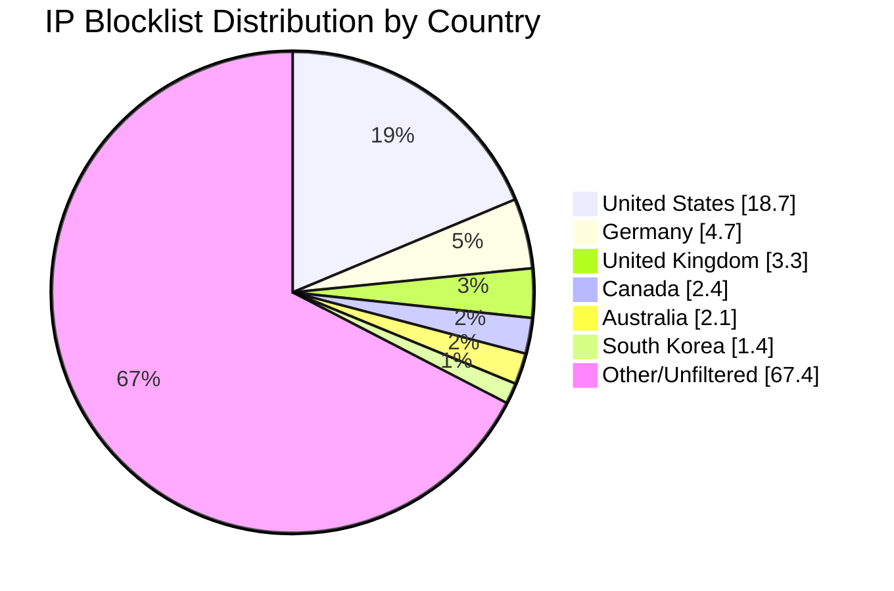

# Multi-Country IP Aggregation Statistics

**Last Updated:** 2026-05-03 04:06:18 UTC

## 📈 Country Distribution

## Overall Summary

- **Total Input IPs:** 599,776
- **Countries Processed:** 6
- **Combined Unique IPs:** 195,318
- **Combined Output File:** `aggregated-multi-6countries-combined.txt`
- **Overall Filter Rate:** 32.57%

## Per-Country Results

| Country | Code | Networks Found | Networks Optimized | IPs Matched | Filter Rate | Output File |
|---------|------|----------------|--------------------|-----------|-----------|-----------|
| United States | US | 169,198 | 167,680 | 112,389 | 18.74% | `aggregated-us-only.txt` |
| Canada | CA | 16,890 | 16,768 | 14,379 | 2.40% | `aggregated-ca-only.txt` |
| United Kingdom | GB | 33,411 | 33,252 | 19,551 | 3.26% | `aggregated-gb-only.txt` |
| Australia | AU | 11,396 | 11,317 | 12,311 | 2.05% | `aggregated-au-only.txt` |
| Germany | DE | 28,972 | 28,867 | 28,147 | 4.69% | `aggregated-de-only.txt` |
| South Korea | KR | 4,006 | 3,996 | 8,541 | 1.42% | `aggregated-kr-only.txt` |

## IP Sources

- **Source 1:** https://raw.githubusercontent.com/borestad/firehol-mirror/refs/heads/main/firehol_level1.netset
- **Source 2:** https://raw.githubusercontent.com/borestad/firehol-mirror/refs/heads/main/firehol_level2.netset
- **Source 3:** https://rules.emergingthreats.net/fwrules/emerging-Block-IPs.txt
- **Source 4:** https://raw.githubusercontent.com/borestad/blocklist-abuseipdb/main/abuseipdb-s100-30d.ipv4
- **Source 5:** https://feodotracker.abuse.ch/downloads/ipblocklist_recommended.txt
- **Source 6:** https://raw.githubusercontent.com/stamparm/ipsum/master/levels/2.txt
- **Source 7:** https://raw.githubusercontent.com/borestad/iplists/refs/heads/main/spamhaus/spamhaus-drop.ipv4
- **Source 8:** https://raw.githubusercontent.com/borestad/iplists/refs/heads/main/spamhaus/spamhaus-asndrop.ipv4
- **Source 9:** https://raw.githubusercontent.com/romainmarcoux/malicious-ip/refs/heads/main/full-300k-aa.txt
- **Source 10:** https://raw.githubusercontent.com/romainmarcoux/malicious-ip/refs/heads/main/full-300k-ab.txt
- **Source 11:** https://raw.githubusercontent.com/romainmarcoux/malicious-ip/refs/heads/main/full-300k-ac.txt
- **Source 12:** https://raw.githubusercontent.com/romainmarcoux/malicious-ip/refs/heads/main/full-300k-ad.txt
- **Source 14:** http://cinsscore.com/list/ci-badguys.txt
- **Source 15:** https://cdn.jsdelivr.net/gh/LittleJake/ip-blacklist/all_blacklist.txt
- **Source 18:** https://opendbl.net/lists/blocklistde-all.list
- **Source 22:** https://raw.githubusercontent.com/O-X-L/risk-db-lists/refs/heads/main/ip/top_100000.txt
- **Source 23:** https://raw.githubusercontent.com/borestad/firehol-mirror/refs/heads/main/firehol_level3.netset
- **Source 24:** https://raw.githubusercontent.com/borestad/firehol-mirror/refs/heads/main/firehol_abusers_1d.netset
- **Source 25:** https://raw.githubusercontent.com/borestad/firehol-mirror/refs/heads/main/ciarmy.ipset
- **Source 26:** https://raw.githubusercontent.com/borestad/firehol-mirror/refs/heads/main/firehol_level4.netset
- **Source 27:** https://raw.githubusercontent.com/elliotwutingfeng/ThreatFox-IOC-IPs/refs/heads/main/ips.txt
- **Source 28:** https://raw.githubusercontent.com/Naunter/BT_BlockLists/refs/heads/master/list_1.txt 

## Configuration Details

