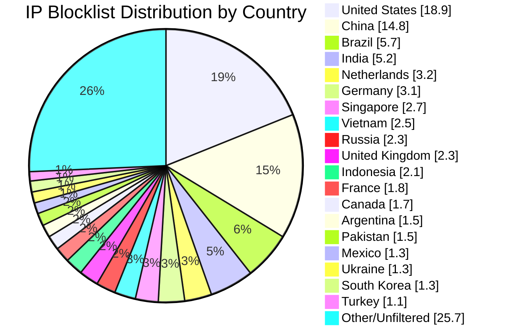

# Multi-Country IP Aggregation Statistics

**Last Updated:** 2026-09-26 16:37:19 UTC

## 📈 Country Distribution

## Overall Summary

- **Total Input IPs:** 1,748,250
- **Countries Processed:** 50
- **Combined Unique IPs:** 1,533,463
- **Combined Output File:** `aggregated-multi-50countries-combined.txt`
- **Overall Filter Rate:** 87.71%

## Per-Country Results

| Country | Code | Networks Found | Networks Optimized | IPs Matched | Filter Rate | Output File |
|---------|------|----------------|--------------------|-----------|-----------|-----------|
| United States | US | 128,919 | 127,081 | 330,062 | 18.88% | `aggregated-us-only.txt` |
| China | CN | 8,091 | 8,090 | 258,603 | 14.79% | `aggregated-cn-only.txt` |
| India | IN | 13,284 | 13,257 | 90,397 | 5.17% | `aggregated-in-only.txt` |
| Germany | DE | 29,692 | 29,583 | 53,501 | 3.06% | `aggregated-de-only.txt` |
| Russia | RU | 13,208 | 12,972 | 39,752 | 2.27% | `aggregated-ru-only.txt` |
| United Kingdom | GB | 36,037 | 35,862 | 39,442 | 2.26% | `aggregated-gb-only.txt` |
| Thailand | TH | 2,087 | 2,087 | 17,927 | 1.03% | `aggregated-th-only.txt` |
| Vietnam | VN | 2,231 | 2,231 | 43,749 | 2.50% | `aggregated-vn-only.txt` |
| South Korea | KR | 3,953 | 3,919 | 21,922 | 1.25% | `aggregated-kr-only.txt` |
| Brazil | BR | 12,549 | 12,508 | 99,632 | 5.70% | `aggregated-br-only.txt` |
| Taiwan | TW | 2,432 | 2,432 | 19,539 | 1.12% | `aggregated-tw-only.txt` |
| Canada | CA | 17,281 | 17,163 | 30,480 | 1.74% | `aggregated-ca-only.txt` |
| Singapore | SG | 9,652 | 9,642 | 47,293 | 2.71% | `aggregated-sg-only.txt` |
| Italy | IT | 9,775 | 9,761 | 19,478 | 1.11% | `aggregated-it-only.txt` |
| Netherlands | NL | 18,262 | 18,151 | 56,373 | 3.22% | `aggregated-nl-only.txt` |
| Indonesia | ID | 6,635 | 6,614 | 36,254 | 2.07% | `aggregated-id-only.txt` |
| France | FR | 33,431 | 33,402 | 32,160 | 1.84% | `aggregated-fr-only.txt` |
| Venezuela | VE | 966 | 966 | 10,278 | 0.59% | `aggregated-ve-only.txt` |
| Australia | AU | 12,686 | 12,614 | 19,028 | 1.09% | `aggregated-au-only.txt` |
| Turkey | TR | 3,535 | 3,510 | 20,083 | 1.15% | `aggregated-tr-only.txt` |
| Ukraine | UA | 5,533 | 5,492 | 22,798 | 1.30% | `aggregated-ua-only.txt` |
| Iran | IR | 2,075 | 2,074 | 6,654 | 0.38% | `aggregated-ir-only.txt` |
| Poland | PL | 8,261 | 8,231 | 10,602 | 0.61% | `aggregated-pl-only.txt` |
| Mexico | MX | 4,267 | 4,263 | 23,601 | 1.35% | `aggregated-mx-only.txt` |
| Spain | ES | 11,567 | 11,531 | 14,553 | 0.83% | `aggregated-es-only.txt` |
| Argentina | AR | 3,494 | 3,492 | 26,791 | 1.53% | `aggregated-ar-only.txt` |
| Egypt | EG | 743 | 743 | 5,065 | 0.29% | `aggregated-eg-only.txt` |
| Pakistan | PK | 1,373 | 1,372 | 25,432 | 1.45% | `aggregated-pk-only.txt` |
| Malaysia | MY | 2,600 | 2,600 | 7,935 | 0.45% | `aggregated-my-only.txt` |
| Bulgaria | BG | 2,371 | 2,361 | 3,868 | 0.22% | `aggregated-bg-only.txt` |
| Czechia | CZ | 3,722 | 3,721 | 2,431 | 0.14% | `aggregated-cz-only.txt` |
| Colombia | CO | 2,254 | 2,254 | 10,883 | 0.62% | `aggregated-co-only.txt` |
| United Arab Emirates | AE | 3,804 | 3,804 | 6,279 | 0.36% | `aggregated-ae-only.txt` |
| Romania | RO | 4,081 | 4,072 | 3,496 | 0.20% | `aggregated-ro-only.txt` |
| Kazakhstan | KZ | 1,313 | 1,310 | 4,175 | 0.24% | `aggregated-kz-only.txt` |
| Morocco | MA | 491 | 491 | 6,968 | 0.40% | `aggregated-ma-only.txt` |
| Saudi Arabia | SA | 1,720 | 1,720 | 6,777 | 0.39% | `aggregated-sa-only.txt` |
| South Africa | ZA | 4,109 | 4,095 | 12,389 | 0.71% | `aggregated-za-only.txt` |
| Bangladesh | BD | 2,721 | 2,719 | 13,135 | 0.75% | `aggregated-bd-only.txt` |
| Chile | CL | 1,957 | 1,955 | 8,481 | 0.49% | `aggregated-cl-only.txt` |
| Nigeria | NG | 1,126 | 1,126 | 2,652 | 0.15% | `aggregated-ng-only.txt` |
| Kenya | KE | 891 | 891 | 4,325 | 0.25% | `aggregated-ke-only.txt` |
| Algeria | DZ | 220 | 220 | 3,252 | 0.19% | `aggregated-dz-only.txt` |
| Serbia | RS | 1,007 | 1,005 | 1,837 | 0.11% | `aggregated-rs-only.txt` |
| Peru | PE | 1,121 | 1,120 | 3,006 | 0.17% | `aggregated-pe-only.txt` |
| Sri Lanka | LK | 253 | 253 | 1,159 | 0.07% | `aggregated-lk-only.txt` |
| Iraq | IQ | 666 | 666 | 4,950 | 0.28% | `aggregated-iq-only.txt` |
| Ethiopia | ET | 100 | 100 | 1,749 | 0.10% | `aggregated-et-only.txt` |
| Ghana | GH | 352 | 352 | 849 | 0.05% | `aggregated-gh-only.txt` |
| Belarus | BY | 427 | 427 | 1,418 | 0.08% | `aggregated-by-only.txt` |

## IP Sources

- **Source 1:** https://raw.githubusercontent.com/borestad/firehol-mirror/refs/heads/main/firehol_level1.netset
- **Source 2:** https://raw.githubusercontent.com/borestad/firehol-mirror/refs/heads/main/firehol_level2.netset
- **Source 3:** https://rules.emergingthreats.net/fwrules/emerging-Block-IPs.txt
- **Source 4:** https://feodotracker.abuse.ch/downloads/ipblocklist_recommended.txt
- **Source 5:** https://raw.githubusercontent.com/stamparm/ipsum/master/levels/2.txt
- **Source 6:** https://raw.githubusercontent.com/borestad/iplists/refs/heads/main/spamhaus/spamhaus-drop.ipv4
- **Source 7:** https://raw.githubusercontent.com/borestad/iplists/refs/heads/main/spamhaus/spamhaus-asndrop.ipv4
- **Source 8:** https://raw.githubusercontent.com/romainmarcoux/malicious-ip/refs/heads/main/full-300k-aa.txt
- **Source 9:** https://raw.githubusercontent.com/romainmarcoux/malicious-ip/refs/heads/main/full-300k-ab.txt
- **Source 10:** https://raw.githubusercontent.com/romainmarcoux/malicious-ip/refs/heads/main/full-300k-ac.txt
- **Source 11:** https://raw.githubusercontent.com/romainmarcoux/malicious-ip/refs/heads/main/full-300k-ad.txt
- **Source 12:** http://cinsscore.com/list/ci-badguys.txt
- **Source 13:** https://cdn.jsdelivr.net/gh/LittleJake/ip-blacklist/all_blacklist.txt
- **Source 14:** https://raw.githubusercontent.com/MagicTeaMC/bad-ips/refs/heads/main/bad-ips.txt
- **Source 15:** https://raw.githubusercontent.com/MagicTeaMC/MCSTORM-IP/main/mcstorm-ip.txt
- **Source 16:** https://opendbl.net/lists/blocklistde-all.list
- **Source 17:** https://raw.githubusercontent.com/bitwire-it/ipblocklist/refs/heads/main/ip-list.txt
- **Source 18:** https://raw.githubusercontent.com/sefinek/Malicious-IP-Addresses/refs/heads/main/lists/main.txt
- **Source 19:** https://raw.githubusercontent.com/borestad/firehol-mirror/refs/heads/main/firehol_level3.netset
- **Source 20:** https://raw.githubusercontent.com/borestad/firehol-mirror/refs/heads/main/firehol_level4.netset
- **Source 21:** https://raw.githubusercontent.com/borestad/firehol-mirror/refs/heads/main/firehol_webserver.netset

## Configuration Details

