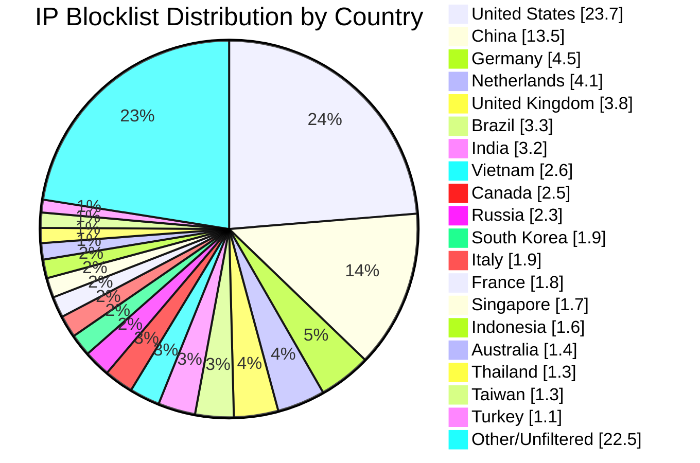

# Multi-Country IP Aggregation Statistics

**Last Updated:** 2026-05-13 07:30:05 UTC

## 📈 Country Distribution

## Overall Summary

- **Total Input IPs:** 897,947
- **Countries Processed:** 50
- **Combined Unique IPs:** 786,715
- **Combined Output File:** `aggregated-multi-50countries-combined.txt`
- **Overall Filter Rate:** 87.61%

## Per-Country Results

| Country | Code | Networks Found | Networks Optimized | IPs Matched | Filter Rate | Output File |
|---------|------|----------------|--------------------|-----------|-----------|-----------|
| United States | US | 167,975 | 166,467 | 212,562 | 23.67% | `aggregated-us-only.txt` |
| China | CN | 7,573 | 7,572 | 121,520 | 13.53% | `aggregated-cn-only.txt` |
| India | IN | 12,849 | 12,821 | 28,512 | 3.18% | `aggregated-in-only.txt` |
| Germany | DE | 28,807 | 28,725 | 40,236 | 4.48% | `aggregated-de-only.txt` |
| Russia | RU | 13,075 | 12,845 | 20,833 | 2.32% | `aggregated-ru-only.txt` |
| United Kingdom | GB | 34,028 | 33,858 | 34,151 | 3.80% | `aggregated-gb-only.txt` |
| Thailand | TH | 1,943 | 1,942 | 11,919 | 1.33% | `aggregated-th-only.txt` |
| Vietnam | VN | 2,134 | 2,134 | 23,761 | 2.65% | `aggregated-vn-only.txt` |
| South Korea | KR | 3,984 | 3,974 | 17,391 | 1.94% | `aggregated-kr-only.txt` |
| Brazil | BR | 12,903 | 12,767 | 29,483 | 3.28% | `aggregated-br-only.txt` |
| Taiwan | TW | 2,418 | 2,418 | 11,765 | 1.31% | `aggregated-tw-only.txt` |
| Canada | CA | 17,039 | 16,905 | 22,119 | 2.46% | `aggregated-ca-only.txt` |
| Singapore | SG | 9,243 | 9,233 | 15,435 | 1.72% | `aggregated-sg-only.txt` |
| Italy | IT | 9,559 | 9,535 | 16,674 | 1.86% | `aggregated-it-only.txt` |
| Netherlands | NL | 18,372 | 18,250 | 36,891 | 4.11% | `aggregated-nl-only.txt` |
| Indonesia | ID | 6,412 | 6,393 | 14,328 | 1.60% | `aggregated-id-only.txt` |
| France | FR | 32,099 | 32,073 | 15,794 | 1.76% | `aggregated-fr-only.txt` |
| Venezuela | VE | 928 | 928 | 2,909 | 0.32% | `aggregated-ve-only.txt` |
| Australia | AU | 12,110 | 12,041 | 12,506 | 1.39% | `aggregated-au-only.txt` |
| Turkey | TR | 3,410 | 3,386 | 9,649 | 1.07% | `aggregated-tr-only.txt` |
| Ukraine | UA | 5,547 | 5,492 | 6,931 | 0.77% | `aggregated-ua-only.txt` |
| Iran | IR | 2,013 | 2,012 | 2,596 | 0.29% | `aggregated-ir-only.txt` |
| Poland | PL | 8,019 | 7,988 | 5,982 | 0.67% | `aggregated-pl-only.txt` |
| Mexico | MX | 4,378 | 4,374 | 8,884 | 0.99% | `aggregated-mx-only.txt` |
| Spain | ES | 10,946 | 10,915 | 6,773 | 0.75% | `aggregated-es-only.txt` |
| Argentina | AR | 3,471 | 3,469 | 7,158 | 0.80% | `aggregated-ar-only.txt` |
| Egypt | EG | 730 | 730 | 2,365 | 0.26% | `aggregated-eg-only.txt` |
| Pakistan | PK | 1,320 | 1,320 | 7,860 | 0.88% | `aggregated-pk-only.txt` |
| Malaysia | MY | 2,480 | 2,480 | 3,852 | 0.43% | `aggregated-my-only.txt` |
| Bulgaria | BG | 2,287 | 2,277 | 2,094 | 0.23% | `aggregated-bg-only.txt` |
| Czechia | CZ | 3,600 | 3,600 | 2,367 | 0.26% | `aggregated-cz-only.txt` |
| Colombia | CO | 2,222 | 2,222 | 3,362 | 0.37% | `aggregated-co-only.txt` |
| United Arab Emirates | AE | 3,232 | 3,232 | 2,940 | 0.33% | `aggregated-ae-only.txt` |
| Romania | RO | 3,917 | 3,908 | 1,844 | 0.21% | `aggregated-ro-only.txt` |
| Kazakhstan | KZ | 1,255 | 1,254 | 2,312 | 0.26% | `aggregated-kz-only.txt` |
| Morocco | MA | 478 | 478 | 3,009 | 0.34% | `aggregated-ma-only.txt` |
| Saudi Arabia | SA | 1,630 | 1,630 | 3,408 | 0.38% | `aggregated-sa-only.txt` |
| South Africa | ZA | 3,962 | 3,949 | 2,335 | 0.26% | `aggregated-za-only.txt` |
| Bangladesh | BD | 2,615 | 2,612 | 1,565 | 0.17% | `aggregated-bd-only.txt` |
| Chile | CL | 1,885 | 1,885 | 1,888 | 0.21% | `aggregated-cl-only.txt` |
| Nigeria | NG | 1,071 | 1,071 | 546 | 0.06% | `aggregated-ng-only.txt` |
| Kenya | KE | 853 | 853 | 1,571 | 0.17% | `aggregated-ke-only.txt` |
| Algeria | DZ | 217 | 217 | 1,370 | 0.15% | `aggregated-dz-only.txt` |
| Serbia | RS | 951 | 949 | 1,005 | 0.11% | `aggregated-rs-only.txt` |
| Peru | PE | 1,103 | 1,102 | 1,078 | 0.12% | `aggregated-pe-only.txt` |
| Sri Lanka | LK | 249 | 249 | 762 | 0.08% | `aggregated-lk-only.txt` |
| Iraq | IQ | 680 | 680 | 800 | 0.09% | `aggregated-iq-only.txt` |
| Ethiopia | ET | 98 | 98 | 828 | 0.09% | `aggregated-et-only.txt` |
| Ghana | GH | 342 | 342 | 431 | 0.05% | `aggregated-gh-only.txt` |
| Belarus | BY | 418 | 418 | 361 | 0.04% | `aggregated-by-only.txt` |

## IP Sources

- **Source 1:** https://raw.githubusercontent.com/borestad/firehol-mirror/refs/heads/main/firehol_level1.netset
- **Source 2:** https://raw.githubusercontent.com/borestad/firehol-mirror/refs/heads/main/firehol_level2.netset
- **Source 3:** https://rules.emergingthreats.net/fwrules/emerging-Block-IPs.txt
- **Source 4:** https://feodotracker.abuse.ch/downloads/ipblocklist_recommended.txt
- **Source 5:** https://raw.githubusercontent.com/stamparm/ipsum/master/levels/2.txt
- **Source 6:** https://raw.githubusercontent.com/borestad/iplists/refs/heads/main/spamhaus/spamhaus-drop.ipv4
- **Source 7:** https://raw.githubusercontent.com/borestad/iplists/refs/heads/main/spamhaus/spamhaus-asndrop.ipv4
- **Source 8:** https://raw.githubusercontent.com/romainmarcoux/malicious-ip/refs/heads/main/full-300k-aa.txt
- **Source 9:** https://raw.githubusercontent.com/romainmarcoux/malicious-ip/refs/heads/main/full-300k-ab.txt
- **Source 10:** https://raw.githubusercontent.com/romainmarcoux/malicious-ip/refs/heads/main/full-300k-ac.txt
- **Source 11:** https://raw.githubusercontent.com/romainmarcoux/malicious-ip/refs/heads/main/full-300k-ad.txt
- **Source 12:** http://cinsscore.com/list/ci-badguys.txt
- **Source 13:** https://cdn.jsdelivr.net/gh/LittleJake/ip-blacklist/all_blacklist.txt
- **Source 14:** https://raw.githubusercontent.com/MagicTeaMC/bad-ips/refs/heads/main/bad-ips.txt
- **Source 15:** https://raw.githubusercontent.com/MagicTeaMC/MCSTORM-IP/main/mcstorm-ip.txt
- **Source 16:** https://opendbl.net/lists/blocklistde-all.list
- **Source 17:** https://raw.githubusercontent.com/bitwire-it/ipblocklist/refs/heads/main/ip-list.txt
- **Source 18:** https://raw.githubusercontent.com/actuallymentor/bluetack-ip-blacklist-generator/refs/heads/master/blacklist
- **Source 19:** https://raw.githubusercontent.com/borestad/firehol-mirror/refs/heads/main/firehol_level3.netset
- **Source 20:** https://raw.githubusercontent.com/borestad/firehol-mirror/refs/heads/main/firehol_level4.netset
- **Source 21:** https://opendbl.net/lists/etknown.list
- **Source 22:** https://opendbl.net/lists/tor-exit.list
- **Source 23:** https://opendbl.net/lists/bruteforce.list
- **Source 24:** https://opendbl.net/lists/dshield.list
- **Source 25:** https://opendbl.net/lists/sslblock.list

## Configuration Details

