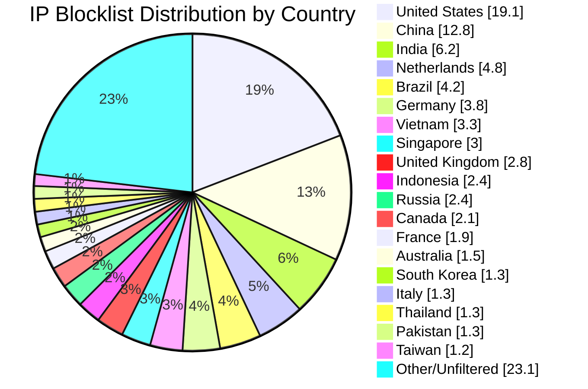

# Multi-Country IP Aggregation Statistics

**Last Updated:** 2026-05-18 08:53:58 UTC

## 📈 Country Distribution

## Overall Summary

- **Total Input IPs:** 1,061,815
- **Countries Processed:** 50
- **Combined Unique IPs:** 940,238
- **Combined Output File:** `aggregated-multi-50countries-combined.txt`
- **Overall Filter Rate:** 88.55%

## Per-Country Results

| Country | Code | Networks Found | Networks Optimized | IPs Matched | Filter Rate | Output File |
|---------|------|----------------|--------------------|-----------|-----------|-----------|
| United States | US | 167,217 | 165,713 | 203,322 | 19.15% | `aggregated-us-only.txt` |
| China | CN | 7,572 | 7,571 | 136,367 | 12.84% | `aggregated-cn-only.txt` |
| India | IN | 12,832 | 12,801 | 65,889 | 6.21% | `aggregated-in-only.txt` |
| Germany | DE | 28,842 | 28,762 | 39,884 | 3.76% | `aggregated-de-only.txt` |
| Russia | RU | 13,087 | 12,857 | 25,112 | 2.37% | `aggregated-ru-only.txt` |
| United Kingdom | GB | 33,930 | 33,764 | 30,228 | 2.85% | `aggregated-gb-only.txt` |
| Thailand | TH | 1,936 | 1,935 | 13,609 | 1.28% | `aggregated-th-only.txt` |
| Vietnam | VN | 2,142 | 2,142 | 35,533 | 3.35% | `aggregated-vn-only.txt` |
| South Korea | KR | 3,976 | 3,966 | 14,324 | 1.35% | `aggregated-kr-only.txt` |
| Brazil | BR | 13,022 | 12,952 | 44,119 | 4.16% | `aggregated-br-only.txt` |
| Taiwan | TW | 2,417 | 2,417 | 13,019 | 1.23% | `aggregated-tw-only.txt` |
| Canada | CA | 17,079 | 16,951 | 22,814 | 2.15% | `aggregated-ca-only.txt` |
| Singapore | SG | 9,249 | 9,239 | 32,315 | 3.04% | `aggregated-sg-only.txt` |
| Italy | IT | 9,537 | 9,513 | 13,882 | 1.31% | `aggregated-it-only.txt` |
| Netherlands | NL | 18,516 | 18,392 | 50,953 | 4.80% | `aggregated-nl-only.txt` |
| Indonesia | ID | 6,418 | 6,397 | 25,316 | 2.38% | `aggregated-id-only.txt` |
| France | FR | 32,086 | 32,060 | 20,116 | 1.89% | `aggregated-fr-only.txt` |
| Venezuela | VE | 924 | 924 | 6,492 | 0.61% | `aggregated-ve-only.txt` |
| Australia | AU | 12,099 | 12,029 | 15,859 | 1.49% | `aggregated-au-only.txt` |
| Turkey | TR | 3,406 | 3,380 | 12,376 | 1.17% | `aggregated-tr-only.txt` |
| Ukraine | UA | 5,551 | 5,496 | 8,082 | 0.76% | `aggregated-ua-only.txt` |
| Iran | IR | 2,016 | 2,015 | 3,941 | 0.37% | `aggregated-ir-only.txt` |
| Poland | PL | 8,036 | 8,005 | 7,463 | 0.70% | `aggregated-pl-only.txt` |
| Mexico | MX | 4,410 | 4,406 | 10,579 | 1.00% | `aggregated-mx-only.txt` |
| Spain | ES | 11,163 | 11,132 | 7,616 | 0.72% | `aggregated-es-only.txt` |
| Argentina | AR | 3,467 | 3,465 | 8,985 | 0.85% | `aggregated-ar-only.txt` |
| Egypt | EG | 716 | 716 | 2,732 | 0.26% | `aggregated-eg-only.txt` |
| Pakistan | PK | 1,319 | 1,319 | 13,405 | 1.26% | `aggregated-pk-only.txt` |
| Malaysia | MY | 2,492 | 2,492 | 5,228 | 0.49% | `aggregated-my-only.txt` |
| Bulgaria | BG | 2,275 | 2,265 | 2,748 | 0.26% | `aggregated-bg-only.txt` |
| Czechia | CZ | 3,605 | 3,604 | 1,683 | 0.16% | `aggregated-cz-only.txt` |
| Colombia | CO | 2,207 | 2,207 | 4,492 | 0.42% | `aggregated-co-only.txt` |
| United Arab Emirates | AE | 3,233 | 3,233 | 3,398 | 0.32% | `aggregated-ae-only.txt` |
| Romania | RO | 3,924 | 3,915 | 2,093 | 0.20% | `aggregated-ro-only.txt` |
| Kazakhstan | KZ | 1,259 | 1,258 | 2,322 | 0.22% | `aggregated-kz-only.txt` |
| Morocco | MA | 475 | 475 | 3,436 | 0.32% | `aggregated-ma-only.txt` |
| Saudi Arabia | SA | 1,623 | 1,623 | 3,765 | 0.35% | `aggregated-sa-only.txt` |
| South Africa | ZA | 3,965 | 3,952 | 6,888 | 0.65% | `aggregated-za-only.txt` |
| Bangladesh | BD | 2,614 | 2,609 | 5,230 | 0.49% | `aggregated-bd-only.txt` |
| Chile | CL | 1,886 | 1,886 | 2,384 | 0.22% | `aggregated-cl-only.txt` |
| Nigeria | NG | 1,072 | 1,072 | 1,125 | 0.11% | `aggregated-ng-only.txt` |
| Kenya | KE | 855 | 855 | 2,425 | 0.23% | `aggregated-ke-only.txt` |
| Algeria | DZ | 217 | 217 | 1,573 | 0.15% | `aggregated-dz-only.txt` |
| Serbia | RS | 945 | 943 | 1,008 | 0.09% | `aggregated-rs-only.txt` |
| Peru | PE | 1,093 | 1,092 | 1,507 | 0.14% | `aggregated-pe-only.txt` |
| Sri Lanka | LK | 247 | 247 | 627 | 0.06% | `aggregated-lk-only.txt` |
| Iraq | IQ | 682 | 682 | 1,894 | 0.18% | `aggregated-iq-only.txt` |
| Ethiopia | ET | 98 | 98 | 898 | 0.08% | `aggregated-et-only.txt` |
| Ghana | GH | 341 | 341 | 499 | 0.05% | `aggregated-gh-only.txt` |
| Belarus | BY | 418 | 418 | 683 | 0.06% | `aggregated-by-only.txt` |

## IP Sources

- **Source 1:** https://raw.githubusercontent.com/borestad/firehol-mirror/refs/heads/main/firehol_level1.netset
- **Source 2:** https://raw.githubusercontent.com/borestad/firehol-mirror/refs/heads/main/firehol_level2.netset
- **Source 3:** https://rules.emergingthreats.net/fwrules/emerging-Block-IPs.txt
- **Source 4:** https://feodotracker.abuse.ch/downloads/ipblocklist_recommended.txt
- **Source 5:** https://raw.githubusercontent.com/stamparm/ipsum/master/levels/2.txt
- **Source 6:** https://raw.githubusercontent.com/borestad/iplists/refs/heads/main/spamhaus/spamhaus-drop.ipv4
- **Source 7:** https://raw.githubusercontent.com/borestad/iplists/refs/heads/main/spamhaus/spamhaus-asndrop.ipv4
- **Source 8:** https://raw.githubusercontent.com/romainmarcoux/malicious-ip/refs/heads/main/full-300k-aa.txt
- **Source 9:** https://raw.githubusercontent.com/romainmarcoux/malicious-ip/refs/heads/main/full-300k-ab.txt
- **Source 10:** https://raw.githubusercontent.com/romainmarcoux/malicious-ip/refs/heads/main/full-300k-ac.txt
- **Source 11:** https://raw.githubusercontent.com/romainmarcoux/malicious-ip/refs/heads/main/full-300k-ad.txt
- **Source 12:** http://cinsscore.com/list/ci-badguys.txt
- **Source 13:** https://cdn.jsdelivr.net/gh/LittleJake/ip-blacklist/all_blacklist.txt
- **Source 14:** https://raw.githubusercontent.com/MagicTeaMC/bad-ips/refs/heads/main/bad-ips.txt
- **Source 15:** https://raw.githubusercontent.com/MagicTeaMC/MCSTORM-IP/main/mcstorm-ip.txt
- **Source 16:** https://opendbl.net/lists/blocklistde-all.list
- **Source 17:** https://raw.githubusercontent.com/bitwire-it/ipblocklist/refs/heads/main/ip-list.txt
- **Source 18:** https://raw.githubusercontent.com/sefinek/Malicious-IP-Addresses/refs/heads/main/lists/main.txt
- **Source 19:** https://raw.githubusercontent.com/borestad/firehol-mirror/refs/heads/main/firehol_level3.netset
- **Source 20:** https://raw.githubusercontent.com/borestad/firehol-mirror/refs/heads/main/firehol_level4.netset
- **Source 21:** https://raw.githubusercontent.com/borestad/firehol-mirror/refs/heads/main/firehol_webserver.netset

## Configuration Details

