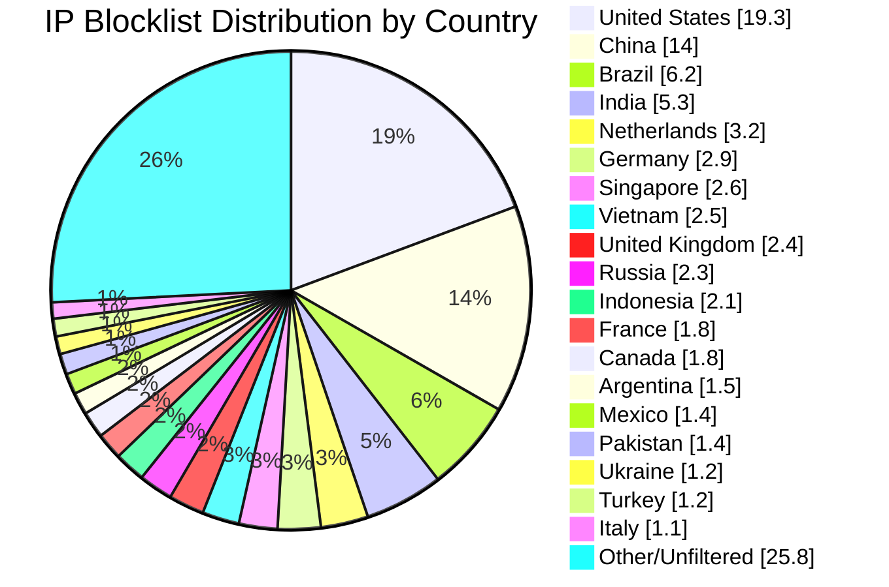

# Multi-Country IP Aggregation Statistics

**Last Updated:** 2026-09-13 05:01:16 UTC

## 📈 Country Distribution

## Overall Summary

- **Total Input IPs:** 1,719,335
- **Countries Processed:** 50
- **Combined Unique IPs:** 1,508,017
- **Combined Output File:** `aggregated-multi-50countries-combined.txt`
- **Overall Filter Rate:** 87.71%

## Per-Country Results

| Country | Code | Networks Found | Networks Optimized | IPs Matched | Filter Rate | Output File |
|---------|------|----------------|--------------------|-----------|-----------|-----------|
| United States | US | 130,348 | 128,515 | 332,382 | 19.33% | `aggregated-us-only.txt` |
| China | CN | 7,851 | 7,850 | 240,677 | 14.00% | `aggregated-cn-only.txt` |
| India | IN | 13,311 | 13,284 | 90,645 | 5.27% | `aggregated-in-only.txt` |
| Germany | DE | 29,911 | 29,797 | 50,172 | 2.92% | `aggregated-de-only.txt` |
| Russia | RU | 13,230 | 12,992 | 38,757 | 2.25% | `aggregated-ru-only.txt` |
| United Kingdom | GB | 36,372 | 36,194 | 40,524 | 2.36% | `aggregated-gb-only.txt` |
| Thailand | TH | 2,066 | 2,066 | 17,593 | 1.02% | `aggregated-th-only.txt` |
| Vietnam | VN | 2,228 | 2,228 | 43,397 | 2.52% | `aggregated-vn-only.txt` |
| South Korea | KR | 3,952 | 3,918 | 19,163 | 1.11% | `aggregated-kr-only.txt` |
| Brazil | BR | 12,599 | 12,560 | 105,894 | 6.16% | `aggregated-br-only.txt` |
| Taiwan | TW | 2,440 | 2,440 | 18,592 | 1.08% | `aggregated-tw-only.txt` |
| Canada | CA | 17,287 | 17,169 | 30,541 | 1.78% | `aggregated-ca-only.txt` |
| Singapore | SG | 9,639 | 9,629 | 44,242 | 2.57% | `aggregated-sg-only.txt` |
| Italy | IT | 9,764 | 9,750 | 19,690 | 1.15% | `aggregated-it-only.txt` |
| Netherlands | NL | 19,077 | 18,965 | 55,039 | 3.20% | `aggregated-nl-only.txt` |
| Indonesia | ID | 6,619 | 6,598 | 36,339 | 2.11% | `aggregated-id-only.txt` |
| France | FR | 33,419 | 33,391 | 31,470 | 1.83% | `aggregated-fr-only.txt` |
| Venezuela | VE | 977 | 977 | 10,497 | 0.61% | `aggregated-ve-only.txt` |
| Australia | AU | 12,330 | 12,258 | 18,744 | 1.09% | `aggregated-au-only.txt` |
| Turkey | TR | 3,534 | 3,510 | 20,847 | 1.21% | `aggregated-tr-only.txt` |
| Ukraine | UA | 5,514 | 5,473 | 21,418 | 1.25% | `aggregated-ua-only.txt` |
| Iran | IR | 2,077 | 2,076 | 6,407 | 0.37% | `aggregated-ir-only.txt` |
| Poland | PL | 8,255 | 8,225 | 10,623 | 0.62% | `aggregated-pl-only.txt` |
| Mexico | MX | 4,258 | 4,254 | 23,629 | 1.37% | `aggregated-mx-only.txt` |
| Spain | ES | 11,463 | 11,426 | 14,494 | 0.84% | `aggregated-es-only.txt` |
| Argentina | AR | 3,510 | 3,508 | 26,136 | 1.52% | `aggregated-ar-only.txt` |
| Egypt | EG | 738 | 738 | 5,413 | 0.31% | `aggregated-eg-only.txt` |
| Pakistan | PK | 1,375 | 1,374 | 23,456 | 1.36% | `aggregated-pk-only.txt` |
| Malaysia | MY | 2,615 | 2,615 | 7,828 | 0.46% | `aggregated-my-only.txt` |
| Bulgaria | BG | 2,373 | 2,363 | 3,803 | 0.22% | `aggregated-bg-only.txt` |
| Czechia | CZ | 3,716 | 3,715 | 2,570 | 0.15% | `aggregated-cz-only.txt` |
| Colombia | CO | 2,251 | 2,251 | 11,110 | 0.65% | `aggregated-co-only.txt` |
| United Arab Emirates | AE | 3,786 | 3,786 | 6,377 | 0.37% | `aggregated-ae-only.txt` |
| Romania | RO | 4,052 | 4,043 | 3,229 | 0.19% | `aggregated-ro-only.txt` |
| Kazakhstan | KZ | 1,312 | 1,309 | 3,992 | 0.23% | `aggregated-kz-only.txt` |
| Morocco | MA | 490 | 490 | 7,459 | 0.43% | `aggregated-ma-only.txt` |
| Saudi Arabia | SA | 1,722 | 1,722 | 7,712 | 0.45% | `aggregated-sa-only.txt` |
| South Africa | ZA | 4,107 | 4,093 | 12,274 | 0.71% | `aggregated-za-only.txt` |
| Bangladesh | BD | 2,719 | 2,717 | 11,530 | 0.67% | `aggregated-bd-only.txt` |
| Chile | CL | 1,959 | 1,957 | 8,522 | 0.50% | `aggregated-cl-only.txt` |
| Nigeria | NG | 1,126 | 1,126 | 2,409 | 0.14% | `aggregated-ng-only.txt` |
| Kenya | KE | 888 | 888 | 4,420 | 0.26% | `aggregated-ke-only.txt` |
| Algeria | DZ | 220 | 220 | 3,373 | 0.20% | `aggregated-dz-only.txt` |
| Serbia | RS | 1,005 | 1,003 | 1,824 | 0.11% | `aggregated-rs-only.txt` |
| Peru | PE | 1,124 | 1,123 | 2,970 | 0.17% | `aggregated-pe-only.txt` |
| Sri Lanka | LK | 253 | 253 | 1,146 | 0.07% | `aggregated-lk-only.txt` |
| Iraq | IQ | 676 | 676 | 4,541 | 0.26% | `aggregated-iq-only.txt` |
| Ethiopia | ET | 100 | 100 | 1,835 | 0.11% | `aggregated-et-only.txt` |
| Ghana | GH | 352 | 352 | 824 | 0.05% | `aggregated-gh-only.txt` |
| Belarus | BY | 426 | 426 | 1,488 | 0.09% | `aggregated-by-only.txt` |

## IP Sources

- **Source 1:** https://raw.githubusercontent.com/borestad/firehol-mirror/refs/heads/main/firehol_level1.netset
- **Source 2:** https://raw.githubusercontent.com/borestad/firehol-mirror/refs/heads/main/firehol_level2.netset
- **Source 3:** https://rules.emergingthreats.net/fwrules/emerging-Block-IPs.txt
- **Source 4:** https://feodotracker.abuse.ch/downloads/ipblocklist_recommended.txt
- **Source 5:** https://raw.githubusercontent.com/stamparm/ipsum/master/levels/2.txt
- **Source 6:** https://raw.githubusercontent.com/borestad/iplists/refs/heads/main/spamhaus/spamhaus-drop.ipv4
- **Source 7:** https://raw.githubusercontent.com/borestad/iplists/refs/heads/main/spamhaus/spamhaus-asndrop.ipv4
- **Source 8:** https://raw.githubusercontent.com/romainmarcoux/malicious-ip/refs/heads/main/full-300k-aa.txt
- **Source 9:** https://raw.githubusercontent.com/romainmarcoux/malicious-ip/refs/heads/main/full-300k-ab.txt
- **Source 10:** https://raw.githubusercontent.com/romainmarcoux/malicious-ip/refs/heads/main/full-300k-ac.txt
- **Source 11:** https://raw.githubusercontent.com/romainmarcoux/malicious-ip/refs/heads/main/full-300k-ad.txt
- **Source 12:** http://cinsscore.com/list/ci-badguys.txt
- **Source 13:** https://cdn.jsdelivr.net/gh/LittleJake/ip-blacklist/all_blacklist.txt
- **Source 14:** https://raw.githubusercontent.com/MagicTeaMC/bad-ips/refs/heads/main/bad-ips.txt
- **Source 15:** https://raw.githubusercontent.com/MagicTeaMC/MCSTORM-IP/main/mcstorm-ip.txt
- **Source 16:** https://opendbl.net/lists/blocklistde-all.list
- **Source 17:** https://raw.githubusercontent.com/bitwire-it/ipblocklist/refs/heads/main/ip-list.txt
- **Source 18:** https://raw.githubusercontent.com/sefinek/Malicious-IP-Addresses/refs/heads/main/lists/main.txt
- **Source 19:** https://raw.githubusercontent.com/borestad/firehol-mirror/refs/heads/main/firehol_level3.netset
- **Source 20:** https://raw.githubusercontent.com/borestad/firehol-mirror/refs/heads/main/firehol_level4.netset
- **Source 21:** https://raw.githubusercontent.com/borestad/firehol-mirror/refs/heads/main/firehol_webserver.netset

## Configuration Details

