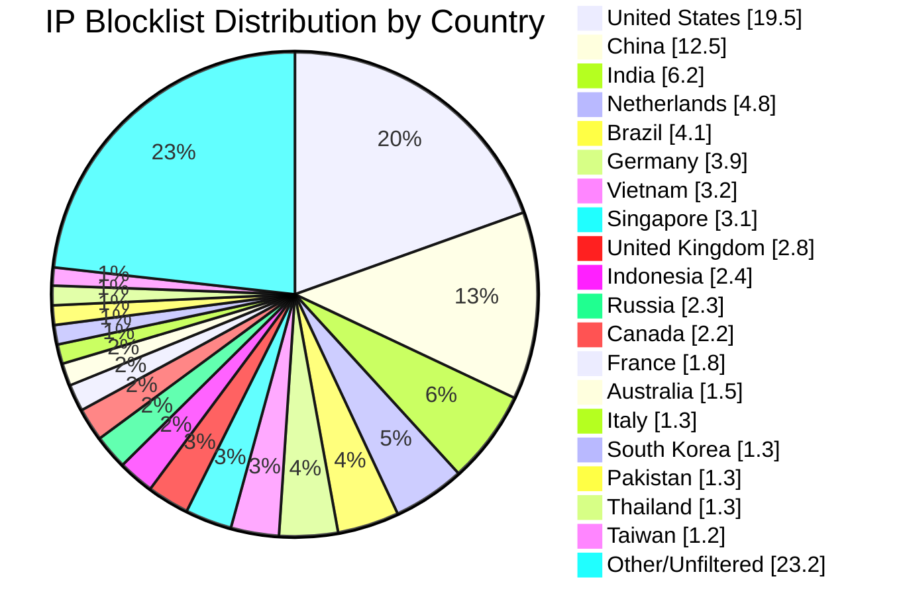

# Multi-Country IP Aggregation Statistics

**Last Updated:** 2026-06-02 17:02:13 UTC

## 📈 Country Distribution

## Overall Summary

- **Total Input IPs:** 1,072,233
- **Countries Processed:** 50
- **Combined Unique IPs:** 947,078
- **Combined Output File:** `aggregated-multi-50countries-combined.txt`
- **Overall Filter Rate:** 88.33%

## Per-Country Results

| Country | Code | Networks Found | Networks Optimized | IPs Matched | Filter Rate | Output File |
|---------|------|----------------|--------------------|-----------|-----------|-----------|
| United States | US | 165,171 | 163,351 | 209,378 | 19.53% | `aggregated-us-only.txt` |
| China | CN | 7,502 | 7,501 | 134,099 | 12.51% | `aggregated-cn-only.txt` |
| India | IN | 12,894 | 12,865 | 66,984 | 6.25% | `aggregated-in-only.txt` |
| Germany | DE | 28,948 | 28,868 | 41,673 | 3.89% | `aggregated-de-only.txt` |
| Russia | RU | 13,123 | 12,894 | 25,067 | 2.34% | `aggregated-ru-only.txt` |
| United Kingdom | GB | 34,022 | 33,847 | 30,376 | 2.83% | `aggregated-gb-only.txt` |
| Thailand | TH | 1,927 | 1,926 | 13,671 | 1.28% | `aggregated-th-only.txt` |
| Vietnam | VN | 2,159 | 2,159 | 34,649 | 3.23% | `aggregated-vn-only.txt` |
| South Korea | KR | 3,938 | 3,928 | 13,940 | 1.30% | `aggregated-kr-only.txt` |
| Brazil | BR | 13,593 | 13,559 | 44,031 | 4.11% | `aggregated-br-only.txt` |
| Taiwan | TW | 2,399 | 2,399 | 13,070 | 1.22% | `aggregated-tw-only.txt` |
| Canada | CA | 17,038 | 16,909 | 23,595 | 2.20% | `aggregated-ca-only.txt` |
| Singapore | SG | 9,341 | 9,331 | 32,753 | 3.05% | `aggregated-sg-only.txt` |
| Italy | IT | 9,565 | 9,541 | 14,073 | 1.31% | `aggregated-it-only.txt` |
| Netherlands | NL | 18,603 | 18,479 | 51,093 | 4.77% | `aggregated-nl-only.txt` |
| Indonesia | ID | 6,408 | 6,389 | 25,472 | 2.38% | `aggregated-id-only.txt` |
| France | FR | 32,238 | 32,212 | 19,672 | 1.83% | `aggregated-fr-only.txt` |
| Venezuela | VE | 931 | 931 | 6,608 | 0.62% | `aggregated-ve-only.txt` |
| Australia | AU | 12,034 | 11,967 | 16,103 | 1.50% | `aggregated-au-only.txt` |
| Turkey | TR | 3,399 | 3,374 | 12,646 | 1.18% | `aggregated-tr-only.txt` |
| Ukraine | UA | 5,573 | 5,519 | 8,083 | 0.75% | `aggregated-ua-only.txt` |
| Iran | IR | 2,018 | 2,017 | 3,974 | 0.37% | `aggregated-ir-only.txt` |
| Poland | PL | 8,039 | 8,008 | 7,455 | 0.70% | `aggregated-pl-only.txt` |
| Mexico | MX | 4,395 | 4,391 | 10,731 | 1.00% | `aggregated-mx-only.txt` |
| Spain | ES | 11,295 | 11,270 | 7,796 | 0.73% | `aggregated-es-only.txt` |
| Argentina | AR | 3,494 | 3,492 | 9,010 | 0.84% | `aggregated-ar-only.txt` |
| Egypt | EG | 718 | 718 | 2,776 | 0.26% | `aggregated-eg-only.txt` |
| Pakistan | PK | 1,338 | 1,336 | 13,703 | 1.28% | `aggregated-pk-only.txt` |
| Malaysia | MY | 2,508 | 2,508 | 5,241 | 0.49% | `aggregated-my-only.txt` |
| Bulgaria | BG | 2,292 | 2,282 | 2,778 | 0.26% | `aggregated-bg-only.txt` |
| Czechia | CZ | 3,588 | 3,587 | 1,717 | 0.16% | `aggregated-cz-only.txt` |
| Colombia | CO | 2,210 | 2,210 | 4,286 | 0.40% | `aggregated-co-only.txt` |
| United Arab Emirates | AE | 3,284 | 3,284 | 3,384 | 0.32% | `aggregated-ae-only.txt` |
| Romania | RO | 3,946 | 3,937 | 2,087 | 0.19% | `aggregated-ro-only.txt` |
| Kazakhstan | KZ | 1,263 | 1,262 | 2,402 | 0.22% | `aggregated-kz-only.txt` |
| Morocco | MA | 475 | 475 | 3,470 | 0.32% | `aggregated-ma-only.txt` |
| Saudi Arabia | SA | 1,629 | 1,629 | 3,753 | 0.35% | `aggregated-sa-only.txt` |
| South Africa | ZA | 3,967 | 3,953 | 6,385 | 0.60% | `aggregated-za-only.txt` |
| Bangladesh | BD | 2,621 | 2,616 | 5,126 | 0.48% | `aggregated-bd-only.txt` |
| Chile | CL | 1,901 | 1,901 | 2,174 | 0.20% | `aggregated-cl-only.txt` |
| Nigeria | NG | 1,077 | 1,077 | 1,141 | 0.11% | `aggregated-ng-only.txt` |
| Kenya | KE | 857 | 857 | 2,098 | 0.20% | `aggregated-ke-only.txt` |
| Algeria | DZ | 218 | 218 | 1,616 | 0.15% | `aggregated-dz-only.txt` |
| Serbia | RS | 949 | 947 | 1,024 | 0.10% | `aggregated-rs-only.txt` |
| Peru | PE | 1,092 | 1,091 | 1,497 | 0.14% | `aggregated-pe-only.txt` |
| Sri Lanka | LK | 247 | 247 | 646 | 0.06% | `aggregated-lk-only.txt` |
| Iraq | IQ | 684 | 684 | 1,758 | 0.16% | `aggregated-iq-only.txt` |
| Ethiopia | ET | 99 | 99 | 877 | 0.08% | `aggregated-et-only.txt` |
| Ghana | GH | 341 | 341 | 493 | 0.05% | `aggregated-gh-only.txt` |
| Belarus | BY | 418 | 418 | 644 | 0.06% | `aggregated-by-only.txt` |

## IP Sources

- **Source 1:** https://raw.githubusercontent.com/borestad/firehol-mirror/refs/heads/main/firehol_level1.netset
- **Source 2:** https://raw.githubusercontent.com/borestad/firehol-mirror/refs/heads/main/firehol_level2.netset
- **Source 3:** https://rules.emergingthreats.net/fwrules/emerging-Block-IPs.txt
- **Source 4:** https://feodotracker.abuse.ch/downloads/ipblocklist_recommended.txt
- **Source 5:** https://raw.githubusercontent.com/stamparm/ipsum/master/levels/2.txt
- **Source 6:** https://raw.githubusercontent.com/borestad/iplists/refs/heads/main/spamhaus/spamhaus-drop.ipv4
- **Source 7:** https://raw.githubusercontent.com/borestad/iplists/refs/heads/main/spamhaus/spamhaus-asndrop.ipv4
- **Source 8:** https://raw.githubusercontent.com/romainmarcoux/malicious-ip/refs/heads/main/full-300k-aa.txt
- **Source 9:** https://raw.githubusercontent.com/romainmarcoux/malicious-ip/refs/heads/main/full-300k-ab.txt
- **Source 10:** https://raw.githubusercontent.com/romainmarcoux/malicious-ip/refs/heads/main/full-300k-ac.txt
- **Source 11:** https://raw.githubusercontent.com/romainmarcoux/malicious-ip/refs/heads/main/full-300k-ad.txt
- **Source 12:** http://cinsscore.com/list/ci-badguys.txt
- **Source 13:** https://cdn.jsdelivr.net/gh/LittleJake/ip-blacklist/all_blacklist.txt
- **Source 14:** https://raw.githubusercontent.com/MagicTeaMC/bad-ips/refs/heads/main/bad-ips.txt
- **Source 15:** https://raw.githubusercontent.com/MagicTeaMC/MCSTORM-IP/main/mcstorm-ip.txt
- **Source 16:** https://opendbl.net/lists/blocklistde-all.list
- **Source 17:** https://raw.githubusercontent.com/bitwire-it/ipblocklist/refs/heads/main/ip-list.txt
- **Source 18:** https://raw.githubusercontent.com/sefinek/Malicious-IP-Addresses/refs/heads/main/lists/main.txt
- **Source 19:** https://raw.githubusercontent.com/borestad/firehol-mirror/refs/heads/main/firehol_level3.netset
- **Source 20:** https://raw.githubusercontent.com/borestad/firehol-mirror/refs/heads/main/firehol_level4.netset
- **Source 21:** https://raw.githubusercontent.com/borestad/firehol-mirror/refs/heads/main/firehol_webserver.netset

## Configuration Details

