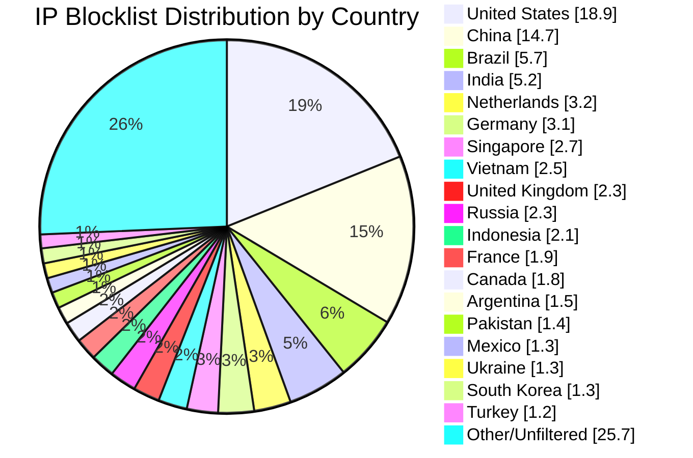

# Multi-Country IP Aggregation Statistics

**Last Updated:** 2026-09-25 17:25:43 UTC

## 📈 Country Distribution

## Overall Summary

- **Total Input IPs:** 1,748,411
- **Countries Processed:** 50
- **Combined Unique IPs:** 1,533,862
- **Combined Output File:** `aggregated-multi-50countries-combined.txt`
- **Overall Filter Rate:** 87.73%

## Per-Country Results

| Country | Code | Networks Found | Networks Optimized | IPs Matched | Filter Rate | Output File |
|---------|------|----------------|--------------------|-----------|-----------|-----------|
| United States | US | 128,919 | 127,081 | 330,861 | 18.92% | `aggregated-us-only.txt` |
| China | CN | 8,091 | 8,090 | 256,856 | 14.69% | `aggregated-cn-only.txt` |
| India | IN | 13,284 | 13,257 | 90,246 | 5.16% | `aggregated-in-only.txt` |
| Germany | DE | 29,692 | 29,583 | 53,613 | 3.07% | `aggregated-de-only.txt` |
| Russia | RU | 13,208 | 12,972 | 39,446 | 2.26% | `aggregated-ru-only.txt` |
| United Kingdom | GB | 36,037 | 35,862 | 40,048 | 2.29% | `aggregated-gb-only.txt` |
| Thailand | TH | 2,087 | 2,087 | 17,901 | 1.02% | `aggregated-th-only.txt` |
| Vietnam | VN | 2,231 | 2,231 | 43,374 | 2.48% | `aggregated-vn-only.txt` |
| South Korea | KR | 3,953 | 3,919 | 22,010 | 1.26% | `aggregated-kr-only.txt` |
| Brazil | BR | 12,549 | 12,508 | 100,470 | 5.75% | `aggregated-br-only.txt` |
| Taiwan | TW | 2,432 | 2,432 | 19,688 | 1.13% | `aggregated-tw-only.txt` |
| Canada | CA | 17,281 | 17,163 | 30,897 | 1.77% | `aggregated-ca-only.txt` |
| Singapore | SG | 9,652 | 9,642 | 47,009 | 2.69% | `aggregated-sg-only.txt` |
| Italy | IT | 9,775 | 9,761 | 19,601 | 1.12% | `aggregated-it-only.txt` |
| Netherlands | NL | 18,262 | 18,151 | 56,489 | 3.23% | `aggregated-nl-only.txt` |
| Indonesia | ID | 6,635 | 6,614 | 36,274 | 2.07% | `aggregated-id-only.txt` |
| France | FR | 33,431 | 33,402 | 32,760 | 1.87% | `aggregated-fr-only.txt` |
| Venezuela | VE | 966 | 966 | 10,370 | 0.59% | `aggregated-ve-only.txt` |
| Australia | AU | 12,686 | 12,614 | 19,071 | 1.09% | `aggregated-au-only.txt` |
| Turkey | TR | 3,535 | 3,510 | 20,201 | 1.16% | `aggregated-tr-only.txt` |
| Ukraine | UA | 5,533 | 5,492 | 22,710 | 1.30% | `aggregated-ua-only.txt` |
| Iran | IR | 2,075 | 2,074 | 6,577 | 0.38% | `aggregated-ir-only.txt` |
| Poland | PL | 8,261 | 8,231 | 10,869 | 0.62% | `aggregated-pl-only.txt` |
| Mexico | MX | 4,267 | 4,263 | 23,598 | 1.35% | `aggregated-mx-only.txt` |
| Spain | ES | 11,567 | 11,531 | 14,955 | 0.86% | `aggregated-es-only.txt` |
| Argentina | AR | 3,494 | 3,492 | 26,715 | 1.53% | `aggregated-ar-only.txt` |
| Egypt | EG | 743 | 743 | 5,058 | 0.29% | `aggregated-eg-only.txt` |
| Pakistan | PK | 1,373 | 1,372 | 25,055 | 1.43% | `aggregated-pk-only.txt` |
| Malaysia | MY | 2,600 | 2,600 | 7,924 | 0.45% | `aggregated-my-only.txt` |
| Bulgaria | BG | 2,371 | 2,361 | 3,850 | 0.22% | `aggregated-bg-only.txt` |
| Czechia | CZ | 3,722 | 3,721 | 2,498 | 0.14% | `aggregated-cz-only.txt` |
| Colombia | CO | 2,254 | 2,254 | 10,997 | 0.63% | `aggregated-co-only.txt` |
| United Arab Emirates | AE | 3,804 | 3,804 | 6,174 | 0.35% | `aggregated-ae-only.txt` |
| Romania | RO | 4,081 | 4,072 | 3,491 | 0.20% | `aggregated-ro-only.txt` |
| Kazakhstan | KZ | 1,313 | 1,310 | 4,101 | 0.23% | `aggregated-kz-only.txt` |
| Morocco | MA | 491 | 491 | 6,947 | 0.40% | `aggregated-ma-only.txt` |
| Saudi Arabia | SA | 1,720 | 1,720 | 6,756 | 0.39% | `aggregated-sa-only.txt` |
| South Africa | ZA | 4,109 | 4,095 | 12,346 | 0.71% | `aggregated-za-only.txt` |
| Bangladesh | BD | 2,721 | 2,719 | 12,699 | 0.73% | `aggregated-bd-only.txt` |
| Chile | CL | 1,957 | 1,955 | 8,531 | 0.49% | `aggregated-cl-only.txt` |
| Nigeria | NG | 1,126 | 1,126 | 2,611 | 0.15% | `aggregated-ng-only.txt` |
| Kenya | KE | 891 | 891 | 4,272 | 0.24% | `aggregated-ke-only.txt` |
| Algeria | DZ | 220 | 220 | 3,330 | 0.19% | `aggregated-dz-only.txt` |
| Serbia | RS | 1,007 | 1,005 | 1,836 | 0.11% | `aggregated-rs-only.txt` |
| Peru | PE | 1,121 | 1,120 | 2,985 | 0.17% | `aggregated-pe-only.txt` |
| Sri Lanka | LK | 253 | 253 | 1,141 | 0.07% | `aggregated-lk-only.txt` |
| Iraq | IQ | 666 | 666 | 4,654 | 0.27% | `aggregated-iq-only.txt` |
| Ethiopia | ET | 100 | 100 | 1,710 | 0.10% | `aggregated-et-only.txt` |
| Ghana | GH | 352 | 352 | 833 | 0.05% | `aggregated-gh-only.txt` |
| Belarus | BY | 427 | 427 | 1,454 | 0.08% | `aggregated-by-only.txt` |

## IP Sources

- **Source 1:** https://raw.githubusercontent.com/borestad/firehol-mirror/refs/heads/main/firehol_level1.netset
- **Source 2:** https://raw.githubusercontent.com/borestad/firehol-mirror/refs/heads/main/firehol_level2.netset
- **Source 3:** https://rules.emergingthreats.net/fwrules/emerging-Block-IPs.txt
- **Source 4:** https://feodotracker.abuse.ch/downloads/ipblocklist_recommended.txt
- **Source 5:** https://raw.githubusercontent.com/stamparm/ipsum/master/levels/2.txt
- **Source 6:** https://raw.githubusercontent.com/borestad/iplists/refs/heads/main/spamhaus/spamhaus-drop.ipv4
- **Source 7:** https://raw.githubusercontent.com/borestad/iplists/refs/heads/main/spamhaus/spamhaus-asndrop.ipv4
- **Source 8:** https://raw.githubusercontent.com/romainmarcoux/malicious-ip/refs/heads/main/full-300k-aa.txt
- **Source 9:** https://raw.githubusercontent.com/romainmarcoux/malicious-ip/refs/heads/main/full-300k-ab.txt
- **Source 10:** https://raw.githubusercontent.com/romainmarcoux/malicious-ip/refs/heads/main/full-300k-ac.txt
- **Source 11:** https://raw.githubusercontent.com/romainmarcoux/malicious-ip/refs/heads/main/full-300k-ad.txt
- **Source 12:** http://cinsscore.com/list/ci-badguys.txt
- **Source 13:** https://cdn.jsdelivr.net/gh/LittleJake/ip-blacklist/all_blacklist.txt
- **Source 14:** https://raw.githubusercontent.com/MagicTeaMC/bad-ips/refs/heads/main/bad-ips.txt
- **Source 15:** https://raw.githubusercontent.com/MagicTeaMC/MCSTORM-IP/main/mcstorm-ip.txt
- **Source 16:** https://opendbl.net/lists/blocklistde-all.list
- **Source 17:** https://raw.githubusercontent.com/bitwire-it/ipblocklist/refs/heads/main/ip-list.txt
- **Source 18:** https://raw.githubusercontent.com/sefinek/Malicious-IP-Addresses/refs/heads/main/lists/main.txt
- **Source 19:** https://raw.githubusercontent.com/borestad/firehol-mirror/refs/heads/main/firehol_level3.netset
- **Source 20:** https://raw.githubusercontent.com/borestad/firehol-mirror/refs/heads/main/firehol_level4.netset
- **Source 21:** https://raw.githubusercontent.com/borestad/firehol-mirror/refs/heads/main/firehol_webserver.netset

## Configuration Details

