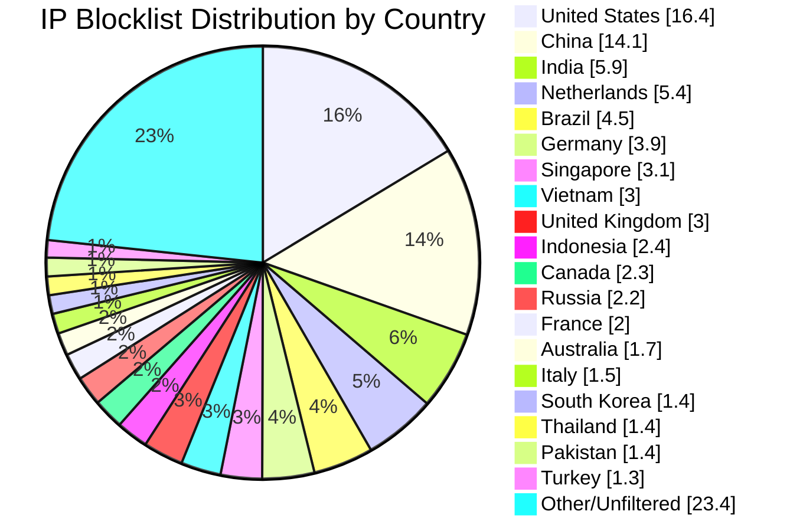

# Multi-Country IP Aggregation Statistics

**Last Updated:** 2026-05-08 17:47:31 UTC

## 📈 Country Distribution

## Overall Summary

- **Total Input IPs:** 899,268
- **Countries Processed:** 50
- **Combined Unique IPs:** 797,431
- **Combined Output File:** `aggregated-multi-50countries-combined.txt`
- **Overall Filter Rate:** 88.68%

## Per-Country Results

| Country | Code | Networks Found | Networks Optimized | IPs Matched | Filter Rate | Output File |
|---------|------|----------------|--------------------|-----------|-----------|-----------|
| United States | US | 169,198 | 167,680 | 147,374 | 16.39% | `aggregated-us-only.txt` |
| China | CN | 7,598 | 7,597 | 127,051 | 14.13% | `aggregated-cn-only.txt` |
| India | IN | 12,838 | 12,810 | 52,809 | 5.87% | `aggregated-in-only.txt` |
| Germany | DE | 28,972 | 28,867 | 35,181 | 3.91% | `aggregated-de-only.txt` |
| Russia | RU | 13,120 | 12,898 | 19,672 | 2.19% | `aggregated-ru-only.txt` |
| United Kingdom | GB | 33,411 | 33,252 | 26,547 | 2.95% | `aggregated-gb-only.txt` |
| Thailand | TH | 1,947 | 1,945 | 12,314 | 1.37% | `aggregated-th-only.txt` |
| Vietnam | VN | 2,128 | 2,128 | 26,615 | 2.96% | `aggregated-vn-only.txt` |
| South Korea | KR | 4,006 | 3,996 | 12,901 | 1.43% | `aggregated-kr-only.txt` |
| Brazil | BR | 12,782 | 12,630 | 40,549 | 4.51% | `aggregated-br-only.txt` |
| Taiwan | TW | 2,413 | 2,413 | 10,965 | 1.22% | `aggregated-tw-only.txt` |
| Canada | CA | 16,890 | 16,768 | 20,315 | 2.26% | `aggregated-ca-only.txt` |
| Singapore | SG | 9,268 | 9,258 | 27,615 | 3.07% | `aggregated-sg-only.txt` |
| Italy | IT | 9,580 | 9,556 | 13,367 | 1.49% | `aggregated-it-only.txt` |
| Netherlands | NL | 18,273 | 18,151 | 48,203 | 5.36% | `aggregated-nl-only.txt` |
| Indonesia | ID | 6,409 | 6,390 | 21,866 | 2.43% | `aggregated-id-only.txt` |
| France | FR | 32,393 | 32,367 | 17,882 | 1.99% | `aggregated-fr-only.txt` |
| Venezuela | VE | 900 | 900 | 4,155 | 0.46% | `aggregated-ve-only.txt` |
| Australia | AU | 11,396 | 11,317 | 15,031 | 1.67% | `aggregated-au-only.txt` |
| Turkey | TR | 3,399 | 3,371 | 11,628 | 1.29% | `aggregated-tr-only.txt` |
| Ukraine | UA | 5,540 | 5,481 | 7,272 | 0.81% | `aggregated-ua-only.txt` |
| Iran | IR | 2,012 | 2,011 | 3,267 | 0.36% | `aggregated-ir-only.txt` |
| Poland | PL | 8,011 | 7,976 | 5,222 | 0.58% | `aggregated-pl-only.txt` |
| Mexico | MX | 4,307 | 4,303 | 9,797 | 1.09% | `aggregated-mx-only.txt` |
| Spain | ES | 11,140 | 11,107 | 6,276 | 0.70% | `aggregated-es-only.txt` |
| Argentina | AR | 3,445 | 3,443 | 8,535 | 0.95% | `aggregated-ar-only.txt` |
| Egypt | EG | 716 | 716 | 2,713 | 0.30% | `aggregated-eg-only.txt` |
| Pakistan | PK | 1,320 | 1,320 | 12,248 | 1.36% | `aggregated-pk-only.txt` |
| Malaysia | MY | 2,498 | 2,498 | 5,049 | 0.56% | `aggregated-my-only.txt` |
| Bulgaria | BG | 2,290 | 2,280 | 2,334 | 0.26% | `aggregated-bg-only.txt` |
| Czechia | CZ | 3,593 | 3,592 | 1,404 | 0.16% | `aggregated-cz-only.txt` |
| Colombia | CO | 2,210 | 2,210 | 4,116 | 0.46% | `aggregated-co-only.txt` |
| United Arab Emirates | AE | 3,206 | 3,206 | 2,803 | 0.31% | `aggregated-ae-only.txt` |
| Romania | RO | 3,916 | 3,907 | 1,614 | 0.18% | `aggregated-ro-only.txt` |
| Kazakhstan | KZ | 1,349 | 1,348 | 2,066 | 0.23% | `aggregated-kz-only.txt` |
| Morocco | MA | 478 | 478 | 3,346 | 0.37% | `aggregated-ma-only.txt` |
| Saudi Arabia | SA | 1,617 | 1,617 | 3,850 | 0.43% | `aggregated-sa-only.txt` |
| South Africa | ZA | 3,955 | 3,942 | 5,001 | 0.56% | `aggregated-za-only.txt` |
| Bangladesh | BD | 2,608 | 2,603 | 4,420 | 0.49% | `aggregated-bd-only.txt` |
| Chile | CL | 1,870 | 1,870 | 2,716 | 0.30% | `aggregated-cl-only.txt` |
| Nigeria | NG | 1,071 | 1,071 | 1,113 | 0.12% | `aggregated-ng-only.txt` |
| Kenya | KE | 851 | 851 | 2,376 | 0.26% | `aggregated-ke-only.txt` |
| Algeria | DZ | 217 | 217 | 1,477 | 0.16% | `aggregated-dz-only.txt` |
| Serbia | RS | 950 | 948 | 945 | 0.11% | `aggregated-rs-only.txt` |
| Peru | PE | 1,105 | 1,104 | 1,292 | 0.14% | `aggregated-pe-only.txt` |
| Sri Lanka | LK | 241 | 241 | 588 | 0.07% | `aggregated-lk-only.txt` |
| Iraq | IQ | 681 | 681 | 1,532 | 0.17% | `aggregated-iq-only.txt` |
| Ethiopia | ET | 99 | 99 | 923 | 0.10% | `aggregated-et-only.txt` |
| Ghana | GH | 344 | 344 | 484 | 0.05% | `aggregated-gh-only.txt` |
| Belarus | BY | 491 | 491 | 612 | 0.07% | `aggregated-by-only.txt` |

## IP Sources

- **Source 1:** https://raw.githubusercontent.com/borestad/firehol-mirror/refs/heads/main/firehol_level1.netset
- **Source 2:** https://raw.githubusercontent.com/borestad/firehol-mirror/refs/heads/main/firehol_level2.netset
- **Source 3:** https://rules.emergingthreats.net/fwrules/emerging-Block-IPs.txt
- **Source 4:** https://feodotracker.abuse.ch/downloads/ipblocklist_recommended.txt
- **Source 5:** https://raw.githubusercontent.com/stamparm/ipsum/master/levels/2.txt
- **Source 6:** https://raw.githubusercontent.com/borestad/iplists/refs/heads/main/spamhaus/spamhaus-drop.ipv4
- **Source 7:** https://raw.githubusercontent.com/borestad/iplists/refs/heads/main/spamhaus/spamhaus-asndrop.ipv4
- **Source 8:** https://raw.githubusercontent.com/romainmarcoux/malicious-ip/refs/heads/main/full-300k-aa.txt
- **Source 9:** https://raw.githubusercontent.com/romainmarcoux/malicious-ip/refs/heads/main/full-300k-ab.txt
- **Source 10:** https://raw.githubusercontent.com/romainmarcoux/malicious-ip/refs/heads/main/full-300k-ac.txt
- **Source 11:** https://raw.githubusercontent.com/romainmarcoux/malicious-ip/refs/heads/main/full-300k-ad.txt
- **Source 12:** http://cinsscore.com/list/ci-badguys.txt
- **Source 13:** https://cdn.jsdelivr.net/gh/LittleJake/ip-blacklist/all_blacklist.txt
- **Source 14:** https://raw.githubusercontent.com/MagicTeaMC/bad-ips/refs/heads/main/bad-ips.txt
- **Source 15:** https://raw.githubusercontent.com/MagicTeaMC/MCSTORM-IP/main/mcstorm-ip.txt
- **Source 16:** https://opendbl.net/lists/blocklistde-all.list
- **Source 17:** https://raw.githubusercontent.com/bitwire-it/ipblocklist/refs/heads/main/ip-list.txt
- **Source 18:** https://raw.githubusercontent.com/borestad/firehol-mirror/refs/heads/main/firehol_level3.netset
- **Source 19:** https://raw.githubusercontent.com/borestad/firehol-mirror/refs/heads/main/ciarmy.ipset
- **Source 20:** https://raw.githubusercontent.com/borestad/firehol-mirror/refs/heads/main/firehol_level4.netset

## Configuration Details

