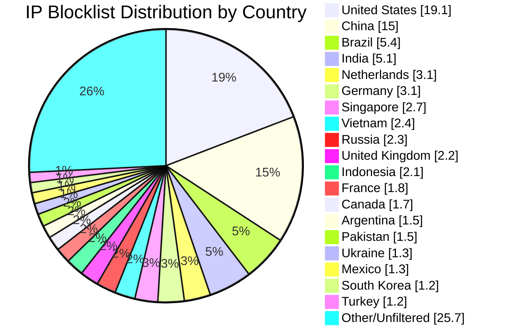

# Multi-Country IP Aggregation Statistics

**Last Updated:** 2026-10-08 23:33:58 UTC

## 📈 Country Distribution

```mermaid
pie showData title IP Blocklist Distribution by Country
"United States" : 19.1
"China" : 15.0
"Brazil" : 5.4
"India" : 5.1
"Netherlands" : 3.1
"Germany" : 3.1
"Singapore" : 2.7
"Vietnam" : 2.4
"Russia" : 2.3
"United Kingdom" : 2.2
"Indonesia" : 2.1
"France" : 1.8
"Canada" : 1.7
"Argentina" : 1.5
"Pakistan" : 1.5
"Ukraine" : 1.3
"Mexico" : 1.3
"South Korea" : 1.2
"Turkey" : 1.2
"Other/Unfiltered" : 25.7
```

## Overall Summary

- **Total Input IPs:** 1,839,448
- **Countries Processed:** 50
- **Combined Unique IPs:** 1,612,952
- **Combined Output File:** `aggregated-multi-50countries-combined.txt`
- **Overall Filter Rate:** 87.69%

## Per-Country Results

| Country | Code | Networks Found | Networks Optimized | IPs Matched | Filter Rate | Output File |
|---------|------|----------------|--------------------|-----------|-----------|-----------|
| United States | US | 128,144 | 126,297 | 350,663 | 19.06% | `aggregated-us-only.txt` |
| China | CN | 8,178 | 8,177 | 276,512 | 15.03% | `aggregated-cn-only.txt` |
| India | IN | 13,446 | 13,419 | 93,902 | 5.10% | `aggregated-in-only.txt` |
| Germany | DE | 29,924 | 29,821 | 57,211 | 3.11% | `aggregated-de-only.txt` |
| Russia | RU | 13,146 | 12,909 | 42,620 | 2.32% | `aggregated-ru-only.txt` |
| United Kingdom | GB | 36,152 | 35,983 | 41,228 | 2.24% | `aggregated-gb-only.txt` |
| Thailand | TH | 2,087 | 2,087 | 18,438 | 1.00% | `aggregated-th-only.txt` |
| Vietnam | VN | 2,254 | 2,254 | 44,344 | 2.41% | `aggregated-vn-only.txt` |
| South Korea | KR | 4,004 | 3,970 | 22,667 | 1.23% | `aggregated-kr-only.txt` |
| Brazil | BR | 11,646 | 11,602 | 99,092 | 5.39% | `aggregated-br-only.txt` |
| Taiwan | TW | 2,446 | 2,446 | 20,603 | 1.12% | `aggregated-tw-only.txt` |
| Canada | CA | 17,518 | 17,394 | 31,905 | 1.73% | `aggregated-ca-only.txt` |
| Singapore | SG | 9,753 | 9,743 | 49,731 | 2.70% | `aggregated-sg-only.txt` |
| Italy | IT | 9,864 | 9,837 | 19,803 | 1.08% | `aggregated-it-only.txt` |
| Netherlands | NL | 18,309 | 18,215 | 57,848 | 3.14% | `aggregated-nl-only.txt` |
| Indonesia | ID | 6,696 | 6,675 | 38,566 | 2.10% | `aggregated-id-only.txt` |
| France | FR | 33,856 | 33,828 | 33,340 | 1.81% | `aggregated-fr-only.txt` |
| Venezuela | VE | 981 | 981 | 10,656 | 0.58% | `aggregated-ve-only.txt` |
| Australia | AU | 12,365 | 12,292 | 19,652 | 1.07% | `aggregated-au-only.txt` |
| Turkey | TR | 3,564 | 3,531 | 22,014 | 1.20% | `aggregated-tr-only.txt` |
| Ukraine | UA | 5,418 | 5,366 | 24,583 | 1.34% | `aggregated-ua-only.txt` |
| Iran | IR | 2,067 | 2,066 | 6,929 | 0.38% | `aggregated-ir-only.txt` |
| Poland | PL | 8,317 | 8,288 | 11,631 | 0.63% | `aggregated-pl-only.txt` |
| Mexico | MX | 4,329 | 4,322 | 24,377 | 1.33% | `aggregated-mx-only.txt` |
| Spain | ES | 11,621 | 11,589 | 14,768 | 0.80% | `aggregated-es-only.txt` |
| Argentina | AR | 3,504 | 3,504 | 28,335 | 1.54% | `aggregated-ar-only.txt` |
| Egypt | EG | 764 | 764 | 5,585 | 0.30% | `aggregated-eg-only.txt` |
| Pakistan | PK | 1,413 | 1,412 | 27,016 | 1.47% | `aggregated-pk-only.txt` |
| Malaysia | MY | 2,587 | 2,587 | 8,449 | 0.46% | `aggregated-my-only.txt` |
| Bulgaria | BG | 2,354 | 2,340 | 3,949 | 0.21% | `aggregated-bg-only.txt` |
| Czechia | CZ | 3,716 | 3,715 | 2,829 | 0.15% | `aggregated-cz-only.txt` |
| Colombia | CO | 2,282 | 2,282 | 11,467 | 0.62% | `aggregated-co-only.txt` |
| United Arab Emirates | AE | 3,837 | 3,837 | 6,630 | 0.36% | `aggregated-ae-only.txt` |
| Romania | RO | 4,104 | 4,096 | 3,694 | 0.20% | `aggregated-ro-only.txt` |
| Kazakhstan | KZ | 1,330 | 1,327 | 4,686 | 0.25% | `aggregated-kz-only.txt` |
| Morocco | MA | 507 | 507 | 7,225 | 0.39% | `aggregated-ma-only.txt` |
| Saudi Arabia | SA | 1,722 | 1,722 | 6,810 | 0.37% | `aggregated-sa-only.txt` |
| South Africa | ZA | 4,121 | 4,108 | 12,586 | 0.68% | `aggregated-za-only.txt` |
| Bangladesh | BD | 2,679 | 2,677 | 15,837 | 0.86% | `aggregated-bd-only.txt` |
| Chile | CL | 1,983 | 1,981 | 9,104 | 0.49% | `aggregated-cl-only.txt` |
| Nigeria | NG | 1,164 | 1,164 | 2,714 | 0.15% | `aggregated-ng-only.txt` |
| Kenya | KE | 899 | 899 | 4,575 | 0.25% | `aggregated-ke-only.txt` |
| Algeria | DZ | 222 | 222 | 3,235 | 0.18% | `aggregated-dz-only.txt` |
| Serbia | RS | 1,014 | 1,012 | 1,962 | 0.11% | `aggregated-rs-only.txt` |
| Peru | PE | 1,105 | 1,104 | 3,171 | 0.17% | `aggregated-pe-only.txt` |
| Sri Lanka | LK | 259 | 259 | 1,201 | 0.07% | `aggregated-lk-only.txt` |
| Iraq | IQ | 691 | 691 | 4,743 | 0.26% | `aggregated-iq-only.txt` |
| Ethiopia | ET | 104 | 104 | 1,675 | 0.09% | `aggregated-et-only.txt` |
| Ghana | GH | 359 | 359 | 848 | 0.05% | `aggregated-gh-only.txt` |
| Belarus | BY | 436 | 436 | 1,543 | 0.08% | `aggregated-by-only.txt` |

## IP Sources

- **Source 1:** https://raw.githubusercontent.com/borestad/firehol-mirror/refs/heads/main/firehol_level1.netset
- **Source 2:** https://raw.githubusercontent.com/borestad/firehol-mirror/refs/heads/main/firehol_level2.netset
- **Source 3:** https://rules.emergingthreats.net/fwrules/emerging-Block-IPs.txt
- **Source 4:** https://feodotracker.abuse.ch/downloads/ipblocklist_recommended.txt
- **Source 5:** https://raw.githubusercontent.com/stamparm/ipsum/master/levels/2.txt
- **Source 6:** https://raw.githubusercontent.com/borestad/iplists/refs/heads/main/spamhaus/spamhaus-drop.ipv4
- **Source 7:** https://raw.githubusercontent.com/borestad/iplists/refs/heads/main/spamhaus/spamhaus-asndrop.ipv4
- **Source 8:** https://raw.githubusercontent.com/romainmarcoux/malicious-ip/refs/heads/main/full-300k-aa.txt
- **Source 9:** https://raw.githubusercontent.com/romainmarcoux/malicious-ip/refs/heads/main/full-300k-ab.txt
- **Source 10:** https://raw.githubusercontent.com/romainmarcoux/malicious-ip/refs/heads/main/full-300k-ac.txt
- **Source 11:** https://raw.githubusercontent.com/romainmarcoux/malicious-ip/refs/heads/main/full-300k-ad.txt
- **Source 12:** http://cinsscore.com/list/ci-badguys.txt
- **Source 13:** https://cdn.jsdelivr.net/gh/LittleJake/ip-blacklist/all_blacklist.txt
- **Source 14:** https://raw.githubusercontent.com/MagicTeaMC/bad-ips/refs/heads/main/bad-ips.txt
- **Source 15:** https://raw.githubusercontent.com/MagicTeaMC/MCSTORM-IP/main/mcstorm-ip.txt
- **Source 16:** https://opendbl.net/lists/blocklistde-all.list
- **Source 17:** https://raw.githubusercontent.com/bitwire-it/ipblocklist/refs/heads/main/ip-list.txt
- **Source 18:** https://raw.githubusercontent.com/sefinek/Malicious-IP-Addresses/refs/heads/main/lists/main.txt
- **Source 19:** https://raw.githubusercontent.com/borestad/firehol-mirror/refs/heads/main/firehol_level3.netset
- **Source 20:** https://raw.githubusercontent.com/borestad/firehol-mirror/refs/heads/main/firehol_level4.netset
- **Source 21:** https://raw.githubusercontent.com/borestad/firehol-mirror/refs/heads/main/firehol_webserver.netset

## Configuration Details

