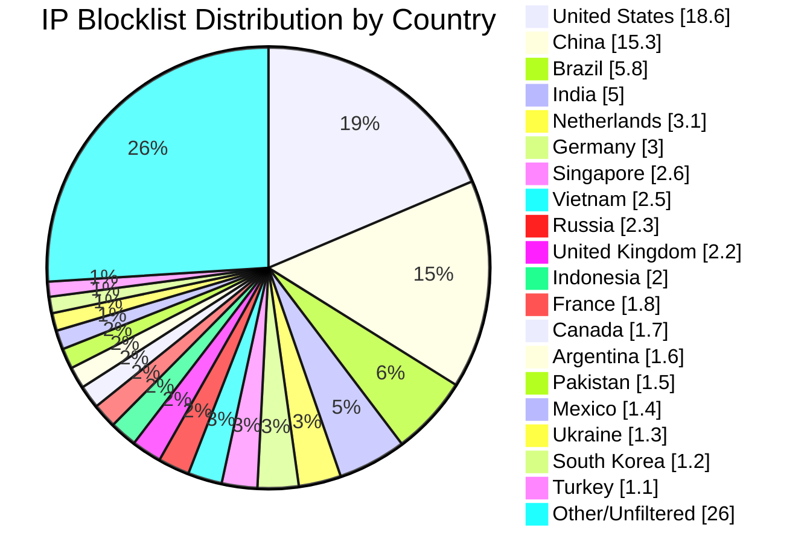

# Multi-Country IP Aggregation Statistics

**Last Updated:** 2026-10-03 21:33:14 UTC

## 📈 Country Distribution

```mermaid
pie showData title IP Blocklist Distribution by Country
"United States" : 18.6
"China" : 15.3
"Brazil" : 5.8
"India" : 5.0
"Netherlands" : 3.1
"Germany" : 3.0
"Singapore" : 2.6
"Vietnam" : 2.5
"Russia" : 2.3
"United Kingdom" : 2.2
"Indonesia" : 2.0
"France" : 1.8
"Canada" : 1.7
"Argentina" : 1.6
"Pakistan" : 1.5
"Mexico" : 1.4
"Ukraine" : 1.3
"South Korea" : 1.2
"Turkey" : 1.1
"Other/Unfiltered" : 26.0
```

## Overall Summary

- **Total Input IPs:** 1,857,573
- **Countries Processed:** 50
- **Combined Unique IPs:** 1,627,581
- **Combined Output File:** `aggregated-multi-50countries-combined.txt`
- **Overall Filter Rate:** 87.62%

## Per-Country Results

| Country | Code | Networks Found | Networks Optimized | IPs Matched | Filter Rate | Output File |
|---------|------|----------------|--------------------|-----------|-----------|-----------|
| United States | US | 127,538 | 125,707 | 346,294 | 18.64% | `aggregated-us-only.txt` |
| China | CN | 8,110 | 8,109 | 284,674 | 15.33% | `aggregated-cn-only.txt` |
| India | IN | 13,287 | 13,260 | 92,718 | 4.99% | `aggregated-in-only.txt` |
| Germany | DE | 29,802 | 29,690 | 56,252 | 3.03% | `aggregated-de-only.txt` |
| Russia | RU | 13,192 | 12,956 | 42,498 | 2.29% | `aggregated-ru-only.txt` |
| United Kingdom | GB | 36,200 | 36,033 | 40,700 | 2.19% | `aggregated-gb-only.txt` |
| Thailand | TH | 2,095 | 2,095 | 18,378 | 0.99% | `aggregated-th-only.txt` |
| Vietnam | VN | 2,234 | 2,234 | 45,780 | 2.46% | `aggregated-vn-only.txt` |
| South Korea | KR | 3,948 | 3,914 | 22,478 | 1.21% | `aggregated-kr-only.txt` |
| Brazil | BR | 11,585 | 11,545 | 107,283 | 5.78% | `aggregated-br-only.txt` |
| Taiwan | TW | 2,429 | 2,429 | 20,279 | 1.09% | `aggregated-tw-only.txt` |
| Canada | CA | 17,458 | 17,338 | 31,174 | 1.68% | `aggregated-ca-only.txt` |
| Singapore | SG | 9,679 | 9,669 | 48,906 | 2.63% | `aggregated-sg-only.txt` |
| Italy | IT | 9,779 | 9,754 | 19,826 | 1.07% | `aggregated-it-only.txt` |
| Netherlands | NL | 18,307 | 18,213 | 57,443 | 3.09% | `aggregated-nl-only.txt` |
| Indonesia | ID | 6,632 | 6,611 | 37,616 | 2.03% | `aggregated-id-only.txt` |
| France | FR | 33,711 | 33,682 | 33,355 | 1.80% | `aggregated-fr-only.txt` |
| Venezuela | VE | 952 | 952 | 11,271 | 0.61% | `aggregated-ve-only.txt` |
| Australia | AU | 12,568 | 12,495 | 19,497 | 1.05% | `aggregated-au-only.txt` |
| Turkey | TR | 3,551 | 3,521 | 20,455 | 1.10% | `aggregated-tr-only.txt` |
| Ukraine | UA | 5,505 | 5,464 | 24,420 | 1.31% | `aggregated-ua-only.txt` |
| Iran | IR | 2,065 | 2,064 | 7,088 | 0.38% | `aggregated-ir-only.txt` |
| Poland | PL | 8,255 | 8,226 | 11,050 | 0.59% | `aggregated-pl-only.txt` |
| Mexico | MX | 4,284 | 4,277 | 25,393 | 1.37% | `aggregated-mx-only.txt` |
| Spain | ES | 11,563 | 11,519 | 15,153 | 0.82% | `aggregated-es-only.txt` |
| Argentina | AR | 3,471 | 3,471 | 29,915 | 1.61% | `aggregated-ar-only.txt` |
| Egypt | EG | 749 | 749 | 5,491 | 0.30% | `aggregated-eg-only.txt` |
| Pakistan | PK | 1,499 | 1,498 | 27,595 | 1.49% | `aggregated-pk-only.txt` |
| Malaysia | MY | 2,569 | 2,569 | 8,395 | 0.45% | `aggregated-my-only.txt` |
| Bulgaria | BG | 2,356 | 2,346 | 4,002 | 0.22% | `aggregated-bg-only.txt` |
| Czechia | CZ | 3,717 | 3,716 | 2,612 | 0.14% | `aggregated-cz-only.txt` |
| Colombia | CO | 2,248 | 2,248 | 12,285 | 0.66% | `aggregated-co-only.txt` |
| United Arab Emirates | AE | 3,829 | 3,829 | 6,899 | 0.37% | `aggregated-ae-only.txt` |
| Romania | RO | 4,069 | 4,061 | 3,702 | 0.20% | `aggregated-ro-only.txt` |
| Kazakhstan | KZ | 1,309 | 1,308 | 5,542 | 0.30% | `aggregated-kz-only.txt` |
| Morocco | MA | 494 | 494 | 8,308 | 0.45% | `aggregated-ma-only.txt` |
| Saudi Arabia | SA | 1,724 | 1,724 | 6,894 | 0.37% | `aggregated-sa-only.txt` |
| South Africa | ZA | 4,106 | 4,092 | 13,351 | 0.72% | `aggregated-za-only.txt` |
| Bangladesh | BD | 2,699 | 2,697 | 15,381 | 0.83% | `aggregated-bd-only.txt` |
| Chile | CL | 1,960 | 1,958 | 9,543 | 0.51% | `aggregated-cl-only.txt` |
| Nigeria | NG | 1,131 | 1,131 | 3,017 | 0.16% | `aggregated-ng-only.txt` |
| Kenya | KE | 891 | 891 | 4,692 | 0.25% | `aggregated-ke-only.txt` |
| Algeria | DZ | 217 | 217 | 3,708 | 0.20% | `aggregated-dz-only.txt` |
| Serbia | RS | 1,005 | 1,003 | 2,047 | 0.11% | `aggregated-rs-only.txt` |
| Peru | PE | 1,101 | 1,100 | 3,382 | 0.18% | `aggregated-pe-only.txt` |
| Sri Lanka | LK | 255 | 255 | 1,223 | 0.07% | `aggregated-lk-only.txt` |
| Iraq | IQ | 667 | 667 | 5,221 | 0.28% | `aggregated-iq-only.txt` |
| Ethiopia | ET | 101 | 101 | 1,823 | 0.10% | `aggregated-et-only.txt` |
| Ghana | GH | 351 | 351 | 885 | 0.05% | `aggregated-gh-only.txt` |
| Belarus | BY | 428 | 428 | 1,687 | 0.09% | `aggregated-by-only.txt` |

## IP Sources

- **Source 1:** https://raw.githubusercontent.com/borestad/firehol-mirror/refs/heads/main/firehol_level1.netset
- **Source 2:** https://raw.githubusercontent.com/borestad/firehol-mirror/refs/heads/main/firehol_level2.netset
- **Source 3:** https://rules.emergingthreats.net/fwrules/emerging-Block-IPs.txt
- **Source 4:** https://feodotracker.abuse.ch/downloads/ipblocklist_recommended.txt
- **Source 5:** https://raw.githubusercontent.com/stamparm/ipsum/master/levels/2.txt
- **Source 6:** https://raw.githubusercontent.com/borestad/iplists/refs/heads/main/spamhaus/spamhaus-drop.ipv4
- **Source 7:** https://raw.githubusercontent.com/borestad/iplists/refs/heads/main/spamhaus/spamhaus-asndrop.ipv4
- **Source 8:** https://raw.githubusercontent.com/romainmarcoux/malicious-ip/refs/heads/main/full-300k-aa.txt
- **Source 9:** https://raw.githubusercontent.com/romainmarcoux/malicious-ip/refs/heads/main/full-300k-ab.txt
- **Source 10:** https://raw.githubusercontent.com/romainmarcoux/malicious-ip/refs/heads/main/full-300k-ac.txt
- **Source 11:** https://raw.githubusercontent.com/romainmarcoux/malicious-ip/refs/heads/main/full-300k-ad.txt
- **Source 12:** http://cinsscore.com/list/ci-badguys.txt
- **Source 13:** https://cdn.jsdelivr.net/gh/LittleJake/ip-blacklist/all_blacklist.txt
- **Source 14:** https://raw.githubusercontent.com/MagicTeaMC/bad-ips/refs/heads/main/bad-ips.txt
- **Source 15:** https://raw.githubusercontent.com/MagicTeaMC/MCSTORM-IP/main/mcstorm-ip.txt
- **Source 16:** https://opendbl.net/lists/blocklistde-all.list
- **Source 17:** https://raw.githubusercontent.com/bitwire-it/ipblocklist/refs/heads/main/ip-list.txt
- **Source 18:** https://raw.githubusercontent.com/sefinek/Malicious-IP-Addresses/refs/heads/main/lists/main.txt
- **Source 19:** https://raw.githubusercontent.com/borestad/firehol-mirror/refs/heads/main/firehol_level3.netset
- **Source 20:** https://raw.githubusercontent.com/borestad/firehol-mirror/refs/heads/main/firehol_level4.netset
- **Source 21:** https://raw.githubusercontent.com/borestad/firehol-mirror/refs/heads/main/firehol_webserver.netset

## Configuration Details

