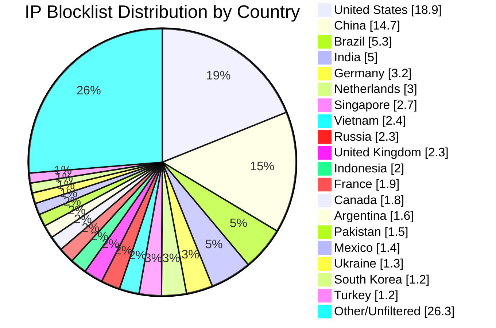

# Multi-Country IP Aggregation Statistics

**Last Updated:** 2026-10-14 12:11:47 UTC

## 📈 Country Distribution

```mermaid
pie showData title IP Blocklist Distribution by Country
"United States" : 18.9
"China" : 14.7
"Brazil" : 5.3
"India" : 5.0
"Germany" : 3.2
"Netherlands" : 3.0
"Singapore" : 2.7
"Vietnam" : 2.4
"Russia" : 2.3
"United Kingdom" : 2.3
"Indonesia" : 2.0
"France" : 1.9
"Canada" : 1.8
"Argentina" : 1.6
"Pakistan" : 1.5
"Mexico" : 1.4
"Ukraine" : 1.3
"South Korea" : 1.2
"Turkey" : 1.2
"Other/Unfiltered" : 26.3
```

## Overall Summary

- **Total Input IPs:** 1,927,176
- **Countries Processed:** 50
- **Combined Unique IPs:** 1,686,881
- **Combined Output File:** `aggregated-multi-50countries-combined.txt`
- **Overall Filter Rate:** 87.53%

## Per-Country Results

| Country | Code | Networks Found | Networks Optimized | IPs Matched | Filter Rate | Output File |
|---------|------|----------------|--------------------|-----------|-----------|-----------|
| United States | US | 128,498 | 126,625 | 364,276 | 18.90% | `aggregated-us-only.txt` |
| China | CN | 8,206 | 8,205 | 284,208 | 14.75% | `aggregated-cn-only.txt` |
| India | IN | 13,510 | 13,485 | 96,210 | 4.99% | `aggregated-in-only.txt` |
| Germany | DE | 30,255 | 30,145 | 60,808 | 3.16% | `aggregated-de-only.txt` |
| Russia | RU | 13,265 | 13,023 | 44,978 | 2.33% | `aggregated-ru-only.txt` |
| United Kingdom | GB | 36,309 | 36,137 | 43,557 | 2.26% | `aggregated-gb-only.txt` |
| Thailand | TH | 2,095 | 2,095 | 18,875 | 0.98% | `aggregated-th-only.txt` |
| Vietnam | VN | 2,260 | 2,260 | 46,267 | 2.40% | `aggregated-vn-only.txt` |
| South Korea | KR | 3,979 | 3,956 | 23,152 | 1.20% | `aggregated-kr-only.txt` |
| Brazil | BR | 11,520 | 11,481 | 102,612 | 5.32% | `aggregated-br-only.txt` |
| Taiwan | TW | 2,458 | 2,458 | 20,940 | 1.09% | `aggregated-tw-only.txt` |
| Canada | CA | 17,644 | 17,526 | 34,044 | 1.77% | `aggregated-ca-only.txt` |
| Singapore | SG | 9,761 | 9,737 | 51,405 | 2.67% | `aggregated-sg-only.txt` |
| Italy | IT | 9,916 | 9,883 | 20,641 | 1.07% | `aggregated-it-only.txt` |
| Netherlands | NL | 18,482 | 18,384 | 58,357 | 3.03% | `aggregated-nl-only.txt` |
| Indonesia | ID | 6,740 | 6,719 | 39,437 | 2.05% | `aggregated-id-only.txt` |
| France | FR | 33,907 | 33,882 | 35,766 | 1.86% | `aggregated-fr-only.txt` |
| Venezuela | VE | 986 | 986 | 11,499 | 0.60% | `aggregated-ve-only.txt` |
| Australia | AU | 12,412 | 12,339 | 20,076 | 1.04% | `aggregated-au-only.txt` |
| Turkey | TR | 3,525 | 3,491 | 22,648 | 1.18% | `aggregated-tr-only.txt` |
| Ukraine | UA | 5,407 | 5,367 | 25,722 | 1.33% | `aggregated-ua-only.txt` |
| Iran | IR | 2,063 | 2,062 | 7,833 | 0.41% | `aggregated-ir-only.txt` |
| Poland | PL | 8,354 | 8,324 | 11,564 | 0.60% | `aggregated-pl-only.txt` |
| Mexico | MX | 4,418 | 4,411 | 26,799 | 1.39% | `aggregated-mx-only.txt` |
| Spain | ES | 11,677 | 11,669 | 16,228 | 0.84% | `aggregated-es-only.txt` |
| Argentina | AR | 3,535 | 3,535 | 31,045 | 1.61% | `aggregated-ar-only.txt` |
| Egypt | EG | 768 | 768 | 5,672 | 0.29% | `aggregated-eg-only.txt` |
| Pakistan | PK | 1,422 | 1,421 | 28,221 | 1.46% | `aggregated-pk-only.txt` |
| Malaysia | MY | 2,611 | 2,611 | 9,806 | 0.51% | `aggregated-my-only.txt` |
| Bulgaria | BG | 2,353 | 2,339 | 4,037 | 0.21% | `aggregated-bg-only.txt` |
| Czechia | CZ | 3,737 | 3,736 | 3,086 | 0.16% | `aggregated-cz-only.txt` |
| Colombia | CO | 2,305 | 2,305 | 12,617 | 0.65% | `aggregated-co-only.txt` |
| United Arab Emirates | AE | 3,883 | 3,883 | 7,064 | 0.37% | `aggregated-ae-only.txt` |
| Romania | RO | 4,105 | 4,097 | 3,826 | 0.20% | `aggregated-ro-only.txt` |
| Kazakhstan | KZ | 1,339 | 1,338 | 5,971 | 0.31% | `aggregated-kz-only.txt` |
| Morocco | MA | 532 | 532 | 8,062 | 0.42% | `aggregated-ma-only.txt` |
| Saudi Arabia | SA | 1,743 | 1,743 | 7,561 | 0.39% | `aggregated-sa-only.txt` |
| South Africa | ZA | 4,127 | 4,114 | 13,942 | 0.72% | `aggregated-za-only.txt` |
| Bangladesh | BD | 2,693 | 2,691 | 18,128 | 0.94% | `aggregated-bd-only.txt` |
| Chile | CL | 1,982 | 1,980 | 10,316 | 0.54% | `aggregated-cl-only.txt` |
| Nigeria | NG | 1,164 | 1,164 | 3,009 | 0.16% | `aggregated-ng-only.txt` |
| Kenya | KE | 903 | 903 | 4,949 | 0.26% | `aggregated-ke-only.txt` |
| Algeria | DZ | 226 | 226 | 3,643 | 0.19% | `aggregated-dz-only.txt` |
| Serbia | RS | 1,018 | 1,016 | 2,078 | 0.11% | `aggregated-rs-only.txt` |
| Peru | PE | 1,118 | 1,117 | 3,489 | 0.18% | `aggregated-pe-only.txt` |
| Sri Lanka | LK | 262 | 262 | 1,236 | 0.06% | `aggregated-lk-only.txt` |
| Iraq | IQ | 694 | 694 | 6,604 | 0.34% | `aggregated-iq-only.txt` |
| Ethiopia | ET | 107 | 107 | 1,976 | 0.10% | `aggregated-et-only.txt` |
| Ghana | GH | 362 | 362 | 905 | 0.05% | `aggregated-gh-only.txt` |
| Belarus | BY | 437 | 437 | 1,736 | 0.09% | `aggregated-by-only.txt` |

## IP Sources

- **Source 1:** https://raw.githubusercontent.com/borestad/firehol-mirror/refs/heads/main/firehol_level1.netset
- **Source 2:** https://raw.githubusercontent.com/borestad/firehol-mirror/refs/heads/main/firehol_level2.netset
- **Source 3:** https://rules.emergingthreats.net/fwrules/emerging-Block-IPs.txt
- **Source 4:** https://feodotracker.abuse.ch/downloads/ipblocklist_recommended.txt
- **Source 5:** https://raw.githubusercontent.com/stamparm/ipsum/master/levels/2.txt
- **Source 6:** https://raw.githubusercontent.com/borestad/iplists/refs/heads/main/spamhaus/spamhaus-drop.ipv4
- **Source 7:** https://raw.githubusercontent.com/borestad/iplists/refs/heads/main/spamhaus/spamhaus-asndrop.ipv4
- **Source 8:** https://raw.githubusercontent.com/romainmarcoux/malicious-ip/refs/heads/main/full-300k-aa.txt
- **Source 9:** https://raw.githubusercontent.com/romainmarcoux/malicious-ip/refs/heads/main/full-300k-ab.txt
- **Source 10:** https://raw.githubusercontent.com/romainmarcoux/malicious-ip/refs/heads/main/full-300k-ac.txt
- **Source 11:** https://raw.githubusercontent.com/romainmarcoux/malicious-ip/refs/heads/main/full-300k-ad.txt
- **Source 12:** http://cinsscore.com/list/ci-badguys.txt
- **Source 13:** https://cdn.jsdelivr.net/gh/LittleJake/ip-blacklist/all_blacklist.txt
- **Source 14:** https://raw.githubusercontent.com/MagicTeaMC/bad-ips/refs/heads/main/bad-ips.txt
- **Source 15:** https://raw.githubusercontent.com/MagicTeaMC/MCSTORM-IP/main/mcstorm-ip.txt
- **Source 16:** https://opendbl.net/lists/blocklistde-all.list
- **Source 17:** https://raw.githubusercontent.com/bitwire-it/ipblocklist/refs/heads/main/ip-list.txt
- **Source 18:** https://raw.githubusercontent.com/sefinek/Malicious-IP-Addresses/refs/heads/main/lists/main.txt
- **Source 19:** https://raw.githubusercontent.com/borestad/firehol-mirror/refs/heads/main/firehol_level3.netset
- **Source 20:** https://raw.githubusercontent.com/borestad/firehol-mirror/refs/heads/main/firehol_level4.netset
- **Source 21:** https://raw.githubusercontent.com/borestad/firehol-mirror/refs/heads/main/firehol_webserver.netset

## Configuration Details

