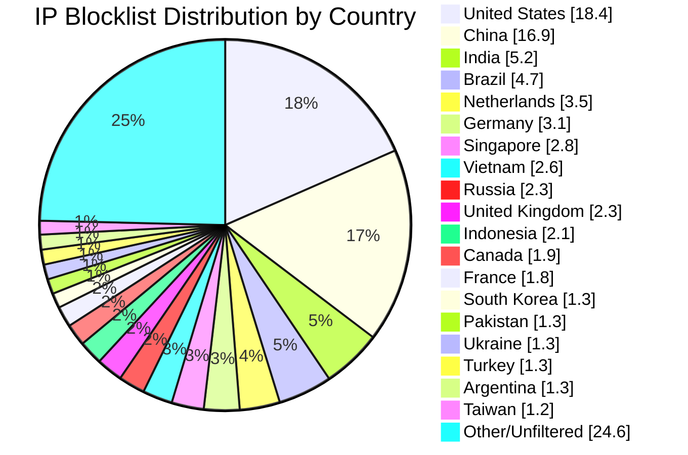

# Multi-Country IP Aggregation Statistics

**Last Updated:** 2026-10-16 11:41:15 UTC

## 📈 Country Distribution

```mermaid
pie showData title IP Blocklist Distribution by Country
"United States" : 18.4
"China" : 16.9
"India" : 5.2
"Brazil" : 4.7
"Netherlands" : 3.5
"Germany" : 3.1
"Singapore" : 2.8
"Vietnam" : 2.6
"Russia" : 2.3
"United Kingdom" : 2.3
"Indonesia" : 2.1
"Canada" : 1.9
"France" : 1.8
"South Korea" : 1.3
"Pakistan" : 1.3
"Ukraine" : 1.3
"Turkey" : 1.3
"Argentina" : 1.3
"Taiwan" : 1.2
"Other/Unfiltered" : 24.6
```

## Overall Summary

- **Total Input IPs:** 1,530,056
- **Countries Processed:** 50
- **Combined Unique IPs:** 1,344,326
- **Combined Output File:** `aggregated-multi-50countries-combined.txt`
- **Overall Filter Rate:** 87.86%

## Per-Country Results

| Country | Code | Networks Found | Networks Optimized | IPs Matched | Filter Rate | Output File |
|---------|------|----------------|--------------------|-----------|-----------|-----------|
| United States | US | 128,424 | 126,547 | 282,117 | 18.44% | `aggregated-us-only.txt` |
| China | CN | 8,195 | 8,194 | 258,365 | 16.89% | `aggregated-cn-only.txt` |
| India | IN | 13,490 | 13,465 | 79,773 | 5.21% | `aggregated-in-only.txt` |
| Germany | DE | 30,289 | 30,183 | 48,112 | 3.14% | `aggregated-de-only.txt` |
| Russia | RU | 13,270 | 13,028 | 35,948 | 2.35% | `aggregated-ru-only.txt` |
| United Kingdom | GB | 36,400 | 36,228 | 35,578 | 2.33% | `aggregated-gb-only.txt` |
| Thailand | TH | 2,082 | 2,082 | 15,914 | 1.04% | `aggregated-th-only.txt` |
| Vietnam | VN | 2,267 | 2,267 | 39,966 | 2.61% | `aggregated-vn-only.txt` |
| South Korea | KR | 3,991 | 3,968 | 20,398 | 1.33% | `aggregated-kr-only.txt` |
| Brazil | BR | 11,529 | 11,490 | 71,180 | 4.65% | `aggregated-br-only.txt` |
| Taiwan | TW | 2,460 | 2,460 | 18,389 | 1.20% | `aggregated-tw-only.txt` |
| Canada | CA | 17,635 | 17,506 | 29,194 | 1.91% | `aggregated-ca-only.txt` |
| Singapore | SG | 9,766 | 9,742 | 42,948 | 2.81% | `aggregated-sg-only.txt` |
| Italy | IT | 9,904 | 9,871 | 17,347 | 1.13% | `aggregated-it-only.txt` |
| Netherlands | NL | 18,442 | 18,347 | 53,504 | 3.50% | `aggregated-nl-only.txt` |
| Indonesia | ID | 6,734 | 6,713 | 31,829 | 2.08% | `aggregated-id-only.txt` |
| France | FR | 33,875 | 33,850 | 28,162 | 1.84% | `aggregated-fr-only.txt` |
| Venezuela | VE | 987 | 987 | 8,040 | 0.53% | `aggregated-ve-only.txt` |
| Australia | AU | 12,423 | 12,350 | 17,876 | 1.17% | `aggregated-au-only.txt` |
| Turkey | TR | 3,536 | 3,501 | 19,333 | 1.26% | `aggregated-tr-only.txt` |
| Ukraine | UA | 5,415 | 5,375 | 19,787 | 1.29% | `aggregated-ua-only.txt` |
| Iran | IR | 2,070 | 2,069 | 6,575 | 0.43% | `aggregated-ir-only.txt` |
| Poland | PL | 8,365 | 8,335 | 9,554 | 0.62% | `aggregated-pl-only.txt` |
| Mexico | MX | 4,413 | 4,406 | 17,765 | 1.16% | `aggregated-mx-only.txt` |
| Spain | ES | 11,673 | 11,663 | 11,833 | 0.77% | `aggregated-es-only.txt` |
| Argentina | AR | 3,528 | 3,528 | 19,147 | 1.25% | `aggregated-ar-only.txt` |
| Egypt | EG | 769 | 769 | 4,147 | 0.27% | `aggregated-eg-only.txt` |
| Pakistan | PK | 1,422 | 1,421 | 20,049 | 1.31% | `aggregated-pk-only.txt` |
| Malaysia | MY | 2,615 | 2,615 | 6,931 | 0.45% | `aggregated-my-only.txt` |
| Bulgaria | BG | 2,356 | 2,342 | 3,459 | 0.23% | `aggregated-bg-only.txt` |
| Czechia | CZ | 3,728 | 3,727 | 2,031 | 0.13% | `aggregated-cz-only.txt` |
| Colombia | CO | 2,309 | 2,309 | 7,666 | 0.50% | `aggregated-co-only.txt` |
| United Arab Emirates | AE | 3,905 | 3,905 | 5,420 | 0.35% | `aggregated-ae-only.txt` |
| Romania | RO | 4,113 | 4,102 | 3,168 | 0.21% | `aggregated-ro-only.txt` |
| Kazakhstan | KZ | 1,343 | 1,342 | 3,316 | 0.22% | `aggregated-kz-only.txt` |
| Morocco | MA | 517 | 517 | 4,963 | 0.32% | `aggregated-ma-only.txt` |
| Saudi Arabia | SA | 1,747 | 1,747 | 5,595 | 0.37% | `aggregated-sa-only.txt` |
| South Africa | ZA | 4,117 | 4,104 | 7,601 | 0.50% | `aggregated-za-only.txt` |
| Bangladesh | BD | 2,718 | 2,716 | 7,648 | 0.50% | `aggregated-bd-only.txt` |
| Chile | CL | 1,984 | 1,982 | 5,775 | 0.38% | `aggregated-cl-only.txt` |
| Nigeria | NG | 1,165 | 1,165 | 1,736 | 0.11% | `aggregated-ng-only.txt` |
| Kenya | KE | 910 | 910 | 3,374 | 0.22% | `aggregated-ke-only.txt` |
| Algeria | DZ | 226 | 226 | 2,226 | 0.15% | `aggregated-dz-only.txt` |
| Serbia | RS | 1,019 | 1,017 | 1,374 | 0.09% | `aggregated-rs-only.txt` |
| Peru | PE | 1,129 | 1,128 | 2,385 | 0.16% | `aggregated-pe-only.txt` |
| Sri Lanka | LK | 262 | 262 | 962 | 0.06% | `aggregated-lk-only.txt` |
| Iraq | IQ | 695 | 695 | 2,928 | 0.19% | `aggregated-iq-only.txt` |
| Ethiopia | ET | 107 | 107 | 1,240 | 0.08% | `aggregated-et-only.txt` |
| Ghana | GH | 362 | 362 | 640 | 0.04% | `aggregated-gh-only.txt` |
| Belarus | BY | 437 | 437 | 1,058 | 0.07% | `aggregated-by-only.txt` |

## IP Sources

- **Source 1:** https://raw.githubusercontent.com/borestad/firehol-mirror/refs/heads/main/firehol_level1.netset
- **Source 2:** https://raw.githubusercontent.com/borestad/firehol-mirror/refs/heads/main/firehol_level2.netset
- **Source 3:** https://rules.emergingthreats.net/fwrules/emerging-Block-IPs.txt
- **Source 4:** https://feodotracker.abuse.ch/downloads/ipblocklist_recommended.txt
- **Source 5:** https://raw.githubusercontent.com/stamparm/ipsum/master/levels/2.txt
- **Source 6:** https://raw.githubusercontent.com/borestad/iplists/refs/heads/main/spamhaus/spamhaus-drop.ipv4
- **Source 7:** https://raw.githubusercontent.com/borestad/iplists/refs/heads/main/spamhaus/spamhaus-asndrop.ipv4
- **Source 8:** https://raw.githubusercontent.com/romainmarcoux/malicious-ip/refs/heads/main/full-300k-aa.txt
- **Source 9:** https://raw.githubusercontent.com/romainmarcoux/malicious-ip/refs/heads/main/full-300k-ab.txt
- **Source 10:** https://raw.githubusercontent.com/romainmarcoux/malicious-ip/refs/heads/main/full-300k-ac.txt
- **Source 11:** https://raw.githubusercontent.com/romainmarcoux/malicious-ip/refs/heads/main/full-300k-ad.txt
- **Source 12:** http://cinsscore.com/list/ci-badguys.txt
- **Source 13:** https://cdn.jsdelivr.net/gh/LittleJake/ip-blacklist/all_blacklist.txt
- **Source 14:** https://raw.githubusercontent.com/MagicTeaMC/bad-ips/refs/heads/main/bad-ips.txt
- **Source 15:** https://raw.githubusercontent.com/MagicTeaMC/MCSTORM-IP/main/mcstorm-ip.txt
- **Source 16:** https://opendbl.net/lists/blocklistde-all.list
- **Source 17:** https://raw.githubusercontent.com/bitwire-it/ipblocklist/refs/heads/main/ip-list.txt
- **Source 18:** https://raw.githubusercontent.com/sefinek/Malicious-IP-Addresses/refs/heads/main/lists/main.txt
- **Source 19:** https://raw.githubusercontent.com/borestad/firehol-mirror/refs/heads/main/firehol_level3.netset
- **Source 20:** https://raw.githubusercontent.com/borestad/firehol-mirror/refs/heads/main/firehol_level4.netset
- **Source 21:** https://raw.githubusercontent.com/borestad/firehol-mirror/refs/heads/main/firehol_webserver.netset

## Configuration Details

