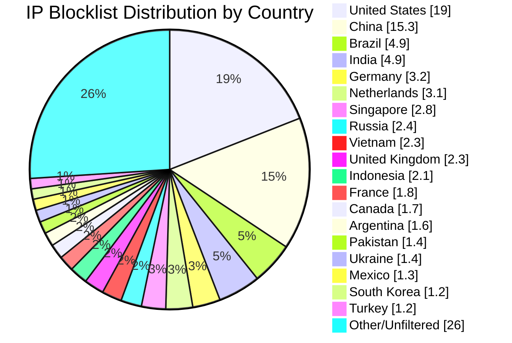

# Multi-Country IP Aggregation Statistics

**Last Updated:** 2026-10-25 05:01:54 UTC

## 📈 Country Distribution

```mermaid
pie showData title IP Blocklist Distribution by Country
"United States" : 19.0
"China" : 15.3
"Brazil" : 4.9
"India" : 4.9
"Germany" : 3.2
"Netherlands" : 3.1
"Singapore" : 2.8
"Russia" : 2.4
"Vietnam" : 2.3
"United Kingdom" : 2.3
"Indonesia" : 2.1
"France" : 1.8
"Canada" : 1.7
"Argentina" : 1.6
"Pakistan" : 1.4
"Ukraine" : 1.4
"Mexico" : 1.3
"South Korea" : 1.2
"Turkey" : 1.2
"Other/Unfiltered" : 26.0
```

## Overall Summary

- **Total Input IPs:** 1,943,406
- **Countries Processed:** 50
- **Combined Unique IPs:** 1,703,546
- **Combined Output File:** `aggregated-multi-50countries-combined.txt`
- **Overall Filter Rate:** 87.66%

## Per-Country Results

| Country | Code | Networks Found | Networks Optimized | IPs Matched | Filter Rate | Output File |
|---------|------|----------------|--------------------|-----------|-----------|-----------|
| United States | US | 129,057 | 127,188 | 368,891 | 18.98% | `aggregated-us-only.txt` |
| China | CN | 7,965 | 7,964 | 298,273 | 15.35% | `aggregated-cn-only.txt` |
| India | IN | 13,622 | 13,597 | 95,391 | 4.91% | `aggregated-in-only.txt` |
| Germany | DE | 30,284 | 30,174 | 62,945 | 3.24% | `aggregated-de-only.txt` |
| Russia | RU | 13,191 | 12,960 | 45,781 | 2.36% | `aggregated-ru-only.txt` |
| United Kingdom | GB | 36,267 | 36,097 | 43,805 | 2.25% | `aggregated-gb-only.txt` |
| Thailand | TH | 2,094 | 2,094 | 18,465 | 0.95% | `aggregated-th-only.txt` |
| Vietnam | VN | 2,271 | 2,271 | 45,500 | 2.34% | `aggregated-vn-only.txt` |
| South Korea | KR | 4,030 | 4,002 | 23,501 | 1.21% | `aggregated-kr-only.txt` |
| Brazil | BR | 11,604 | 11,569 | 95,711 | 4.92% | `aggregated-br-only.txt` |
| Taiwan | TW | 2,465 | 2,465 | 21,448 | 1.10% | `aggregated-tw-only.txt` |
| Canada | CA | 17,613 | 17,490 | 33,779 | 1.74% | `aggregated-ca-only.txt` |
| Singapore | SG | 9,897 | 9,873 | 53,897 | 2.77% | `aggregated-sg-only.txt` |
| Italy | IT | 9,872 | 9,839 | 21,068 | 1.08% | `aggregated-it-only.txt` |
| Netherlands | NL | 18,296 | 18,198 | 60,130 | 3.09% | `aggregated-nl-only.txt` |
| Indonesia | ID | 6,778 | 6,757 | 39,845 | 2.05% | `aggregated-id-only.txt` |
| France | FR | 33,876 | 33,851 | 35,879 | 1.85% | `aggregated-fr-only.txt` |
| Venezuela | VE | 991 | 991 | 11,023 | 0.57% | `aggregated-ve-only.txt` |
| Australia | AU | 12,281 | 12,208 | 19,959 | 1.03% | `aggregated-au-only.txt` |
| Turkey | TR | 3,570 | 3,539 | 23,288 | 1.20% | `aggregated-tr-only.txt` |
| Ukraine | UA | 5,398 | 5,357 | 27,247 | 1.40% | `aggregated-ua-only.txt` |
| Iran | IR | 2,068 | 2,067 | 8,418 | 0.43% | `aggregated-ir-only.txt` |
| Poland | PL | 8,406 | 8,376 | 14,596 | 0.75% | `aggregated-pl-only.txt` |
| Mexico | MX | 4,406 | 4,399 | 25,246 | 1.30% | `aggregated-mx-only.txt` |
| Spain | ES | 11,667 | 11,660 | 15,381 | 0.79% | `aggregated-es-only.txt` |
| Argentina | AR | 3,521 | 3,521 | 31,393 | 1.62% | `aggregated-ar-only.txt` |
| Egypt | EG | 776 | 776 | 5,779 | 0.30% | `aggregated-eg-only.txt` |
| Pakistan | PK | 1,429 | 1,427 | 28,073 | 1.44% | `aggregated-pk-only.txt` |
| Malaysia | MY | 2,614 | 2,614 | 9,334 | 0.48% | `aggregated-my-only.txt` |
| Bulgaria | BG | 2,370 | 2,356 | 4,062 | 0.21% | `aggregated-bg-only.txt` |
| Czechia | CZ | 3,756 | 3,755 | 2,882 | 0.15% | `aggregated-cz-only.txt` |
| Colombia | CO | 2,326 | 2,326 | 12,354 | 0.64% | `aggregated-co-only.txt` |
| United Arab Emirates | AE | 4,021 | 4,021 | 6,935 | 0.36% | `aggregated-ae-only.txt` |
| Romania | RO | 4,118 | 4,107 | 3,840 | 0.20% | `aggregated-ro-only.txt` |
| Kazakhstan | KZ | 1,351 | 1,350 | 4,981 | 0.26% | `aggregated-kz-only.txt` |
| Morocco | MA | 516 | 516 | 7,080 | 0.36% | `aggregated-ma-only.txt` |
| Saudi Arabia | SA | 1,763 | 1,763 | 7,043 | 0.36% | `aggregated-sa-only.txt` |
| South Africa | ZA | 4,171 | 4,158 | 13,560 | 0.70% | `aggregated-za-only.txt` |
| Bangladesh | BD | 2,771 | 2,769 | 18,587 | 0.96% | `aggregated-bd-only.txt` |
| Chile | CL | 1,994 | 1,992 | 10,356 | 0.53% | `aggregated-cl-only.txt` |
| Nigeria | NG | 1,168 | 1,168 | 2,972 | 0.15% | `aggregated-ng-only.txt` |
| Kenya | KE | 920 | 920 | 4,951 | 0.25% | `aggregated-ke-only.txt` |
| Algeria | DZ | 224 | 224 | 3,184 | 0.16% | `aggregated-dz-only.txt` |
| Serbia | RS | 1,020 | 1,018 | 2,039 | 0.10% | `aggregated-rs-only.txt` |
| Peru | PE | 1,132 | 1,131 | 3,476 | 0.18% | `aggregated-pe-only.txt` |
| Sri Lanka | LK | 262 | 262 | 1,204 | 0.06% | `aggregated-lk-only.txt` |
| Iraq | IQ | 683 | 683 | 5,576 | 0.29% | `aggregated-iq-only.txt` |
| Ethiopia | ET | 115 | 115 | 1,860 | 0.10% | `aggregated-et-only.txt` |
| Ghana | GH | 363 | 363 | 835 | 0.04% | `aggregated-gh-only.txt` |
| Belarus | BY | 434 | 434 | 1,723 | 0.09% | `aggregated-by-only.txt` |

## IP Sources

- **Source 1:** https://raw.githubusercontent.com/borestad/firehol-mirror/refs/heads/main/firehol_level1.netset
- **Source 2:** https://raw.githubusercontent.com/borestad/firehol-mirror/refs/heads/main/firehol_level2.netset
- **Source 3:** https://rules.emergingthreats.net/fwrules/emerging-Block-IPs.txt
- **Source 4:** https://feodotracker.abuse.ch/downloads/ipblocklist_recommended.txt
- **Source 5:** https://raw.githubusercontent.com/stamparm/ipsum/master/levels/2.txt
- **Source 6:** https://raw.githubusercontent.com/borestad/iplists/refs/heads/main/spamhaus/spamhaus-drop.ipv4
- **Source 7:** https://raw.githubusercontent.com/borestad/iplists/refs/heads/main/spamhaus/spamhaus-asndrop.ipv4
- **Source 8:** https://raw.githubusercontent.com/romainmarcoux/malicious-ip/refs/heads/main/full-300k-aa.txt
- **Source 9:** https://raw.githubusercontent.com/romainmarcoux/malicious-ip/refs/heads/main/full-300k-ab.txt
- **Source 10:** https://raw.githubusercontent.com/romainmarcoux/malicious-ip/refs/heads/main/full-300k-ac.txt
- **Source 11:** https://raw.githubusercontent.com/romainmarcoux/malicious-ip/refs/heads/main/full-300k-ad.txt
- **Source 12:** http://cinsscore.com/list/ci-badguys.txt
- **Source 13:** https://cdn.jsdelivr.net/gh/LittleJake/ip-blacklist/all_blacklist.txt
- **Source 14:** https://raw.githubusercontent.com/MagicTeaMC/bad-ips/refs/heads/main/bad-ips.txt
- **Source 15:** https://raw.githubusercontent.com/MagicTeaMC/MCSTORM-IP/main/mcstorm-ip.txt
- **Source 16:** https://opendbl.net/lists/blocklistde-all.list
- **Source 17:** https://raw.githubusercontent.com/bitwire-it/ipblocklist/refs/heads/main/ip-list.txt
- **Source 18:** https://raw.githubusercontent.com/sefinek/Malicious-IP-Addresses/refs/heads/main/lists/main.txt
- **Source 19:** https://raw.githubusercontent.com/borestad/firehol-mirror/refs/heads/main/firehol_level3.netset
- **Source 20:** https://raw.githubusercontent.com/borestad/firehol-mirror/refs/heads/main/firehol_level4.netset
- **Source 21:** https://raw.githubusercontent.com/borestad/firehol-mirror/refs/heads/main/firehol_webserver.netset

## Configuration Details

