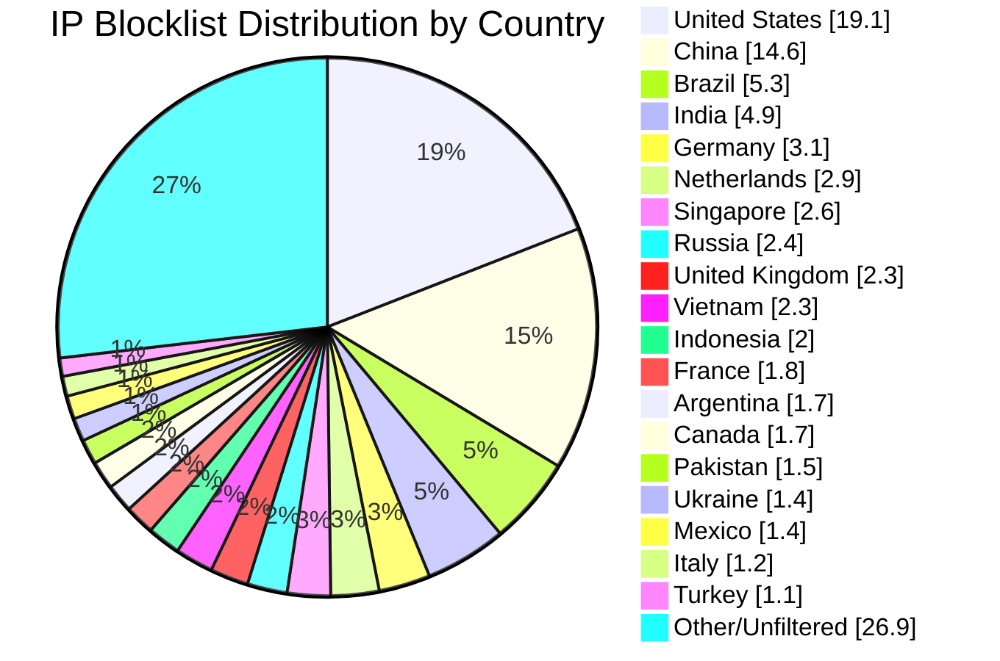

# Multi-Country IP Aggregation Statistics

**Last Updated:** 2026-10-24 21:04:37 UTC

## 📈 Country Distribution

```mermaid
pie showData title IP Blocklist Distribution by Country
"United States" : 19.1
"China" : 14.6
"Brazil" : 5.3
"India" : 4.9
"Germany" : 3.1
"Netherlands" : 2.9
"Singapore" : 2.6
"Russia" : 2.4
"United Kingdom" : 2.3
"Vietnam" : 2.3
"Indonesia" : 2.0
"France" : 1.8
"Argentina" : 1.7
"Canada" : 1.7
"Pakistan" : 1.5
"Ukraine" : 1.4
"Mexico" : 1.4
"Italy" : 1.2
"Turkey" : 1.1
"Other/Unfiltered" : 26.9
```

## Overall Summary

- **Total Input IPs:** 2,127,070
- **Countries Processed:** 50
- **Combined Unique IPs:** 1,855,244
- **Combined Output File:** `aggregated-multi-50countries-combined.txt`
- **Overall Filter Rate:** 87.22%

## Per-Country Results

| Country | Code | Networks Found | Networks Optimized | IPs Matched | Filter Rate | Output File |
|---------|------|----------------|--------------------|-----------|-----------|-----------|
| United States | US | 128,606 | 126,734 | 405,395 | 19.06% | `aggregated-us-only.txt` |
| China | CN | 8,106 | 8,105 | 309,574 | 14.55% | `aggregated-cn-only.txt` |
| India | IN | 13,526 | 13,501 | 103,257 | 4.85% | `aggregated-in-only.txt` |
| Germany | DE | 30,436 | 30,330 | 66,020 | 3.10% | `aggregated-de-only.txt` |
| Russia | RU | 13,272 | 13,031 | 50,161 | 2.36% | `aggregated-ru-only.txt` |
| United Kingdom | GB | 36,427 | 36,255 | 48,678 | 2.29% | `aggregated-gb-only.txt` |
| Thailand | TH | 2,095 | 2,095 | 19,350 | 0.91% | `aggregated-th-only.txt` |
| Vietnam | VN | 2,270 | 2,270 | 48,189 | 2.27% | `aggregated-vn-only.txt` |
| South Korea | KR | 3,994 | 3,971 | 24,142 | 1.13% | `aggregated-kr-only.txt` |
| Brazil | BR | 11,545 | 11,506 | 113,194 | 5.32% | `aggregated-br-only.txt` |
| Taiwan | TW | 2,460 | 2,460 | 21,934 | 1.03% | `aggregated-tw-only.txt` |
| Canada | CA | 17,658 | 17,529 | 36,443 | 1.71% | `aggregated-ca-only.txt` |
| Singapore | SG | 9,814 | 9,790 | 55,451 | 2.61% | `aggregated-sg-only.txt` |
| Italy | IT | 9,904 | 9,871 | 25,042 | 1.18% | `aggregated-it-only.txt` |
| Netherlands | NL | 18,480 | 18,385 | 61,375 | 2.89% | `aggregated-nl-only.txt` |
| Indonesia | ID | 6,770 | 6,749 | 42,080 | 1.98% | `aggregated-id-only.txt` |
| France | FR | 33,926 | 33,901 | 38,922 | 1.83% | `aggregated-fr-only.txt` |
| Venezuela | VE | 986 | 986 | 12,940 | 0.61% | `aggregated-ve-only.txt` |
| Australia | AU | 12,448 | 12,375 | 20,479 | 0.96% | `aggregated-au-only.txt` |
| Turkey | TR | 3,540 | 3,505 | 24,389 | 1.15% | `aggregated-tr-only.txt` |
| Ukraine | UA | 5,399 | 5,359 | 29,774 | 1.40% | `aggregated-ua-only.txt` |
| Iran | IR | 2,068 | 2,067 | 9,108 | 0.43% | `aggregated-ir-only.txt` |
| Poland | PL | 8,392 | 8,362 | 16,350 | 0.77% | `aggregated-pl-only.txt` |
| Mexico | MX | 4,429 | 4,422 | 29,247 | 1.37% | `aggregated-mx-only.txt` |
| Spain | ES | 11,676 | 11,666 | 17,704 | 0.83% | `aggregated-es-only.txt` |
| Argentina | AR | 3,532 | 3,532 | 36,953 | 1.74% | `aggregated-ar-only.txt` |
| Egypt | EG | 767 | 767 | 6,549 | 0.31% | `aggregated-eg-only.txt` |
| Pakistan | PK | 1,424 | 1,423 | 31,757 | 1.49% | `aggregated-pk-only.txt` |
| Malaysia | MY | 2,624 | 2,624 | 10,441 | 0.49% | `aggregated-my-only.txt` |
| Bulgaria | BG | 2,347 | 2,333 | 4,401 | 0.21% | `aggregated-bg-only.txt` |
| Czechia | CZ | 3,747 | 3,746 | 3,449 | 0.16% | `aggregated-cz-only.txt` |
| Colombia | CO | 2,316 | 2,316 | 14,980 | 0.70% | `aggregated-co-only.txt` |
| United Arab Emirates | AE | 3,959 | 3,959 | 7,872 | 0.37% | `aggregated-ae-only.txt` |
| Romania | RO | 4,120 | 4,110 | 4,368 | 0.21% | `aggregated-ro-only.txt` |
| Kazakhstan | KZ | 1,344 | 1,343 | 6,118 | 0.29% | `aggregated-kz-only.txt` |
| Morocco | MA | 518 | 518 | 9,284 | 0.44% | `aggregated-ma-only.txt` |
| Saudi Arabia | SA | 1,752 | 1,752 | 8,507 | 0.40% | `aggregated-sa-only.txt` |
| South Africa | ZA | 4,131 | 4,118 | 14,529 | 0.68% | `aggregated-za-only.txt` |
| Bangladesh | BD | 2,740 | 2,738 | 20,851 | 0.98% | `aggregated-bd-only.txt` |
| Chile | CL | 1,986 | 1,984 | 12,486 | 0.59% | `aggregated-cl-only.txt` |
| Nigeria | NG | 1,167 | 1,167 | 3,190 | 0.15% | `aggregated-ng-only.txt` |
| Kenya | KE | 910 | 910 | 5,616 | 0.26% | `aggregated-ke-only.txt` |
| Algeria | DZ | 226 | 226 | 4,256 | 0.20% | `aggregated-dz-only.txt` |
| Serbia | RS | 1,024 | 1,022 | 2,365 | 0.11% | `aggregated-rs-only.txt` |
| Peru | PE | 1,135 | 1,134 | 4,305 | 0.20% | `aggregated-pe-only.txt` |
| Sri Lanka | LK | 259 | 259 | 1,323 | 0.06% | `aggregated-lk-only.txt` |
| Iraq | IQ | 695 | 695 | 6,860 | 0.32% | `aggregated-iq-only.txt` |
| Ethiopia | ET | 107 | 107 | 2,490 | 0.12% | `aggregated-et-only.txt` |
| Ghana | GH | 363 | 363 | 922 | 0.04% | `aggregated-gh-only.txt` |
| Belarus | BY | 437 | 437 | 2,174 | 0.10% | `aggregated-by-only.txt` |

## IP Sources

- **Source 1:** https://raw.githubusercontent.com/borestad/firehol-mirror/refs/heads/main/firehol_level1.netset
- **Source 2:** https://raw.githubusercontent.com/borestad/firehol-mirror/refs/heads/main/firehol_level2.netset
- **Source 3:** https://rules.emergingthreats.net/fwrules/emerging-Block-IPs.txt
- **Source 4:** https://feodotracker.abuse.ch/downloads/ipblocklist_recommended.txt
- **Source 5:** https://raw.githubusercontent.com/stamparm/ipsum/master/levels/2.txt
- **Source 6:** https://raw.githubusercontent.com/borestad/iplists/refs/heads/main/spamhaus/spamhaus-drop.ipv4
- **Source 7:** https://raw.githubusercontent.com/borestad/iplists/refs/heads/main/spamhaus/spamhaus-asndrop.ipv4
- **Source 8:** https://raw.githubusercontent.com/romainmarcoux/malicious-ip/refs/heads/main/full-300k-aa.txt
- **Source 9:** https://raw.githubusercontent.com/romainmarcoux/malicious-ip/refs/heads/main/full-300k-ab.txt
- **Source 10:** https://raw.githubusercontent.com/romainmarcoux/malicious-ip/refs/heads/main/full-300k-ac.txt
- **Source 11:** https://raw.githubusercontent.com/romainmarcoux/malicious-ip/refs/heads/main/full-300k-ad.txt
- **Source 12:** http://cinsscore.com/list/ci-badguys.txt
- **Source 13:** https://cdn.jsdelivr.net/gh/LittleJake/ip-blacklist/all_blacklist.txt
- **Source 14:** https://raw.githubusercontent.com/MagicTeaMC/bad-ips/refs/heads/main/bad-ips.txt
- **Source 15:** https://raw.githubusercontent.com/MagicTeaMC/MCSTORM-IP/main/mcstorm-ip.txt
- **Source 16:** https://opendbl.net/lists/blocklistde-all.list
- **Source 17:** https://raw.githubusercontent.com/bitwire-it/ipblocklist/refs/heads/main/ip-list.txt
- **Source 18:** https://raw.githubusercontent.com/sefinek/Malicious-IP-Addresses/refs/heads/main/lists/main.txt
- **Source 19:** https://raw.githubusercontent.com/borestad/firehol-mirror/refs/heads/main/firehol_level3.netset
- **Source 20:** https://raw.githubusercontent.com/borestad/firehol-mirror/refs/heads/main/firehol_level4.netset
- **Source 21:** https://raw.githubusercontent.com/borestad/firehol-mirror/refs/heads/main/firehol_webserver.netset

## Configuration Details

