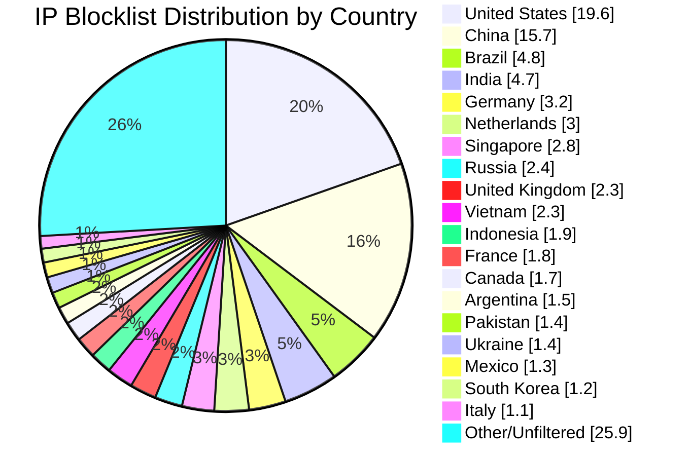

# Multi-Country IP Aggregation Statistics

**Last Updated:** 2026-11-09 22:36:57 UTC

## 📈 Country Distribution

```mermaid
pie showData title IP Blocklist Distribution by Country
"United States" : 19.6
"China" : 15.7
"Brazil" : 4.8
"India" : 4.7
"Germany" : 3.2
"Netherlands" : 3.0
"Singapore" : 2.8
"Russia" : 2.4
"United Kingdom" : 2.3
"Vietnam" : 2.3
"Indonesia" : 1.9
"France" : 1.8
"Canada" : 1.7
"Argentina" : 1.5
"Pakistan" : 1.4
"Ukraine" : 1.4
"Mexico" : 1.3
"South Korea" : 1.2
"Italy" : 1.1
"Other/Unfiltered" : 25.9
```

## Overall Summary

- **Total Input IPs:** 2,033,198
- **Countries Processed:** 50
- **Combined Unique IPs:** 1,782,922
- **Combined Output File:** `aggregated-multi-50countries-combined.txt`
- **Overall Filter Rate:** 87.69%

## Per-Country Results

| Country | Code | Networks Found | Networks Optimized | IPs Matched | Filter Rate | Output File |
|---------|------|----------------|--------------------|-----------|-----------|-----------|
| United States | US | 129,352 | 127,481 | 397,694 | 19.56% | `aggregated-us-only.txt` |
| China | CN | 7,945 | 7,944 | 319,643 | 15.72% | `aggregated-cn-only.txt` |
| India | IN | 13,652 | 13,627 | 95,521 | 4.70% | `aggregated-in-only.txt` |
| Germany | DE | 30,360 | 30,243 | 65,301 | 3.21% | `aggregated-de-only.txt` |
| Russia | RU | 13,305 | 13,077 | 49,348 | 2.43% | `aggregated-ru-only.txt` |
| United Kingdom | GB | 36,757 | 36,605 | 45,859 | 2.26% | `aggregated-gb-only.txt` |
| Thailand | TH | 2,101 | 2,101 | 18,613 | 0.92% | `aggregated-th-only.txt` |
| Vietnam | VN | 2,269 | 2,269 | 45,803 | 2.25% | `aggregated-vn-only.txt` |
| South Korea | KR | 3,997 | 3,988 | 23,743 | 1.17% | `aggregated-kr-only.txt` |
| Brazil | BR | 11,476 | 11,427 | 97,665 | 4.80% | `aggregated-br-only.txt` |
| Taiwan | TW | 2,475 | 2,475 | 22,291 | 1.10% | `aggregated-tw-only.txt` |
| Canada | CA | 17,672 | 17,547 | 34,614 | 1.70% | `aggregated-ca-only.txt` |
| Singapore | SG | 9,744 | 9,734 | 56,763 | 2.79% | `aggregated-sg-only.txt` |
| Italy | IT | 9,938 | 9,905 | 22,833 | 1.12% | `aggregated-it-only.txt` |
| Netherlands | NL | 18,491 | 18,385 | 60,925 | 3.00% | `aggregated-nl-only.txt` |
| Indonesia | ID | 6,809 | 6,788 | 39,580 | 1.95% | `aggregated-id-only.txt` |
| France | FR | 33,844 | 33,819 | 37,564 | 1.85% | `aggregated-fr-only.txt` |
| Venezuela | VE | 997 | 997 | 11,004 | 0.54% | `aggregated-ve-only.txt` |
| Australia | AU | 11,939 | 11,864 | 20,412 | 1.00% | `aggregated-au-only.txt` |
| Turkey | TR | 3,568 | 3,535 | 22,716 | 1.12% | `aggregated-tr-only.txt` |
| Ukraine | UA | 5,407 | 5,366 | 27,683 | 1.36% | `aggregated-ua-only.txt` |
| Iran | IR | 2,070 | 2,069 | 9,152 | 0.45% | `aggregated-ir-only.txt` |
| Poland | PL | 8,432 | 8,405 | 19,793 | 0.97% | `aggregated-pl-only.txt` |
| Mexico | MX | 4,346 | 4,339 | 26,068 | 1.28% | `aggregated-mx-only.txt` |
| Spain | ES | 11,639 | 11,619 | 15,868 | 0.78% | `aggregated-es-only.txt` |
| Argentina | AR | 3,591 | 3,591 | 31,077 | 1.53% | `aggregated-ar-only.txt` |
| Egypt | EG | 785 | 785 | 5,693 | 0.28% | `aggregated-eg-only.txt` |
| Pakistan | PK | 1,433 | 1,431 | 29,036 | 1.43% | `aggregated-pk-only.txt` |
| Malaysia | MY | 2,617 | 2,617 | 9,945 | 0.49% | `aggregated-my-only.txt` |
| Bulgaria | BG | 2,357 | 2,347 | 4,069 | 0.20% | `aggregated-bg-only.txt` |
| Czechia | CZ | 3,758 | 3,756 | 2,811 | 0.14% | `aggregated-cz-only.txt` |
| Colombia | CO | 2,326 | 2,326 | 12,514 | 0.62% | `aggregated-co-only.txt` |
| United Arab Emirates | AE | 4,005 | 4,005 | 6,846 | 0.34% | `aggregated-ae-only.txt` |
| Romania | RO | 4,114 | 4,103 | 3,856 | 0.19% | `aggregated-ro-only.txt` |
| Kazakhstan | KZ | 1,358 | 1,355 | 4,741 | 0.23% | `aggregated-kz-only.txt` |
| Morocco | MA | 513 | 513 | 6,925 | 0.34% | `aggregated-ma-only.txt` |
| Saudi Arabia | SA | 1,786 | 1,786 | 7,929 | 0.39% | `aggregated-sa-only.txt` |
| South Africa | ZA | 3,972 | 3,959 | 13,610 | 0.67% | `aggregated-za-only.txt` |
| Bangladesh | BD | 2,917 | 2,911 | 19,338 | 0.95% | `aggregated-bd-only.txt` |
| Chile | CL | 1,991 | 1,989 | 10,636 | 0.52% | `aggregated-cl-only.txt` |
| Nigeria | NG | 1,171 | 1,171 | 2,826 | 0.14% | `aggregated-ng-only.txt` |
| Kenya | KE | 924 | 924 | 4,951 | 0.24% | `aggregated-ke-only.txt` |
| Algeria | DZ | 222 | 222 | 2,983 | 0.15% | `aggregated-dz-only.txt` |
| Serbia | RS | 1,016 | 1,016 | 1,951 | 0.10% | `aggregated-rs-only.txt` |
| Peru | PE | 1,126 | 1,125 | 3,626 | 0.18% | `aggregated-pe-only.txt` |
| Sri Lanka | LK | 266 | 266 | 1,165 | 0.06% | `aggregated-lk-only.txt` |
| Iraq | IQ | 696 | 696 | 5,552 | 0.27% | `aggregated-iq-only.txt` |
| Ethiopia | ET | 112 | 112 | 1,873 | 0.09% | `aggregated-et-only.txt` |
| Ghana | GH | 362 | 362 | 821 | 0.04% | `aggregated-gh-only.txt` |
| Belarus | BY | 422 | 422 | 1,692 | 0.08% | `aggregated-by-only.txt` |

## IP Sources

- **Source 1:** https://raw.githubusercontent.com/borestad/firehol-mirror/refs/heads/main/firehol_level1.netset
- **Source 2:** https://raw.githubusercontent.com/borestad/firehol-mirror/refs/heads/main/firehol_level2.netset
- **Source 3:** https://rules.emergingthreats.net/fwrules/emerging-Block-IPs.txt
- **Source 4:** https://feodotracker.abuse.ch/downloads/ipblocklist_recommended.txt
- **Source 5:** https://raw.githubusercontent.com/stamparm/ipsum/master/levels/2.txt
- **Source 6:** https://raw.githubusercontent.com/borestad/iplists/refs/heads/main/spamhaus/spamhaus-drop.ipv4
- **Source 7:** https://raw.githubusercontent.com/borestad/iplists/refs/heads/main/spamhaus/spamhaus-asndrop.ipv4
- **Source 8:** https://raw.githubusercontent.com/romainmarcoux/malicious-ip/refs/heads/main/full-300k-aa.txt
- **Source 9:** https://raw.githubusercontent.com/romainmarcoux/malicious-ip/refs/heads/main/full-300k-ab.txt
- **Source 10:** https://raw.githubusercontent.com/romainmarcoux/malicious-ip/refs/heads/main/full-300k-ac.txt
- **Source 11:** https://raw.githubusercontent.com/romainmarcoux/malicious-ip/refs/heads/main/full-300k-ad.txt
- **Source 12:** http://cinsscore.com/list/ci-badguys.txt
- **Source 13:** https://cdn.jsdelivr.net/gh/LittleJake/ip-blacklist/all_blacklist.txt
- **Source 14:** https://raw.githubusercontent.com/MagicTeaMC/bad-ips/refs/heads/main/bad-ips.txt
- **Source 15:** https://raw.githubusercontent.com/MagicTeaMC/MCSTORM-IP/main/mcstorm-ip.txt
- **Source 16:** https://opendbl.net/lists/blocklistde-all.list
- **Source 17:** https://raw.githubusercontent.com/bitwire-it/ipblocklist/refs/heads/main/ip-list.txt
- **Source 18:** https://raw.githubusercontent.com/sefinek/Malicious-IP-Addresses/refs/heads/main/lists/main.txt
- **Source 19:** https://raw.githubusercontent.com/borestad/firehol-mirror/refs/heads/main/firehol_level3.netset
- **Source 20:** https://raw.githubusercontent.com/borestad/firehol-mirror/refs/heads/main/firehol_level4.netset
- **Source 21:** https://raw.githubusercontent.com/borestad/firehol-mirror/refs/heads/main/firehol_webserver.netset

## Configuration Details

